# Spring Boot를 활용한 Cloud Native AP개발(Spring Cloud)

[TOC]


***

## 1장. 클라우드 네이티브와 Spring Boot 개요

### 1.1 클라우드 네이티브 애플리케이션의 이해

#### 클라우드 네이티브의 정의와 특징

클라우드 네이티브는 클라우드 환경에서 동적으로 확장 가능한 애플리케이션을 구축하고 실행하는 접근 방식입니다.
컨테이너, 서비스 메시, 마이크로서비스, 불변 인프라스트럭처, 선언적 API를 활용합니다.
애플리케이션을 클라우드에서 최적으로 실행하기 위해 설계된 아키텍처 패턴을 의미합니다.


| 특징 | 설명 | 장점 |
| :-- | :-- | :-- |
| **탄력성** | 트래픽에 따른 자동 확장/축소 | 비용 효율성, 성능 최적화 |
| **복원력** | 장애 발생 시 자동 복구 | 높은 가용성, 안정성 |
| **관찰가능성** | 실시간 모니터링과 추적 | 신속한 문제 해결, 성능 분석 |
| **자동화** | CI/CD 파이프라인 통합 | 빠른 배포, 휴먼 에러 감소 |

> #### 클라우드 네이티브의 가치
>
> 기존 온프레미스 환경에서 발생하는 확장성 한계를 해결합니다.
> 수동적인 인프라 관리로 인한 운영 비용과 복잡성을 줄입니다.
> 시장 변화에 빠르게 대응할 수 있는 애플리케이션 개발 속도를 향상시킵니다.


#### 모놀리식 vs 마이크로서비스 아키텍처

모놀리식 아키텍처는 모든 기능이 하나의 배포 단위로 구성된 구조입니다.
마이크로서비스 아키텍처는 비즈니스 기능별로 독립적인 서비스로 분리된 구조입니다.
각 마이크로서비스는 독립적으로 개발, 배포, 확장이 가능합니다.

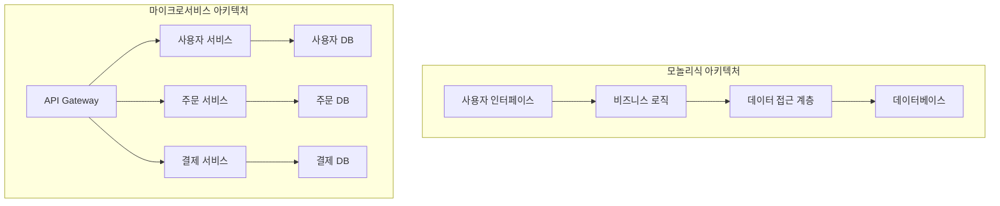


### 1.2 Cloud Native 특성

Cloud Native는 클라우드 환경의 특성을 최대한 활용하여 설계된 애플리케이션 개발 방법론입니다. 이러한 특성들로 인해 전통적인 온프레미스 환경과는 다른 접근 방식과 고려사항이 필요합니다.

#### 마이크로서비스 아키텍처로 인한 고려사항

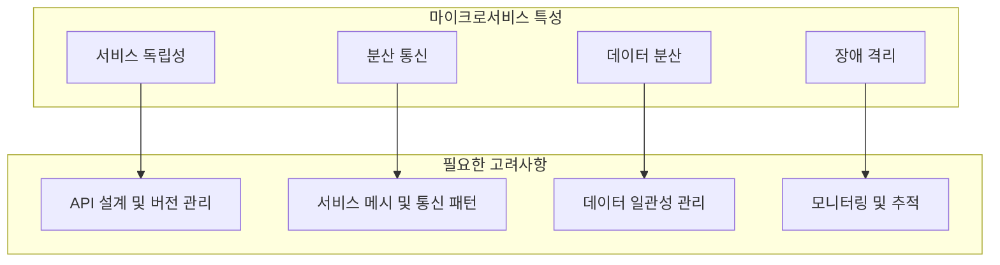


#### 분산 시스템 아키텍처

| 특성                    | 설명                                  | 발생하는 문제                        | 필요한 고려사항                      |
| ----------------------- | ------------------------------------- | ------------------------------------ | ------------------------------------ |
| **마이크로서비스 분산** | 애플리케이션을 독립적인 서비스로 분해 | 서비스 간 통신 복잡성, 데이터 일관성 | API 설계, 분산 트랜잭션, 서비스 메시 |
| **네트워크 통신 의존**  | 서비스가 네트워크를 통해 통신         | 네트워크 지연, 실패 가능성           | Circuit Breaker, Retry, Timeout      |
| **상태 분산 관리**      | 상태가 여러 서비스에 분산 저장        | 데이터 동기화, 일관성 문제           | Event Sourcing, CQRS, Saga Pattern   |

#### 동적 환경 특성

| 특성                   | 설명                                 | 발생하는 문제              | 필요한 고려사항                  |
| ---------------------- | ------------------------------------ | -------------------------- | -------------------------------- |
| **인스턴스 생성/삭제** | 서비스 인스턴스가 동적으로 생성/삭제 | IP 주소 변경, 서비스 발견  | Service Discovery, Load Balancer |
| **자동 스케일링**      | 부하에 따라 인스턴스 수 자동 조정    | 상태 손실, 세션 관리       | Stateless 설계, 외부 세션 저장소 |
| **롤링 업데이트**      | 무중단으로 서비스 업데이트           | 버전 호환성, 트래픽 라우팅 | 하위 호환성, Health Check        |

#### 컨테이너화 환경

| 특성                  | 설명                               | 발생하는 문제                  | 필요한 고려사항                |
| --------------------- | ---------------------------------- | ------------------------------ | ------------------------------ |
| **격리된 실행 환경**  | 각 서비스가 독립 컨테이너에서 실행 | 리소스 제한, 환경 설정         | Resource Limits, 12-Factor App |
| **이식성**            | 다양한 환경에서 동일하게 실행      | 환경별 설정 차이               | Configuration 외부화           |
| **컨테이너 생명주기** | 컨테이너의 빠른 시작/종료          | 초기화 시간, Graceful Shutdown | 빠른 시작, 우아한 종료         |


### 1.3 Cloud Native vs 전통적 방식 비교

#### 아키텍처 복잡성

| 구분          | 전통적 방식       | Cloud Native     | 고려사항 변화          |
| :------------ | :---------------- | :--------------- | :--------------------- |
| **배포 단위** | 단일 애플리케이션 | 여러 독립 서비스 | 서비스 간 의존성 관리  |
| **장애 범위** | 전체 시스템 중단  | 부분적 장애      | 장애 격리 및 복구 전략 |
| **확장 방식** | 수직 확장         | 수평 확장        | Stateless 설계 필수    |
| **통신 방식** | 내부 메소드 호출  | 네트워크 통신    | 통신 실패 대응         |

#### 운영 복잡성

| 운영 측면     | 전통적 방식        | Cloud Native       | 추가 고려사항            |
| :------------ | :----------------- | :----------------- | :----------------------- |
| **모니터링**  | 단일 애플리케이션  | 분산된 여러 서비스 | 분산 추적, 통합 모니터링 |
| **배포**      | 예약된 시점에 일괄 | 지속적이고 독립적  | CI/CD, 자동화            |
| **설정 관리** | 정적 설정 파일     | 동적 환경 설정     | Configuration 외부화     |
| **보안**      | 경계 기반 보안     | Zero Trust 모델    | 서비스 간 인증/인가      |


### 1.4 Cloud Native 전환 전략
#### 1.4.1 단계 전환 로드맵

**단계별 성숙도 모델**

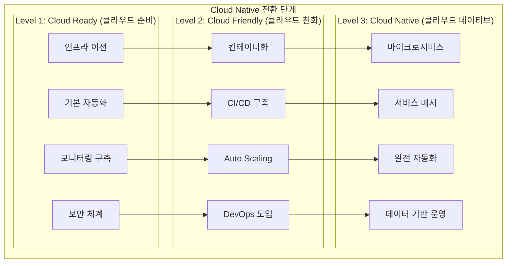


##### Level 1: Cloud Ready (클라우드 준비 단계)

| 영역             | 목표                      | 주요 활동                         | 성과 지표                     |
| :--------------- | :------------------------ | :-------------------------------- | :---------------------------- |
| **인프라**       | 클라우드 기본 환경 구축   | IaaS 환경 구성, 네트워크 설정     | 인프라 가용성 99.9%           |
| **애플리케이션** | 기존 앱을 클라우드로 이전 | Lift \& Shift, 기본 모니터링      | 이전 완료율 100%              |
| **보안**         | 클라우드 보안 체계 구축   | IAM, 네트워크 보안, 데이터 암호화 | 보안 정책 준수율 100%         |
| **조직**         | 클라우드 운영 팀 구성     | 교육, 역할 정의, 프로세스 수립    | 팀 구성 완료, 교육 이수율 90% |

**주요 기술 스택:**

- **인프라**: AWS EC2, Azure VM, GCP Compute Engine
- **스토리지**: AWS S3, Azure Blob, GCP Cloud Storage
- **네트워킹**: VPC, Load Balancer, CDN
- **모니터링**: CloudWatch, Azure Monitor, Stackdriver


##### Level 2: Cloud Friendly (클라우드 친화 단계)

| 영역           | 목표                    | 주요 활동                          | 성과 지표            |
| :------------- | :---------------------- | :--------------------------------- | :------------------- |
| **컨테이너화** | 애플리케이션 컨테이너화 | Docker, Kubernetes 도입            | 컨테이너화율 80%     |
| **자동화**     | CI/CD 파이프라인 구축   | Jenkins, GitLab CI, GitHub Actions | 배포 자동화율 90%    |
| **확장성**     | Auto Scaling 구현       | HPA, VPA, Cluster Autoscaler       | 자동 확장 대응률 95% |
| **문화**       | DevOps 문화 정착        | 협업 도구, 프로세스 개선           | 배포 빈도 10배 증가  |

**주요 기술 스택:**

- **컨테이너**: Docker, Podman
- **오케스트레이션**: Kubernetes, OpenShift
- **CI/CD**: Jenkins, GitLab CI, ArgoCD
- **모니터링**: Prometheus, Grafana, ELK Stack


##### Level 3: Cloud Native (클라우드 네이티브 단계)

| 영역         | 목표                    | 주요 활동                            | 성과 지표          |
| :----------- | :---------------------- | :----------------------------------- | :----------------- |
| **아키텍처** | 마이크로서비스 아키텍처 | 서비스 분해, API Gateway             | 서비스 분해율 90%  |
| **데이터**   | 분산 데이터 관리        | Database per Service, Event Sourcing | 데이터 독립성 100% |
| **관찰성**   | 완전한 관찰성 구현      | 분산 추적, 로그 분석, 메트릭         | MTTR 50% 단축      |
| **최적화**   | 성능 및 비용 최적화     | Auto Scaling, FinOps                 | 비용 30% 절감      |

**주요 기술 스택:**

- **서비스 메시**: Istio, Linkerd
- **메시징**: Kafka, RabbitMQ
- **데이터베이스**: PostgreSQL, MongoDB, Redis
- **관찰성**: Jaeger, Zipkin, OpenTelemetry


#### 1.4.2 6R 전환 방법론

##### 6R 전략 선택 가이드

| 전략           | 설명                        | 적용 대상                    | 비용 | 복잡도 | 클라우드 이점 |
| :------------- | :-------------------------- | :--------------------------- | :--- | :----- | :------------ |
| **Retire**     | 시스템 폐기                 | 레거시, 사용하지 않는 시스템 | 최소 | 최소   | 해당없음      |
| **Retain**     | 현상 유지                   | 규제, 보안상 이전 불가       | 최소 | 최소   | 해당없음      |
| **Rehost**     | 그대로 이전 (Lift \& Shift) | 단순 이전, 빠른 효과         | 낮음 | 낮음   | 제한적        |
| **Replatform** | 부분 최적화                 | 클라우드 서비스 일부 활용    | 중간 | 중간   | 중간          |
| **Refactor**   | 클라우드 네이티브 재구성    | 중요 비즈니스 시스템         | 높음 | 높음   | 최대          |
| **Replace**    | SaaS로 대체                 | 표준 기능, 차별화 불필요     | 중간 | 중간   | 높음          |

##### 시스템별 전략 선택 매트릭스

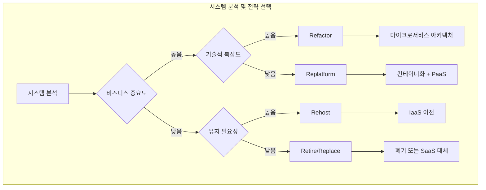


### 1.5 Spring Boot와 클라우드 네이티브의 만남

https://spring.io/

자바 기반 엔터프라이즈 애플리케이션을 만들기 위한 경량 컨테이너로, 객체 생명주기 관리와 일관된 프로그래밍 모델을 제공해 생산성과 유지보수성을 높여준다.

핵심 철학은 **IoC/DI**, **AOP**, **PSA**를 중심으로 느슨한 결합과 횡단 관심사의 분리를 실현하는 데 있다.

- 느슨한 결합과 모듈화: DI/IoC로 의존을 주입해 코드 결합도를 낮추고 재사용성과 변경 용이성을 높인다.
- 횡단 관심사 분리: AOP로 트랜잭션·보안·로깅을 핵심 로직에서 분리해 유지보수성과 응집도를 향상한다.
- 생산성: Spring Boot와 자동 구성, 스타터, 임베디드 서버로 초기 설정을 최소화해 빠르게 프로덕션 수준 앱을 만든다.
- 일관된 추상화(PSA): 데이터 접근·메시징·웹 등에서 구현 교체가 쉬운 공통 프로그래밍 모델을 제공한다.
- 테스트 용이성: DI로 목 주입이 쉬워 단위/통합 테스트 품질과 속도를 높인다.
- 광범위한 생태계: Data, Security, Cloud, Batch 등 서브프로젝트와 커뮤니티 지원으로 대부분의 엔터프라이즈 요구를 커버한다.
- 통합 용이성: JPA/Hibernate, 메시징, 외부 프레임워크와 원활히 통합되는 모듈러 설계다.
- 학습·운영 효율: 일관된 구성 모델과 풍부한 문서·사례로 학습 곡선과 운영 복잡도를 낮춘다.
#### Spring Triangle

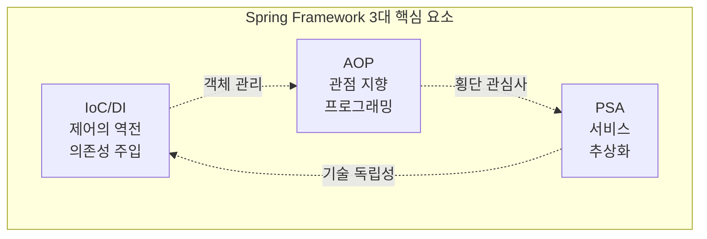

| 요소       | 영문명                                    | 핵심 개념               | 주요 목적           | 해결 문제                     |
| :--------- | :---------------------------------------- | :---------------------- | :------------------ | :---------------------------- |
| **IoC/DI** | Inversion of Control Dependency Injection | 제어권 역전 의존성 주입 | 객체 간 결합도 감소 | 객체 생성/관리의 복잡성       |
| **AOP**    | Aspect-Oriented Programming               | 관점 지향 프로그래밍    | 횡단 관심사 분리    | 코드 중복, 비즈니스 로직 오염 |
| **PSA**    | Portable Service Abstraction              | 서비스 추상화           | 기술 독립적 개발    | 특정 기술에 종속적인 코드     |

https://spring.io/projects


#### Spring Boot

https://spring.io/projects/spring-boot

Spring Boot를 사용하면 "그냥 실행하기만 하면 되는" 독립형 프로덕션급 Spring 기반 애플리케이션을 쉽게 만들 수 있습니다.
Spring 플랫폼과 서드파티 라이브러리에 대해 저희는 독자적인 관점을 가지고 있으므로, 최소한의 번거로움으로 시작할 수 있습니다. 
대부분의 Spring Boot 애플리케이션에는 최소한의 Spring 구성만 필요합니다.

| 문제점          | 기존 Spring의 한계                  | Spring Boot의 해결책          |
| :-------------- | :---------------------------------- | :---------------------------- |
| **복잡한 설정** | XML 기반의 방대한 설정 파일         | 자동 설정(Auto-Configuration) |
| **의존성 관리** | 라이브러리 버전 호환성 문제         | Starter Dependencies          |
| **배포 복잡성** | 외부 WAS 설치 및 설정 필요          | 내장 서버(Embedded Server)    |
| **개발 생산성** | 초기 프로젝트 설정에 많은 시간 소요 | Spring Initializr로 빠른 시작 |
| **테스트 환경** | 복잡한 테스트 환경 구성             | @SpringBootTest 제공          |


#### Spring Boot의 클라우드 네이티브 지원 기능

https://spring.io/microservices

Spring Boot는 마이크로서비스 개발을 위한 자동 구성과 스타터를 제공합니다.
내장 웹 서버를 통해 독립적으로 실행 가능한 JAR 파일을 생성합니다.
Actuator를 통한 애플리케이션 모니터링과 헬스체크 기능을 내장합니다.


#### Spring Cloud 생태계 소개

https://spring.io/cloud

Spring Cloud는 분산 시스템 개발을 위한 도구와 패턴을 제공합니다.
서비스 디스커버리, 설정 관리, 회로 차단기, 지능형 라우팅 등을 지원합니다.
클라우드 네이티브 애플리케이션 개발의 복잡성을 추상화합니다.

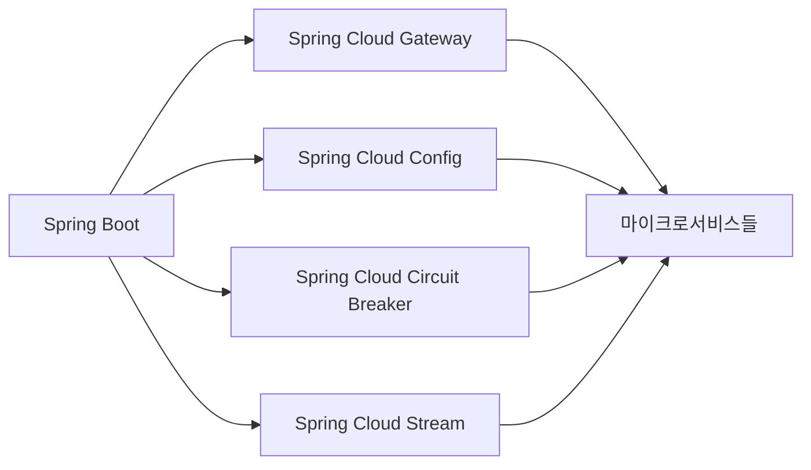


### 1.6 Spring Boot 프로젝트 생성과 구조

#### Spring Initializr를 통한 프로젝트 생성

Spring Initializr는 Spring Boot 프로젝트의 초기 구조를 생성하는 웹 기반 도구입니다.
프로젝트 메타데이터, 의존성, 패키징 옵션을 선택하여 프로젝트를 생성할 수 있습니다.
CLI, 웹 인터페이스, IDE 통합을 통해 접근 가능합니다.

```bash
# Spring Boot CLI를 통한 프로젝트 생성
spring init --build=maven --dependencies=web,actuator,data-jpa,h2 --name=microservice-demo microservice-demo

# curl을 통한 프로젝트 생성
curl https://start.spring.io/starter.zip \
    -d dependencies=web,actuator,data-jpa \
    -d build=maven \
    -d name=microservice-demo \
    -d packageName=com.example.microservice \
    -o microservice-demo.zip
```


#### 프로젝트 구조 이해

Spring Boot 프로젝트는 Maven/Gradle 표준 디렉토리 구조를 따릅니다.
소스 코드, 리소스, 테스트가 명확히 분리되어 있습니다.
설정 파일은 `src/main/resources` 디렉토리에 위치합니다.

```
microservice-demo/
├── src/
│   ├── main/
│   │   ├── java/
│   │   │   └── com/example/microservice/
│   │   │       ├── MicroserviceDemoApplication.java
│   │   │       ├── controller/
│   │   │       ├── service/
│   │   │       ├── repository/
│   │   │       └── config/
│   │   └── resources/
│   │       ├── application.yml
│   │       ├── application-dev.yml
│   │       ├── application-prod.yml
│   │       └── static/
│   └── test/
│       └── java/
├── target/
├── pom.xml
└── README.md
```


#### 의존성 관리와 Starter 개념

Spring Boot Starter는 특정 기능을 위한 의존성들을 그룹화한 편의성 디스크립터입니다.
자동 구성(Auto Configuration)을 통해 복잡한 설정을 단순화합니다.
개발자는 필요한 Starter만 추가하면 관련 라이브러리와 설정이 자동으로 구성됩니다.


| Starter                          | 기능            | 포함된 주요 의존성          |
| :------------------------------- | :-------------- | :-------------------------- |
| **spring-boot-starter-web**      | 웹 애플리케이션 | Spring MVC, Tomcat, Jackson |
| **spring-boot-starter-data-jpa** | JPA 데이터 접근 | Hibernate, Spring Data JPA  |
| **spring-boot-starter-security** | 보안            | Spring Security             |
| **spring-boot-starter-actuator** | 모니터링        | Micrometer, Health 체크     |


#### Spring Boot Auto Configuration 

[using-boot-disabling-specific-auto-configuration](https://docs.spring.io/spring-boot/docs/current/reference/html/using-boot-auto-configuration.html#using-boot-disabling-specific-auto-configuration)

- Spring Boot는 Spring과 마찬가지로 component-scan을 통해 component들을 찾고 bean 생성을 진행한다.

- 그 과정에서 우리가 설정한 bean들이 생성된다.

- 예를들면, @Controller, @RestController, @Service, @Repository 그리고 @Configuration에 등록한 @Bean 과 같은 설정 이고 그 과정에서 Spring Boot에서 미리 작성해둔 auto configuration에 의해 추가적인 bean들도 함께 생성된다.

- Spring에서는 ThreadPoolTaskExecutor를 사용하기 위해서는 우리가 해당 bean을 등록해야했지만 Spring Boot에서는 등록하지 않아도 해당 bean이 자동으로 생성되기 때문에 사용할 수 있게된다.

  

##### @SpringBootApplication

- @SpringBootApplication는 @ComponentScan과 @EnableAutoConfiguration을 포함하고 있다.

- 아래의 Application.java는 @SpringBootApplication 설정만 했지만 component scan과 auto configuration이 이루어진다.

```
Application.java
package com.dveamer.sample

@SpringBootApplication
public class Application {
    public static void main(String[] args) {
        SpringApplication.run(Application.class, args);
    }
}
```

- 즉, 우리는 프로젝트의 최상단에 Application.java를 위치시키고 @SpringBootApplication 설정해두면 앞으로 프로젝트에 추가할 configuration 관련 정보들이 모두 유효하도록 설정이 된다.

  

##### @EnableAutoConfiguration

- @EnableAutoConfiguration은 auto configuration 기능을 사용하겠다는 설정이다. 
- @EnableAutoConfiguration을 설정하지 않는다면 auto configuration 을 사용하지 못하게 된다. 일반적으로 아래와 같이 @ComponentScan과 함께 사용된다.

```
package com.dveamer.sample

@SpringBootConfiguration
@ComponentScan("com.dveamer.sample")
@EnableAutoConfiguration
public class Application {
    public static void main(String[] args) {
        SpringApplication.run(Application.class, args);
    }
}
```

- @ComponentScan에 입력된 com.dveamer.sample 값은 component scan를 시작할 패키지 위치이다.
- com.dveamer.sample 하위 모든 패키지를 component scan 범위로 잡겠다는 설정이다.
- package 위치를 입력하지 않는다면 com.dveamer.sample.Application이 놓여진 패키지(com.dveamer.sample)가 기본 값으로 사용된다. 여러 패키지 위치를 scan 대상으로 설정하는 것도 가능하다.
- component scan을 통해서 모은 component들의 정보와 Spring Boot가 spring.factories 파일에 사전에 정의한 AutoConfiguration 내용에 의해 bean 생성이 진행된다.


##### Auto Configuration Filters & Conditions

- Spring Boot가 미리 정의해둔 AutoConfiguration 정보는 `spring-boot-autoconfigure/META-INF/spring.factories`에서 혹은 [spring.factories](https://github.com/spring-projects/spring-boot/blob/master/spring-boot-project/spring-boot-autoconfigure/src/main/resources/META-INF/spring.factories)에서 확인 가능하다.

`org.springframework.boot.autoconfigure.EnableAutoConfiguration`에 상당히 많은 AutoConfigruation이 등록되어있는 것을 확인할 수 있다.

```
...

# Auto Configure
org.springframework.boot.autoconfigure.EnableAutoConfiguration=\
org.springframework.boot.autoconfigure.admin.SpringApplicationAdminJmxAutoConfiguration,\
org.springframework.boot.autoconfigure.aop.AopAutoConfiguration,\
org.springframework.boot.autoconfigure.amqp.RabbitAutoConfiguration,\
org.springframework.boot.autoconfigure.batch.BatchAutoConfiguration,\
org.springframework.boot.autoconfigure.cache.CacheAutoConfiguration,\
org.springframework.boot.autoconfigure.cassandra.CassandraAutoConfiguration,\
org.springframework.boot.autoconfigure.cloud.CloudServiceConnectorsAutoConfiguration,\
org.springframework.boot.autoconfigure.context.ConfigurationPropertiesAutoConfiguration,\
org.springframework.boot.autoconfigure.context.MessageSourceAutoConfiguration,\
org.springframework.boot.autoconfigure.context.PropertyPlaceholderAutoConfiguration,\
org.springframework.boot.autoconfigure.couchbase.CouchbaseAutoConfiguration,\
org.springframework.boot.autoconfigure.dao.PersistenceExceptionTranslationAutoConfiguration,\
org.springframework.boot.autoconfigure.data.cassandra.CassandraDataAutoConfiguration,\
org.springframework.boot.autoconfigure.data.cassandra.CassandraReactiveDataAutoConfiguration,\
...
```

- 각 AutoConfigruation들은 필요한 상황에만 자신이 실행될 수 있도록 @Conditional, @Condition과 같은 annotation들로 설정이 되어있다. 그 annotation 을 기반으로 필터링이 먼저 이뤄지고 필터링되지 않은 AutoConfigruation을 가지고 작업이 진행된다.

- @Condition, @Conditional 은 Sprig 4.0부터 추가된 annotation이고 Spring Boot auto configuration 과정에서 사용되는 또 다른 annotation들도 [autoconfigure-condition](https://docs.spring.io/spring-boot/docs/current/api/org/springframework/boot/autoconfigure/condition/)에서 확인 가능하다.

- 또한 [@Profile](https://docs.spring.io/spring-framework/docs/current/javadoc-api/org/springframework/context/annotation/Profile.html), [@Lazy](https://docs.spring.io/spring-framework/docs/current/javadoc-api/org/springframework/context/annotation/Lazy.html)와 같은 Spring에서 제공하는 다른 annotation들도 Spring Boot auto configuration에 활용된다.


##### Auto Configuration Import Filters

- Spring Boot는 [spring.factories](https://github.com/spring-projects/spring-boot/blob/master/spring-boot-project/spring-boot-autoconfigure/src/main/resources/META-INF/spring.factories) 정보를 가지고 auto configruation을 진행한다.

- 그리고 그 내용 중에 AutoConfigurationImportFilter 관련 설정이 있으며 아래와 같은 3개의 필터가 적용 된 것을 확인할 수 있다.

```properties
spring.factories
...
# Auto Configuration Import Filters
org.springframework.boot.autoconfigure.AutoConfigurationImportFilter=\
org.springframework.boot.autoconfigure.condition.OnBeanCondition,\
org.springframework.boot.autoconfigure.condition.OnClassCondition,\
org.springframework.boot.autoconfigure.condition.OnWebApplicationCondition

...
```

- 해당 필터들은 각 AutoConfiguration이 가진 @Conditional을 가지고 조건 만족여부를 체크 한다. 그리고 조건이 맞지 않을 경우 해당 AutoConfiguration이 동작하지 않도록 제외 시키는 역할을 수행한다.

  - [org.springframework.boot.autoconfigure.condition.OnBeanCondition](https://github.com/spring-projects/spring-boot/blob/master/spring-boot-project/spring-boot-autoconfigure/src/main/java/org/springframework/boot/autoconfigure/condition/OnBeanCondition.java)

    특정 bean들의 존재유무에 대해서 다루는 필터이다.

    대상 : @ConditionalOnBean, @ConditionalOnMissingBean, @ConditionalOnSingleCandidate

  - [org.springframework.boot.autoconfigure.condition.OnClassCondition](https://github.com/spring-projects/spring-boot/blob/master/spring-boot-project/spring-boot-autoconfigure/src/main/java/org/springframework/boot/autoconfigure/condition/OnClassCondition.java)

    특정 class들의 존재유무에 대해서 다루는 필터이다.

    대상 : @ConditionalOnClass, @ConditionalOnMissingClass

  - org.springframework.boot.autoconfigure.condition.OnWebApplicationCondition](https://github.com/spring-projects/spring-boot/blob/master/spring-boot-project/spring-boot-autoconfigure/src/main/java/org/springframework/boot/autoconfigure/condition/OnWebApplicationCondition.java)

    WebApplicationContext의 존재유무에 대해서 다루는 필터이다.

    대상 : @ConditionalOnWebApplication, @ConditionalOnNotWebApplication

  

##### @ConditionalOnMissingBean

- **[@ConditionalOnMissingBean](https://docs.spring.io/spring-boot/docs/current/api/org/springframework/boot/autoconfigure/condition/ConditionalOnMissingBean.html)은 특정 bean이 사전에 생성되지 않은 경우 조건이 만족된다.** 
- @Bean과 함께 사용된다면 이미 생성된 bean이 없을 때 해당 bean을 생성한다는 의미이다.
- 특정 bean을 생성하도록 설정해놨다면, 일반적으로 AutoConfiguration의 bean생성 순서가 마지막에 오도록 AutoConfiguration이 잘 짜여져있기 때문에 우리가 설정한 bean이 먼저 생성되고 해당 AutoConfiguration은 필터링 되어 중복생성되는 상황을 막는다. 우리가 해당 bean을 설정하지 않았다면 AutoConfiguration에서는 해당 bean을 자동 생성하게 된다.
- ThreadPoolTaskExecutor bean을 생성하는 [TaskExecutionAutoConfiguration.java](https://github.com/spring-projects/spring-boot/blob/master/spring-boot-project/spring-boot-autoconfigure/src/main/java/org/springframework/boot/autoconfigure/task/TaskExecutionAutoConfiguration.java)를 예로 들어보자.

```java
TaskExecutionAutoConfiguration.java
...
@Configuration(proxyBeanMethods = false)
public class TaskExecutionAutoConfiguration {

    /**
     * Bean name of the application {@link TaskExecutor}.
     */
    public static final String APPLICATION_TASK_EXECUTOR_BEAN_NAME = "applicationTaskExecutor";

    ...

    @Lazy
    @Bean(name = { APPLICATION_TASK_EXECUTOR_BEAN_NAME,
        AsyncAnnotationBeanPostProcessor.DEFAULT_TASK_EXECUTOR_BEAN_NAME })
    @ConditionalOnMissingBean(Executor.class)
    public ThreadPoolTaskExecutor applicationTaskExecutor(TaskExecutorBuilder builder) {
        return builder.build();
    }

}
```

- @Lazy가 걸려있기 때문에 Spring Boot 기동시에 생성되지 않고 ThreadPoolTaskExecutor가 필요한 상황에서 bean이 생성이 요청된다.
- Executor.class와 같은 class type인 bean이 이미 생성되지 않은 경우에 @ConditionalOnMissingBean 조건이 만족되고 bean생성이 진행된다. 
- 즉, 우리가 아래와 같은 Executor bean을 생성하는 설정을 해뒀다면 우리가 설정한 bean이 생성되고 TaskExecutionAutoConfiguration 에 의해서는 bean생성이 이뤄지지 않는다. 반대로 우리가 Executor bean 등록을 설정하지 않았더라도 필요한 상황이되면 해당 bean이 생성되게 된다.

```java
CustomizedAsyncConfig.java
...

@Configuration
public class CustomizedAsyncConfig {

    @Bean(name = "threadPoolTaskExecutor")
    public Executor threadPoolTaskExecutor() {
        ThreadPoolTaskExecutor taskExecutor = new ThreadPoolTaskExecutor();
        taskExecutor.setCorePoolSize(3);
        taskExecutor.setMaxPoolSize(30);
        taskExecutor.setQueueCapacity(10);
        taskExecutor.setThreadNamePrefix("Executor-");
        taskExecutor.initialize();
        return taskExecutor;
    }
}
```


##### @ConditionalOnBean

- **[@ConditionalOnBean](https://docs.spring.io/spring-boot/docs/current/api/org/springframework/boot/autoconfigure/condition/ConditionalOnBean.html)은 특정 bean이 이미 생성되어있는 경우에만 조건이 만족된다.** 
- 작업을 위해 필수적으로 필요한 bean이 미리 생성되어있는지 체크할 때 사용할 수 있다.

- 예를들어, JdbcTemplate를 생성하기 위해서는 DataSource가 필요한 경우  아래의 JdbcTemplate bean 생성 설정은 @ConditionalOnBean이 함께 사용되어 dataSource라고 정의된 bean이 존재할 때만 JdbcTemplate bean을 생성한다.
- 만약에 dataSource가 존재하지 않는다면 JdbcTemplate을 만들 수도 없을 뿐더러 만들 필요가 없기 때문에 auto configuration 과정에서 JdbcTemplate을 bean 생성을 진행하지 않는다.

```java
    @Bean 
    @ConditionalOnBean(name={"dataSource"}) 
    public JdbcTemplate jdbcTemplate(DataSource dataSource) {
        return new JdbcTemplate(dataSource); 
    }
```

- 참고로, 실제 [JdbcTemplateAutoConfiguration.java](https://github.com/spring-projects/spring-boot/blob/master/spring-boot-project/spring-boot-autoconfigure/src/main/java/org/springframework/boot/autoconfigure/jdbc/JdbcTemplateAutoConfiguration.java)은 @ConditionalOnBean을 사용하지는 않는다.


##### @ConditionalOnClass

- **[@ConditionalOnClass](https://docs.spring.io/spring-boot/docs/current/api/org/springframework/boot/autoconfigure/condition/ConditionalOnClass.html)은 classpath에 특정 class가 존재할 때만 조건이 만족된다.**
- 작업을 위해 필수적으로 필요한 의존성이 등록되어 있는지 체크할 때 사용할 수 있다.

- [H2ConsoleAutoConfiguration.java](https://github.com/spring-projects/spring-boot/blob/master/spring-boot-project/spring-boot-autoconfigure/src/main/java/org/springframework/boot/autoconfigure/h2/H2ConsoleAutoConfiguration.java)을 예로들어 좀 더 자세히 살펴보면 브라우저에서 접근 가능한 H2 DB 콘솔 화면을 자동으로 구성하는 내용이다.

```java
H2ConsoleAutoConfiguration.java
package org.springframework.boot.autoconfigure.h2;

...

@Configuration(proxyBeanMethods = false)
@ConditionalOnWebApplication(type = Type.SERVLET)
@ConditionalOnClass(WebServlet.class)
@ConditionalOnProperty(prefix = "spring.h2.console", name = "enabled", havingValue = "true", matchIfMissing = false)
@AutoConfigureAfter(DataSourceAutoConfiguration.class)
@EnableConfigurationProperties(H2ConsoleProperties.class)
public class H2ConsoleAutoConfiguration {

    private static final Log logger = LogFactory.getLog(H2ConsoleAutoConfiguration.class);

    @Bean
    public ServletRegistrationBean<WebServlet> h2Console(H2ConsoleProperties properties, ObjectProvider<DataSource> dataSource) {

        ...

        String path = properties.getPath();
        String urlMapping = path + (path.endsWith("/") ? "*" : "/*");
        ServletRegistrationBean<WebServlet> registration = new ServletRegistrationBean<>(new WebServlet(), urlMapping);

        ...

        return registration;
    }

}
```

- WebServlet.java 파일이 classpath에 존재해야지만 @ConditionalOnClass의 조건이 만족된다. 결국 WebServlet.java를 가진 spring-boot-stater-web 과 같은 의존성이 추가되어있는 상황에서만 H2ConsoleAutoConfiguration은 동작하게 된다.

- 그 외 다른 조건들의 의미는 다음과 같다.
  - @ConditionalOnWebApplication : servlet 타입의 web application 일 경우
  - @ConditionalOnProperty : 프로퍼티에 spring.h2.console.enabled=true가 있는 경우
  - @AutoConfigureAfter : DataSourceAutoConfiguration 이 먼저 진행 된 후에 처리 된다.
  - @EnableConfigurationProperties : [H2ConsoleProperties](https://github.com/spring-projects/spring-boot/blob/master/spring-boot-project/spring-boot-autoconfigure/src/main/java/org/springframework/boot/autoconfigure/h2/H2ConsoleProperties.java)를 이용해서 관련 프로퍼티 정보를 읽어온다.

- 위의 조건들 모두가 만족된다면 ServletRegistrationBean bean이 생성되고 브라우저로 /h2-console 에 접근하면 console을 사용할 수 있게 되고 이 모든 과정은 auto configuration에 의해서 진행되고 아래와 같은 H2에 대한 의존성 주입과 프로퍼티 설정만으로도 H2 web console을 사용할 수 있게 된다.

```
pom.xml
    ...
    <dependency>
        <groupId>com.h2database</groupId>
        <artifactId>h2</artifactId>
    </dependency>
    ...
application.properties
...
spring.h2.console.enabled=true
```


##### Disabling Specific Auto-configuration Classes

- 만약 **특정 AutoConfiguration을 사용하지 않으려고 한다면 아래와 같이 exclude 설정**을 하면 된다.

```
import org.springframework.boot.autoconfigure.*;
import org.springframework.boot.autoconfigure.jdbc.*;
import org.springframework.context.annotation.*;

@Configuration
@EnableAutoConfiguration(exclude={DataSourceAutoConfiguration.class})
public class MyConfiguration {
    ...
}
```


### 1.6 개발 환경 구성

#### 필수 소프트웨어 설치 가이드

**Chocolatey 설치**

```powershell
# 관리자 권한으로 PowerShell 실행
Set-ExecutionPolicy Bypass -Scope Process -Force; [System.Net.ServicePointManager]::SecurityProtocol = [System.Net.ServicePointManager]::SecurityProtocol -bor 3072; iex ((New-Object System.Net.WebClient).DownloadString('https://community.chocolatey.org/install.ps1'))
```

**Java 17+ 설치**

```bash
# Windows (Chocolatey 사용)
choco install openjdk17

# macOS (Homebrew 사용)
brew install openjdk@17

# Ubuntu
sudo apt update
sudo apt install openjdk-17-jdk
```

**Spring Boot CLI 설치**

```bash
# Windows (Chocolatey)
choco install spring-boot-cli

# Manual 설치 (모든 OS)
# https://docs.spring.io/spring-boot/installing.html#getting-started.installing.cli

#"C:\ProgramData\chocolatey\lib\spring-boot-cli\spring-3.2.2\bin" 시스템환경변수 Path에 등록
```

**Docker 설치**

```bash
# Windows: Docker Desktop or PodMan 설치
# https://www.docker.com/products/docker-desktop
```

**Eclipse(IDE) 설치**

```powershell
#Spring 공식 사이트: https://spring.io/tools
#"Spring Tools 4 for Eclipse" 다운로드 선택
java -jar spring-tool-suite-4-[버전].jar
```

**Lombok 설치**

```powershell
#Lombok 공식 사이트: https://projectlombok.org/download
#어노테이션 기반 코드 생성 유틸리티
java -jar lombok-1.18.30.jar
```

**maven 설치**

```powershell
#Apache Maven 공식 사이트 접속(https://maven.apache.org/download.cgi)
#Binary zip archive 다운로드 (예: apache-maven-3.9.6-bin.zip)
#Maven 압축 해제
#- 다운로드한 파일을 C:\Program Files\Apache\ 경로에 압축 해제
#- 최종 경로: C:\Program Files\Apache\apache-maven-3.9.6
#환경변수 설정
#- MAVEN_HOME 설정
#  시스템 속성 → 고급 → 환경 변수
#  시스템 변수에서 새로 만들기
#  변수 이름: MAVEN_HOME
#  변수 값: C:\Program Files\Apache\apache-maven-3.9.6
#- Path 설정
#  시스템 변수에서 Path 선택 → 편집
#  새로 만들기 → %MAVEN_HOME%\bin 추가
```


##### Spring Boot 애플리케이션 실습

##### 소스코드

```java
// src/main/java/com/example/cloudnative/CloudNativeApplication.java
package com.example.cloudnative;

import org.springframework.boot.SpringApplication;
import org.springframework.boot.autoconfigure.SpringBootApplication;
import org.springframework.web.bind.annotation.GetMapping;
import org.springframework.web.bind.annotation.RestController;

@SpringBootApplication
public class CloudNativeApplication {
    public static void main(String[] args) {
        SpringApplication.run(CloudNativeApplication.class, args);
    }
}

@RestController
class HelloController {
    
    @GetMapping("/")
    public String hello() {
        return "Hello Cloud Native World!";
    }
    
    @GetMapping("/health")
    public String health() {
        return "Application is running";
    }
}
```
##### Maven 의존성 (pom.xml)

```xml
<!-- pom.xml -->
<?xml version="1.0" encoding="UTF-8"?>
<project xmlns="http://maven.apache.org/POM/4.0.0"
         xmlns:xsi="http://www.w3.org/2001/XMLSchema-instance"
         xsi:schemaLocation="http://maven.apache.org/POM/4.0.0 
         http://maven.apache.org/xsd/maven-4.0.0.xsd">
    <modelVersion>4.0.0</modelVersion>
    
    <parent>
        <groupId>org.springframework.boot</groupId>
        <artifactId>spring-boot-starter-parent</artifactId>
        <version>3.2.0</version>
        <relativePath/>
    </parent>
    
    <groupId>com.example</groupId>
    <artifactId>cloud-native-demo</artifactId>
    <version>0.0.1-SNAPSHOT</version>
    <name>cloud-native-demo</name>
    <description>Cloud Native Application with Spring Boot</description>
    
    <properties>
        <java.version>17</java.version>
    </properties>
    
    <dependencies>
        <dependency>
            <groupId>org.springframework.boot</groupId>
            <artifactId>spring-boot-starter-web</artifactId>
        </dependency>
        
        <dependency>
            <groupId>org.springframework.boot</groupId>
            <artifactId>spring-boot-starter-actuator</artifactId>
        </dependency>
        
        <dependency>
            <groupId>org.springframework.boot</groupId>
            <artifactId>spring-boot-starter-test</artifactId>
            <scope>test</scope>
        </dependency>
    </dependencies>
    
    <build>
        <plugins>
            <plugin>
                <groupId>org.springframework.boot</groupId>
                <artifactId>spring-boot-maven-plugin</artifactId>
            </plugin>
        </plugins>
    </build>
</project>
```


##### 애플리케이션 실행 및 테스트

```bash
# 애플리케이션 빌드
mvn clean compile

# 애플리케이션 실행
mvn spring-boot:run

# 또는 JAR 파일로 실행
mvn clean package
java -jar target/cloud-native-demo-0.0.1-SNAPSHOT.jar

# 테스트
curl http://localhost:8080/
curl http://localhost:8080/health
curl http://localhost:8080/actuator/health
```


## 2장. 클라우드 네이티브 원칙

### 2.1 15 Factor App 원칙 적용

12 Factor App은 SaaS 환경의 애플리케이션 개발을 위한 방법론 입니다..
15 Factor App은 12 Factor App에 API First, Telemetry, Authentication \& Authorization을 추가한 현대적 마이크로서비스 환경에 맞게 확장되었습니다.
이 원칙들은 클라우드 네이티브 애플리케이션의 설계 지침(확장성, 탄력성, 이식성, 자동화)을 제공합니다.

| 순번 | 15-Factor 원칙                     | 설명                                                         | Spring Boot 구현                           | 기대효과                                                     |
| ---- | ---------------------------------- | ------------------------------------------------------------ | ------------------------------------------ | ------------------------------------------------------------ |
| 1    | **Codebase**                       | 버전 관리되는 하나의 코드베이스로 다양한 환경에 배포         | Git 저장소 기반 단일 코드베이스            | 코드 일관성과 추적성을 확보하여 배포 오류를 방지하고 협업 효율성을 높임 |
| 2    | **Dependencies**                   | 모든 종속성을 명시적으로 선언하고 외부 시스템에 의존하지 않음 | Maven/Gradle + Starter Dependencies        | 종속성 충돌과 버전 불일치 문제를 해결하여 빌드 안정성을 보장 |
| 3    | **Config**                         | 환경별 설정을 코드와 분리하여 외부에서 주입                  | application.yml, 환경변수, ConfigMap       | 코드 변경 없이 환경별 배포가 가능하며 보안 정보 노출을 방지  |
| 4    | **Backing Services**               | 데이터베이스, 캐시, 메시지 큐 등을 연결된 리소스로 취급      | @ConfigurationProperties, 외부 서비스 연결 | 서비스 간 결합도를 낮춰 유연한 아키텍처와 장애 격리를 실현   |
| 5    | **Build/Release/Run**              | 빌드/릴리스/실행 단계를 엄격히 분리하여 배포 일관성 보장     | 내장 서버, JAR 빌드, 독립 실행             | 배포 프로세스를 표준화하여 롤백과 배포 자동화를 용이하게 함  |
| 6    | **Processes**                      | 무상태 프로세스로 실행하여 확장성과 안정성 확보              | Stateless 설계, 외부 상태 저장             | 수평 확장이 가능하고 프로세스 재시작 시에도 데이터 손실이 없음 |
| 7    | **Port Binding**                   | 포트 바인딩을 통해 HTTP 서비스를 자체적으로 제공             | 내장 Tomcat/Jetty/Undertow                 | 외부 웹서버 의존성을 제거하여 배포 단순화와 이식성을 향상    |
| 8    | **Concurrency**                    | 프로세스 모델을 통해 수평적으로 확장 가능하도록 설계         | 수평 확장, 멀티 인스턴스                   | 트래픽 증가에 유연하게 대응하고 시스템 가용성을 보장         |
| 9    | **Disposability**                  | 빠른 시작과 우아한 종료로 견고성 극대화                      | Graceful Shutdown, 빠른 시작               | 서비스 중단 시간을 최소화하고 데이터 무결성을 보장           |
| 10   | **Dev/Prod Parity**                | 개발, 스테이징, 프로덕션 환경을 최대한 유사하게 유지         | 프로파일 기반 환경 관리                    | 환경별 버그를 사전에 발견하여 프로덕션 안정성을 높임         |
| 11   | **Logs**                           | 로그를 이벤트 스트림으로 처리하여 중앙집중식 관리            | 구조화된 로깅, 표준 출력                   | 분산 환경에서 통합 모니터링과 효율적인 장애 분석이 가능      |
| 12   | **Admin Processes**                | 관리/운영 작업을 일회성 프로세스로 실행                      | Actuator, 관리 엔드포인트                  | 운영 작업의 안전성을 보장하고 시스템 상태를 실시간 모니터링  |
| 13   | **API First**                      | API 설계를 우선하여 서비스의 의도와 기능을 명확화            | Spring Web, OpenAPI, REST                  | 서비스 간 통신 규약을 명확히 하여 개발 효율성과 유지보수성 향상 |
| 14   | **Telemetry**                      | 비즈니스 의미있는 예측 분석을 위한 이벤트 및 데이터 수집     | Micrometer, Actuator Metrics               | 성능 최적화와 비즈니스 인사이트 도출을 통한 데이터 기반 의사결정 |
| 15   | **Authentication & Authorization** | 모든 요청에 대한 사용자 인증과 적절한 권한 부여 관리         | Spring Security                            | 보안 위협을 방지하고 규정 준수를 통한 시스템 신뢰성 확보     |


#### 아키텍처 원칙 (1-5번)

- **단일 책임**: 하나의 코드베이스가 하나의 애플리케이션을 담당
- **명시적 선언**: 모든 의존성과 설정을 명확하게 정의
- **환경 분리**: 코드와 설정의 완전한 분리로 유연한 배포

#### 운영 원칙 (6-12번)

- **확장성**: 무상태 프로세스와 수평 확장 지원
- **안정성**: 빠른 시작/종료와 환경 일치로 운영 안정성 확보
- **관찰성**: 중앙집중식 로그 관리와 운영 도구 제공

#### 현대적 확장 (13-15번)

- **API 중심**: 계약 우선 개발로 서비스 간 명확한 인터페이스

- **모니터링**: 비즈니스 메트릭 기반 운영 인사이트

- **보안**: Zero Trust 기반 인증/인가 체계

  


### 2.2 12-Factor App 원칙별 실습

#### 시스템 구성도

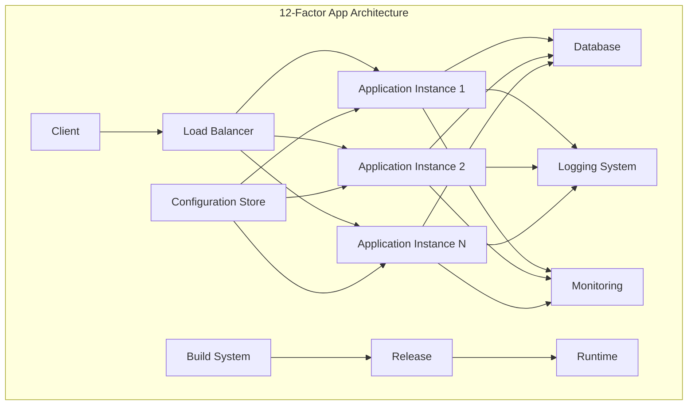


#### API 요청 흐름

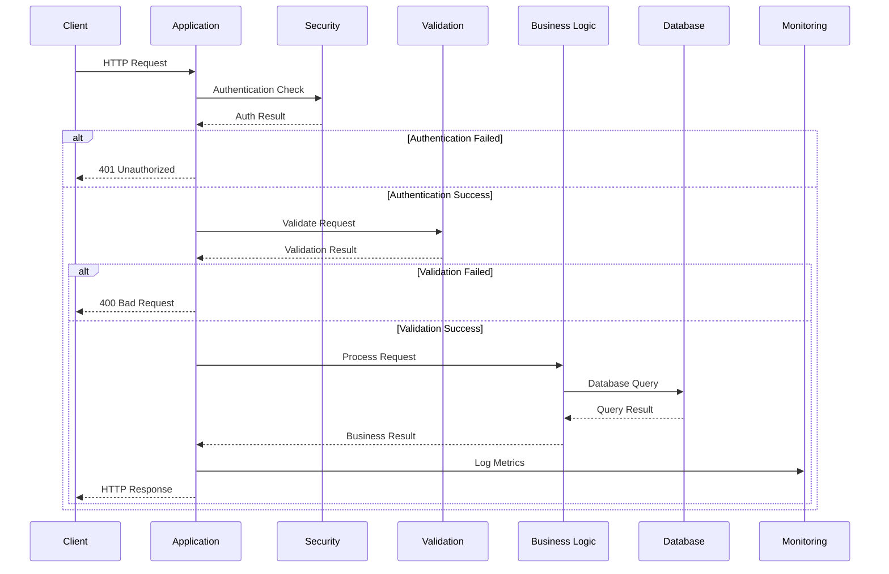


#### 실습 프로젝트 생성


##### 프로젝트 구조

```
src/
├── main/
│   ├── java/
│   │   └── com/example/twelvefactorapp/
│   │       ├── TwelveFactorAppApplication.java
│   │       ├── config/
│   │       │   ├── AppConfig.java
│   │       │   └── SecurityConfig.java
│   │       ├── controller/
│   │       │   └── ProductController.java
│   │       ├── entity/
│   │       │   └── Product.java
│   │       ├── repository/
│   │       │   └── ProductRepository.java
│   │       ├── service/
│   │       │   └── ProductService.java
│   │       └── admin/
│   │           └── AdminTaskRunner.java
│   └── resources/
│       ├── application.yml
│       ├── application-dev.yml
│       ├── application-prod.yml
│       └── data.sql
└── test/
    └── java/
        └── com/example/twelvefactorapp/
            └── TwelveFactorAppApplicationTests.java
```

#### 원칙별 구현 방안

##### 1. Codebase (코드베이스)

**원칙**: 하나의 코드베이스에서 여러 환경으로 배포합니다; 버전 관리 시스템(Git)에서 단일 저장소를 유지합니다; 각 환경은 동일한 코드베이스의 다른 버전을 실행합니다.

**구현**:

- Git 저장소 하나로 모든 환경 관리
- 브랜치 전략으로 개발/운영 환경 분리
- 환경별 설정만 다르게 적용


##### 2. Dependencies (의존성)

**원칙**: 모든 의존성을 명시적으로 선언합니다; 시스템 전체에 암묵적으로 존재하는 패키지에 의존하지 않습니다; 의존성 격리 도구를 사용합니다.

**구현**: Maven을 통한 의존성 관리

```xml
<?xml version="1.0" encoding="UTF-8"?>
<project xmlns="http://maven.apache.org/POM/4.0.0" 
         xmlns:xsi="http://www.w3.org/2001/XMLSchema-instance"
         xsi:schemaLocation="http://maven.apache.org/POM/4.0.0 
         https://maven.apache.org/xsd/maven-4.0.0.xsd">
    <modelVersion>4.0.0</modelVersion>
    
    <parent>
        <groupId>org.springframework.boot</groupId>
        <artifactId>spring-boot-starter-parent</artifactId>
        <version>3.2.0</version>
        <relativePath/>
    </parent>
    
    <groupId>com.example</groupId>
    <artifactId>twelve-factor-app</artifactId>
    <version>0.0.1-SNAPSHOT</version>
    <name>twelve-factor-app</name>
    <description>12-Factor App principles with Spring Boot 3.2</description>
    
    <properties>
        <java.version>17</java.version>
    </properties>
    
    <dependencies>
        <!-- Web Starter -->
        <dependency>
            <groupId>org.springframework.boot</groupId>
            <artifactId>spring-boot-starter-web</artifactId>
        </dependency>
        
        <!-- Actuator for Health Checks and Metrics -->
        <dependency>
            <groupId>org.springframework.boot</groupId>
            <artifactId>spring-boot-starter-actuator</artifactId>
        </dependency>
        
        <!-- JPA for Database -->
        <dependency>
            <groupId>org.springframework.boot</groupId>
            <artifactId>spring-boot-starter-data-jpa</artifactId>
        </dependency>
        
        <!-- H2 Database for Demo -->
        <dependency>
            <groupId>com.h2database</groupId>
            <artifactId>h2</artifactId>
            <scope>runtime</scope>
        </dependency>
        
        <!-- Security -->
        <dependency>
            <groupId>org.springframework.boot</groupId>
            <artifactId>spring-boot-starter-security</artifactId>
        </dependency>
        
        <!-- Validation -->
        <dependency>
            <groupId>org.springframework.boot</groupId>
            <artifactId>spring-boot-starter-validation</artifactId>
        </dependency>
        
        <!-- OpenAPI Documentation -->
        <dependency>
            <groupId>org.springdoc</groupId>
            <artifactId>springdoc-openapi-starter-webmvc-ui</artifactId>
            <version>2.2.0</version>
        </dependency>
        
        <!-- Micrometer for Metrics -->
        <dependency>
            <groupId>io.micrometer</groupId>
            <artifactId>micrometer-core</artifactId>
        </dependency>
        
        <dependency>
            <groupId>io.micrometer</groupId>
            <artifactId>micrometer-registry-prometheus</artifactId>
        </dependency>
        
        <!-- Test Dependencies -->
        <dependency>
            <groupId>org.springframework.boot</groupId>
            <artifactId>spring-boot-starter-test</artifactId>
            <scope>test</scope>
        </dependency>
        
        <dependency>
            <groupId>org.springframework.security</groupId>
            <artifactId>spring-security-test</artifactId>
            <scope>test</scope>
        </dependency>
        
        <!-- Auto Configuration -->
        <dependency>
        	<groupId>org.springframework.boot</groupId>
        	<artifactId>spring-boot-configuration-processor</artifactId>
        	<optional>true</optional>
        </dependency        
    </dependencies>
    
    <build>
        <plugins>
            <plugin>
                <groupId>org.springframework.boot</groupId>
                <artifactId>spring-boot-maven-plugin</artifactId>
                <configuration>
                    <excludes>
                        <exclude>
                            <groupId>org.projectlombok</groupId>
                            <artifactId>lombok</artifactId>
                        </exclude>
                    </excludes>
                </configuration>
            </plugin>
        </plugins>
    </build>
</project>
```

어노테이션을 통한 명시적 선언

```java
// TwelveFactorAppApplication.java
package com.example.twelvefactorapp;

import org.springframework.boot.SpringApplication;
import org.springframework.boot.autoconfigure.SpringBootApplication;
import org.springframework.scheduling.annotation.EnableAsync;

@SpringBootApplication
@EnableAsync
public class TwelveFactorAppApplication {
    public static void main(String[] args) {
        SpringApplication.run(TwelveFactorAppApplication.class, args);
    }
}
```


##### 3. Config (설정)

**원칙**: 환경에 따라 달라지는 설정을 환경 변수에 저장합니다; 코드와 설정을 엄격히 분리합니다; 설정은 배포된 환경에서 변경 가능해야 합니다.

```yaml
## application.yml (기본 설정)
spring:
  application:
    name: twelve-factor-app
  profiles:
    active: ${SPRING_PROFILES_ACTIVE:dev}
  
server:
  port: ${SERVER_PORT:8080}

management:
  endpoints:
    web:
      exposure:
        include: health,info,metrics,prometheus
  endpoint:
    health:
      show-details: always

logging:
  level:
    com.example: ${LOG_LEVEL:INFO}
```

```yaml
## application-dev.yml (개발 환경)
spring:
  datasource:
    url: jdbc:h2:mem:devdb
    driverClassName: org.h2.Driver
    username: sa
    password: 
  h2:
    console:
      enabled: true
  jpa:
    show-sql: true
    hibernate:
      ddl-auto: create-drop

app:
  config:
    max-connections: 10
    timeout-seconds: 30
```

```yaml
## application-prod.yml (운영 환경)
spring:
  datasource:
    url: ${DATABASE_URL}
    username: ${DATABASE_USERNAME}
    password: ${DATABASE_PASSWORD}
  jpa:
    show-sql: false
    hibernate:
      ddl-auto: validate

app:
  config:
    max-connections: ${MAX_CONNECTIONS:50}
    timeout-seconds: ${TIMEOUT_SECONDS:60}
```

```java
// AppConfig.java
package com.example.twelvefactorapp.config;

import org.springframework.boot.context.properties.ConfigurationProperties;
import org.springframework.context.annotation.Configuration;

@Configuration
@ConfigurationProperties(prefix = "app.config")
public class AppConfig {
    private int maxConnections;
    private int timeoutSeconds;
    
    // Getters and Setters
    public int getMaxConnections() {
        return maxConnections;
    }
    
    public void setMaxConnections(int maxConnections) {
        this.maxConnections = maxConnections;
    }
    
    public int getTimeoutSeconds() {
        return timeoutSeconds;
    }
    
    public void setTimeoutSeconds(int timeoutSeconds) {
        this.timeoutSeconds = timeoutSeconds;
    }
}
```


##### 4. Backing Services (백엔드 서비스)

**원칙**: 백엔드 서비스를 연결된 리소스로 취급합니다; 로컬 서비스와 서드파티 서비스를 구분하지 않습니다; 설정 변경만으로 백엔드 서비스를 교체할 수 있어야 합니다.

```java
// Product.java
package com.example.twelvefactorapp.entity;

import jakarta.persistence.*;
import jakarta.validation.constraints.NotBlank;
import jakarta.validation.constraints.PositiveOrZero;
import java.time.LocalDateTime;

@Entity
@Table(name = "products")
public class Product {
    @Id
    @GeneratedValue(strategy = GenerationType.IDENTITY)
    private Long id;
    
    @NotBlank
    @Column(nullable = false)
    private String name;
    
    @Column(length = 1000)
    private String description;
    
    @PositiveOrZero
    @Column(nullable = false)
    private Double price;
    
    @Column(name = "created_at")
    private LocalDateTime createdAt;
    
    @PrePersist
    protected void onCreate() {
        createdAt = LocalDateTime.now();
    }
    
    // Constructors
    public Product() {}
    
    public Product(String name, String description, Double price) {
        this.name = name;
        this.description = description;
        this.price = price;
    }
    
    // Getters and Setters
    public Long getId() { return id; }
    public void setId(Long id) { this.id = id; }
    
    public String getName() { return name; }
    public void setName(String name) { this.name = name; }
    
    public String getDescription() { return description; }
    public void setDescription(String description) { this.description = description; }
    
    public Double getPrice() { return price; }
    public void setPrice(Double price) { this.price = price; }
    
    public LocalDateTime getCreatedAt() { return createdAt; }
    public void setCreatedAt(LocalDateTime createdAt) { this.createdAt = createdAt; }
}
```

```java
// ProductRepository.java
package com.example.twelvefactorapp.repository;

import com.example.twelvefactorapp.entity.Product;
import org.springframework.data.jpa.repository.JpaRepository;
import org.springframework.data.jpa.repository.Query;
import org.springframework.stereotype.Repository;

import java.util.List;

@Repository
public interface ProductRepository extends JpaRepository<Product, Long> {
    List<Product> findByNameContainingIgnoreCase(String name);
    
    @Query("SELECT p FROM Product p WHERE p.price BETWEEN :minPrice AND :maxPrice")
    List<Product> findByPriceRange(Double minPrice, Double maxPrice);
}
```


##### 5. Build, Release, Run (빌드, 릴리스, 실행)

**원칙**: 빌드, 릴리스, 실행 단계를 엄격히 분리합니다; 각 릴리스는 고유한 식별자를 가져야 합니다; 실행 환경에서는 코드 변경이 불가능해야 합니다.

**구현**: Maven Build Lifecycle 활용

```bash
## 빌드 단계
mvn clean compile

## 패키징 단계
mvn package

## 실행 단계
java -jar target/twelve-factor-app-0.0.1-SNAPSHOT.jar
```


##### 6. Processes (프로세스)

**원칙**: 애플리케이션을 무상태 프로세스로 실행합니다; 세션 상태를 외부 저장소에 보관합니다; 메모리나 파일 시스템을 캐시로만 사용합니다.

```java
// ProductService.java
package com.example.twelvefactorapp.service;

import com.example.twelvefactorapp.entity.Product;
import com.example.twelvefactorapp.repository.ProductRepository;
import org.slf4j.Logger;
import org.slf4j.LoggerFactory;
import org.springframework.beans.factory.annotation.Autowired;
import org.springframework.scheduling.annotation.Async;
import org.springframework.stereotype.Service;
import org.springframework.transaction.annotation.Transactional;

import java.util.List;
import java.util.Optional;
import java.util.concurrent.CompletableFuture;

@Service
@Transactional
public class ProductService {
    private static final Logger logger = LoggerFactory.getLogger(ProductService.class);
    
    @Autowired
    private ProductRepository productRepository;
    
    public List<Product> getAllProducts() {
        logger.info("Fetching all products");
        return productRepository.findAll();
    }
    
    public Optional<Product> getProductById(Long id) {
        logger.info("Fetching product by id: {}", id);
        return productRepository.findById(id);
    }
    
    public Product createProduct(Product product) {
        logger.info("Creating new product: {}", product.getName());
        return productRepository.save(product);
    }
    
    public Product updateProduct(Long id, Product product) {
        logger.info("Updating product: {}", id);
        product.setId(id);
        return productRepository.save(product);
    }
    
    public void deleteProduct(Long id) {
        logger.info("Deleting product: {}", id);
        productRepository.deleteById(id);
    }
    
    @Async
    public CompletableFuture<List<Product>> searchProductsAsync(String name) {
        logger.info("Async search for products with name: {}", name);
        List<Product> products = productRepository.findByNameContainingIgnoreCase(name);
        return CompletableFuture.completedFuture(products);
    }
}
```


##### 7. Port Binding (포트 바인딩)

**원칙**: 포트 바인딩을 통해 서비스를 공개합니다; 애플리케이션이 완전히 독립적이어야 합니다; 웹서버 라이브러리를 애플리케이션에 내장합니다.

**구현**: Spring Boot Embedded Tomcat 사용 (설정은 application.yml의 server.port)

##### 8. Concurrency (동시성)

**원칙**: 프로세스 모델을 통해 확장합니다; 다양한 워크로드를 다양한 프로세스 타입에 할당합니다; 프로세스는 스스로 복제되지 않아야 합니다.

**구현**: @Async를 통한 비동기 처리 (위의 ProductService.searchProductsAsync 참조)

##### 9. Disposability (폐기 가능성)

**원칙**: 빠른 시작과 graceful shutdown을 지원합니다; 프로세스는 SIGTERM 신호를 받으면 gracefully 종료되어야 합니다; 견고성을 위해 갑작스러운 종료도 처리할 수 있어야 합니다.

```java
// Component for graceful shutdown
package com.example.twelvefactorapp.config;

import org.slf4j.Logger;
import org.slf4j.LoggerFactory;
import org.springframework.stereotype.Component;

import jakarta.annotation.PreDestroy;

@Component
public class GracefulShutdown {
    private static final Logger logger = LoggerFactory.getLogger(GracefulShutdown.class);
    
    @PreDestroy
    public void onDestroy() {
        logger.info("Application is shutting down gracefully...");
        // Clean up resources, close connections, etc.
    }
}
```


##### 10. Dev/Prod Parity (개발/운영 일치)

**원칙**: 개발, 스테이징, 운영 환경을 최대한 유사하게 유지합니다; 시간 차이, 담당자 차이, 도구 차이를 최소화합니다.

**구현**: Profile별 설정으로 환경 차이 최소화 (위의 application-dev.yml, application-prod.yml 참조)

##### 11. Logs (로그)

**원칙**: 로그를 이벤트 스트림으로 취급합니다; 애플리케이션은 로그 파일을 직접 관리하지 않습니다; 실행 환경이 로그 스트림을 수집하고 처리합니다.

**구현**: SLF4J + Logback 사용 (위의 서비스 클래스에서 logger 사용 참조)

##### 12. Admin Processes (관리 프로세스)

**원칙**: 관리 작업을 일회성 프로세스로 실행합니다; 관리 프로세스는 애플리케이션과 동일한 환경에서 실행됩니다; 관리 코드도 애플리케이션 코드와 함께 버전 관리됩니다.

```java
// AdminTaskRunner.java
package com.example.twelvefactorapp.admin;

import com.example.twelvefactorapp.entity.Product;
import com.example.twelvefactorapp.repository.ProductRepository;
import org.slf4j.Logger;
import org.slf4j.LoggerFactory;
import org.springframework.beans.factory.annotation.Autowired;
import org.springframework.boot.CommandLineRunner;
import org.springframework.stereotype.Component;

@Component
public class AdminTaskRunner implements CommandLineRunner {
    private static final Logger logger = LoggerFactory.getLogger(AdminTaskRunner.class);
    
    @Autowired
    private ProductRepository productRepository;
    
    @Override
    public void run(String... args) throws Exception {
        // 초기 데이터 설정 등의 관리 작업
        if (args.length > 0 && "init-data".equals(args[0])) {
            logger.info("Initializing sample data...");
            initializeSampleData();
        }
    }
    
    private void initializeSampleData() {
        if (productRepository.count() == 0) {
            productRepository.save(new Product("Laptop", "High-performance laptop", 1500.00));
            productRepository.save(new Product("Mouse", "Wireless optical mouse", 25.00));
            productRepository.save(new Product("Keyboard", "Mechanical keyboard", 120.00));
            logger.info("Sample data initialized successfully");
        }
    }
}
```


##### 13. API First (API 우선)

**원칙**: API를 먼저 설계하고 개발합니다; 문서화된 API 스펙을 기반으로 개발합니다; API 버전 관리를 통해 하위 호환성을 보장합니다.

```java
// ProductController.java
package com.example.twelvefactorapp.controller;

import com.example.twelvefactorapp.entity.Product;
import com.example.twelvefactorapp.service.ProductService;
import io.swagger.v3.oas.annotations.Operation;
import io.swagger.v3.oas.annotations.tags.Tag;
import jakarta.validation.Valid;
import org.springframework.beans.factory.annotation.Autowired;
import org.springframework.http.HttpStatus;
import org.springframework.http.ResponseEntity;
import org.springframework.web.bind.annotation.*;

import java.util.List;
import java.util.Optional;
import java.util.concurrent.CompletableFuture;

@RestController
@RequestMapping("/api/v1/products")
@Tag(name = "Product", description = "Product management API")
public class ProductController {
    
    @Autowired
    private ProductService productService;
    
    @GetMapping
    @Operation(summary = "Get all products", description = "Retrieve a list of all products")
    public ResponseEntity<List<Product>> getAllProducts() {
        List<Product> products = productService.getAllProducts();
        return ResponseEntity.ok(products);
    }
    
    @GetMapping("/{id}")
    @Operation(summary = "Get product by ID", description = "Retrieve a specific product by its ID")
    public ResponseEntity<Product> getProductById(@PathVariable Long id) {
        Optional<Product> product = productService.getProductById(id);
        return product.map(ResponseEntity::ok)
                     .orElse(ResponseEntity.notFound().build());
    }
    
    @PostMapping
    @Operation(summary = "Create new product", description = "Create a new product")
    public ResponseEntity<Product> createProduct(@Valid @RequestBody Product product) {
        Product createdProduct = productService.createProduct(product);
        return ResponseEntity.status(HttpStatus.CREATED).body(createdProduct);
    }
    
    @PutMapping("/{id}")
    @Operation(summary = "Update product", description = "Update an existing product")
    public ResponseEntity<Product> updateProduct(@PathVariable Long id, 
                                               @Valid @RequestBody Product product) {
        Product updatedProduct = productService.updateProduct(id, product);
        return ResponseEntity.ok(updatedProduct);
    }
    
    @DeleteMapping("/{id}")
    @Operation(summary = "Delete product", description = "Delete a product by its ID")
    public ResponseEntity<Void> deleteProduct(@PathVariable Long id) {
        productService.deleteProduct(id);
        return ResponseEntity.noContent().build();
    }
    
    @GetMapping("/search")
    @Operation(summary = "Search products", description = "Search products by name asynchronously")
    public CompletableFuture<ResponseEntity<List<Product>>> searchProducts(@RequestParam String name) {
        return productService.searchProductsAsync(name)
                           .thenApply(ResponseEntity::ok);
    }
}
```


##### 14. Telemetry (원격 측정)

**원칙**: 애플리케이션 모니터링과 관찰 가능성을 확보합니다; 메트릭, 헬스 체크, 분산 추적을 제공합니다; 실시간 모니터링 대시보드를 구성합니다.

**구현**: Spring Boot Actuator + Micrometer (pom.xml의 의존성과 application.yml의 management 설정 참조)

##### 15. Authentication \& Authorization (인증과 인가)

**원칙**: 보안을 처음부터 고려합니다; 인증과 인가 메커니즘을 구현합니다; API 보안을 위한 토큰 기반 인증을 사용합니다.

```java
// SecurityConfig.java
package com.example.twelvefactorapp.config;

import org.springframework.context.annotation.Bean;
import org.springframework.context.annotation.Configuration;
import org.springframework.security.config.annotation.web.builders.HttpSecurity;
import org.springframework.security.config.annotation.web.configuration.EnableWebSecurity;
import org.springframework.security.core.userdetails.User;
import org.springframework.security.core.userdetails.UserDetails;
import org.springframework.security.core.userdetails.UserDetailsService;
import org.springframework.security.crypto.bcrypt.BCryptPasswordEncoder;
import org.springframework.security.crypto.password.PasswordEncoder;
import org.springframework.security.provisioning.InMemoryUserDetailsManager;
import org.springframework.security.web.SecurityFilterChain;

@Configuration
@EnableWebSecurity
public class SecurityConfig {
    
    @Bean
    public SecurityFilterChain filterChain(HttpSecurity http) throws Exception {
        http
            .authorizeHttpRequests(authz -> authz
                .requestMatchers("/actuator/**", "/swagger-ui/**", "/v3/api-docs/**").permitAll()
                .requestMatchers("/h2-console/**").permitAll()
                .anyRequest().authenticated()
            )
            .httpBasic(basic -> basic.realmName("12-Factor App"))
            .csrf(csrf -> csrf.disable())
            .headers(headers -> headers.frameOptions().sameOrigin());
        
        return http.build();
    }
    
    @Bean
    public UserDetailsService userDetailsService() {
        UserDetails user = User.builder()
            .username("admin")
            .password(passwordEncoder().encode("admin123"))
            .roles("ADMIN")
            .build();
        
        return new InMemoryUserDetailsManager(user);
    }
    
    @Bean
    public PasswordEncoder passwordEncoder() {
        return new BCryptPasswordEncoder();
    }
}
```


#### 애플리케이션 실행 방법

1. **개발 환경 실행**

```bash
## 프로젝트 빌드
mvn clean package

## 개발 프로필로 실행
java -jar -Dspring.profiles.active=dev target/twelve-factor-app-0.0.1-SNAPSHOT.jar

## 또는 Maven으로 직접 실행
mvn spring-boot:run -Dspring-boot.run.profiles=dev
```

2. **운영 환경 실행**

```bash
## 환경 변수 설정
export SPRING_PROFILES_ACTIVE=prod
export DATABASE_URL=jdbc:postgresql://localhost:5432/proddb
export DATABASE_USERNAME=produser
export DATABASE_PASSWORD=prodpass
export SERVER_PORT=8080

## 애플리케이션 실행
java -jar target/twelve-factor-app-0.0.1-SNAPSHOT.jar
```

3. **관리 작업 실행**

```bash
## 초기 데이터 설정
java -jar target/twelve-factor-app-0.0.1-SNAPSHOT.jar init-data
```


#### API 테스트

```bash
## 인증 정보: admin/admin123

## 모든 상품 조회
curl -u admin:admin123 http://localhost:8080/api/v1/products

## 상품 생성
curl -u admin:admin123 -X POST http://localhost:8080/api/v1/products \
  -H "Content-Type: application/json" \
  -d '{"name":"Tablet","description":"10-inch tablet","price":300.00}'

## 상품 검색
curl -u admin:admin123 "http://localhost:8080/api/v1/products/search?name=laptop"

## 헬스 체크
curl http://localhost:8080/actuator/health

## 메트릭 확인
curl http://localhost:8080/actuator/metrics

## API 문서 확인
## http://localhost:8080/swagger-ui/index.html
```


#### 모니터링 엔드포인트

| 엔드포인트   | 설명                   | URL                    |
| :----------- | :--------------------- | :--------------------- |
| Health Check | 애플리케이션 상태 확인 | /actuator/health       |
| Metrics      | 애플리케이션 메트릭    | /actuator/metrics      |
| Info         | 애플리케이션 정보      | /actuator/info         |
| Prometheus   | Prometheus 메트릭      | /actuator/prometheus   |
| API Docs     | OpenAPI 문서           | /swagger-ui/index.html |


### 2.3 Hexagonal 아키텍처

#### 2.3.1 Hexagonal 아키텍처 개념

Hexagonal 아키텍처(육각형 아키텍처)는 Alistair Cockburn이 제안한 아키텍처 패턴으로, Ports and Adapters 패턴이라고도 불립니다.
비즈니스 로직을 외부 세계로부터 완전히 격리하여 테스트 가능하고 유연한 시스템을 구축하는 것이 목표입니다.
클라우드 네이티브 환경에서 마이크로서비스의 독립성과 테스트 용이성을 보장하는 핵심 아키텍처 패턴입니다.

| 구성 요소               | 역할                     | 위치              | 예시                                             |
| :---------------------- | :----------------------- | :---------------- | :----------------------------------------------- |
| **Domain (Core)**       | 비즈니스 로직과 규칙     | 중앙              | Entity, Value Object, Domain Service             |
| **Port**                | 외부와의 통신 인터페이스 | 경계              | Repository Interface, Service Interface          |
| **Adapter**             | Port의 구체적 구현       | 외부              | JPA Repository, REST Controller, Message Handler |
| **Application Service** | 도메인 오케스트레이션    | 애플리케이션 계층 | Use Case 구현체                                  |

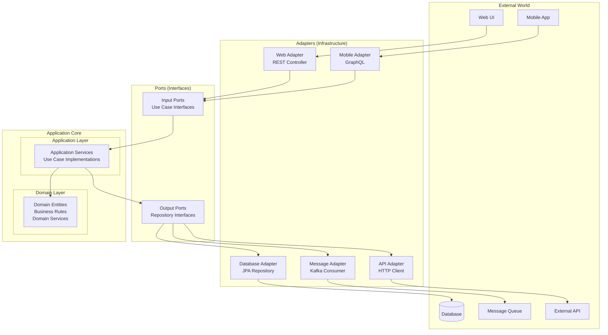


#### 2.3.2 Hexagonal 아키텍처 구현

##### 프로젝트 구조

```
src/
├── main/
│   └── java/
│       └── com/example/ecommerce/
│           ├── domain/                    # 도메인 계층
│           │   ├── model/                # 도메인 모델
│           │   │   ├── Order.java
│           │   │   ├── Customer.java
│           │   │   └── Product.java
│           │   ├── service/              # 도메인 서비스
│           │   │   └── OrderDomainService.java
│           │   └── exception/            # 도메인 예외
│           │       └── OrderNotFoundException.java
│           │
│           ├── application/               # 애플리케이션 계층
│           │   ├── port/                 # 포트 (인터페이스)
│           │   │   ├── in/              # 입력 포트
│           │   │   │   ├── CreateOrderUseCase.java
│           │   │   │   └── GetOrderUseCase.java
│           │   │   └── out/             # 출력 포트
│           │   │       ├── OrderRepository.java
│           │   │       ├── PaymentService.java
│           │   │       └── NotificationService.java
│           │   └── service/              # 애플리케이션 서비스
│           │       └── OrderApplicationService.java
│           │
│           └── infrastructure/            # 인프라스트럭처 계층
│               ├── adapter/              # 어댑터
│               │   ├── in/              # 입력 어댑터
│               │   │   ├── web/         # 웹 어댑터
│               │   │   │   └── OrderController.java
│               │   │   └── messaging/   # 메시징 어댑터
│               │   │       └── OrderEventHandler.java
│               │   └── out/             # 출력 어댑터
│               │       ├── persistence/ # 영속성 어댑터
│               │       │   ├── OrderJpaRepository.java
│               │       │   └── OrderRepositoryImpl.java
│               │       └── external/    # 외부 서비스 어댑터
│               │           ├── PaymentServiceImpl.java
│               │           └── NotificationServiceImpl.java
│               └── config/               # 설정
│                   └── ApplicationConfig.java
```

##### 어플리케이션 설계

- 코어(도메인·유스케이스)는 인터페이스(포트)로 외부를 정의하고, 기술 세부는 어댑터가 구현하여 교체 가능성을 높이는 **방향성**을 유지한다.
- 입력 어댑터는 입력 포트를 호출하고, 출력 어댑터는 출력 포트를 구현하여 코어가 프레임워크·DB에 독립적이 되도록 한다.

###### 실행/환경 파일

- pom.xml: Spring Boot 3.x + Java 17, web/data-jpa/validation, H2(runtime) 의존성을 선언하며 Spring Boot Maven Plugin으로 실행/패키징을 구성한다.
- application.yml: H2 인메모리 데이터베이스, JPA ddl-auto(update), SQL 로깅, 포트(8080), 로깅 레벨 등을 설정한다.

###### 애플리케이션 부트스트랩

- infrastructure/config/ApplicationConfig.java: SpringBootApplication 엔트리 포인트이며, 애플리케이션 기동과 Bean(Clock) 등록을 담당한다.
- scanBasePackages로 전체 패키지를 스캔하여 포트/어댑터 빈을 자동 구성한다.

###### 도메인 모델

- domain/model/Order.java: 주문 애그리게이트로 상태(OrderStatus), 총액, 생성시각, 라인아이템을 보유하며 recalculateTotal, addLine, markPaid, cancel 등 **행위**를 제공한다.
- Order.OrderLine(Embeddable): productId, productName, unitPrice, quantity로 구성되며 lineTotal로 금액을 계산한다.
- domain/model/Customer.java: 단순 고객 엔티티로 id, 이름, 이메일을 가진다.
- domain/model/Product.java: 단순 상품 엔티티로 id, 이름, 가격을 가진다.

###### 도메인 예외

- domain/exception/OrderNotFoundException.java: 주문 조회 시 존재하지 않으면 발생하는 런타임 예외로, 애플리케이션 서비스와 컨트롤러 예외 매핑에 사용된다.

###### 도메인 서비스

- domain/service/OrderDomainService.java: 주문의 불변 규칙과 계산 로직을 응집(수량 > 0, 단가 >= 0, 라인 필수, 고객 필수)하며 recalcTotal로 합계 재계산을 명시한다.
- 엔티티 행위 외 비즈니스 규칙을 명시적으로 분리하여 테스트 용이성과 규칙 재사용성을 높인다.

###### 입력 포트(Use Case)

- application/port/in/CreateOrderUseCase.java: 주문 생성 유스케이스 인터페이스로 CreateOrderCommand, Item 레코드로 입력 모델을 명확히 정의한다.
- application/port/in/GetOrderUseCase.java: 단건 주문 조회 유스케이스로 식별자 기반 조회 계약을 제공한다.

###### 출력 포트

- application/port/out/OrderRepository.java: 주문 저장/조회 계약으로 코어가 영속 기술에 의존하지 않도록 한다.
- application/port/out/PaymentService.java: 결제 처리 계약과 결과(PaymentResult)를 정의하여 외부 결제 연동을 추상화한다.
- application/port/out/NotificationService.java: 주문 생성/결제 알림 전송 계약을 정의한다.

###### 애플리케이션 서비스

- application/service/OrderApplicationService.java: 입력 포트 구현체로 트랜잭션 경계를 관리하며, 도메인 서비스 검증 → 저장 → 알림 → 결제 → 상태 변경 → 재저장 → 알림의 오케스트레이션을 담당한다.
- 출력 포트(OrderRepository, PaymentService, NotificationService)에만 의존하여 의존성 방향을 코어 중심으로 유지한다.

###### 입력 어댑터(웹)

- infrastructure/adapter/in/web/OrderController.java: REST API를 통해 CreateOrderUseCase, GetOrderUseCase를 호출하는 얇은 컨트롤러다.
- POST /api/orders: CreateOrderRequest DTO를 검증(Bean Validation) 후 주문 생성, 생성된 주문을 OrderResponse로 반환한다.
- GET /api/orders/{id}: 주문을 조회하여 OrderResponse로 반환하며, OrderNotFoundException을 404로 매핑한다.

###### 입력 어댑터(메시징)

- infrastructure/adapter/in/messaging/OrderEventHandler.java: 데모용 이벤트 리스너로 OrderCreatedEvent 수신 시 로그를 남긴다.
- 실제 운영에서는 ApplicationEventPublisher 또는 메시지 브로커 연계를 추가해 비동기 처리로 확장한다.

###### 출력 어댑터(영속)

- infrastructure/adapter/out/persistence/OrderJpaRepository.java: Spring Data JPA 리포지터리로 기본 CRUD를 제공한다.
- infrastructure/adapter/out/persistence/OrderRepositoryImpl.java: 출력 포트(OrderRepository) 구현체로 코어의 저장/조회 요청을 JPA로 위임한다.

###### 출력 어댑터(외부 서비스)

- infrastructure/adapter/out/external/PaymentServiceImpl.java: PaymentService 구현체로 실제 결제 연동을 추상화하며 데모에서는 승인 후 트랜잭션 ID를 생성한다.
- infrastructure/adapter/out/external/NotificationServiceImpl.java: NotificationService 구현체로 주문 생성/결제 알림을 전송하며 데모에서는 로그로 대체한다.

###### 데이터 유효성/DTO 설계

- CreateOrderRequest, OrderItem에 @NotNull, @NotBlank, @Min 등을 부여하여 입력 계층에서 조기 검증을 수행한다.
- API 응답은 OrderResponse로 캡슐화하여 도메인 모델을 직접 노출하지 않고 표현 모델을 분리한다.

###### 트랜잭션·일관성

- 주문 생성 유스케이스는 @Transactional로 원자성을 부여하며, 결제 성공 시 상태를 PAID로 전이하고 재저장하여 일관성을 유지한다.
- 조회 유스케이스는 readOnly 트랜잭션으로 불필요한 쓰기 지연과 더티 체킹을 방지한다.

###### 오류 처리

- OrderNotFoundException은 컨트롤러에서 @ExceptionHandler로 404 응답과 에러 메시지를 생성한다.

- 입력 검증 실패는 Spring Validation에 의해 400(Bad Request)로 처리되며, 필요 시 글로벌 예외 처리기로 규격화할 수 있다.

  

##### 소스코드

```xml
<!-- pom.xml -->
<project xmlns="http://maven.apache.org/POM/4.0.0"
         xmlns:xsi="http://www.w3.org/2001/XMLSchema-instance"
         xsi:schemaLocation="http://maven.apache.org/POM/4.0.0 https://maven.apache.org/xsd/maven-4.0.0.xsd">
  <modelVersion>4.0.0</modelVersion>

  <groupId>com.example</groupId>
  <artifactId>ecommerce-hexagonal</artifactId>
  <version>0.0.1-SNAPSHOT</version>
  <name>ecommerce-hexagonal</name>
  <description>Hexagonal Architecture Example</description>

  <properties>
    <java.version>17</java.version>
    <spring-boot.version>3.3.4</spring-boot.version>
  </properties>

  <parent>
    <groupId>org.springframework.boot</groupId>
    <artifactId>spring-boot-starter-parent</artifactId>
    <version>${spring-boot.version}</version>
    <relativePath/>
  </parent>

  <dependencies>
    <!-- Web (입력 어댑터) -->
    <dependency>
      <groupId>org.springframework.boot</groupId>
      <artifactId>spring-boot-starter-web</artifactId>
    </dependency>

    <!-- JPA (영속 어댑터) -->
    <dependency>
      <groupId>org.springframework.boot</groupId>
      <artifactId>spring-boot-starter-data-jpa</artifactId>
    </dependency>

    <!-- Validation -->
    <dependency>
      <groupId>org.springframework.boot</groupId>
      <artifactId>spring-boot-starter-validation</artifactId>
    </dependency>

    <!-- In-memory DB for demo -->
    <dependency>
      <groupId>com.h2database</groupId>
      <artifactId>h2</artifactId>
      <scope>runtime</scope>
    </dependency>

    <!-- Test -->
    <dependency>
      <groupId>org.springframework.boot</groupId>
      <artifactId>spring-boot-starter-test</artifactId>
      <scope>test</scope>
    </dependency>
    
  </dependencies>

  <build>
    <plugins>
      <!-- Spring Boot Maven Plugin -->
      <plugin>
        <groupId>org.springframework.boot</groupId>
        <artifactId>spring-boot-maven-plugin</artifactId>
      </plugin>
    </plugins>
  </build>
</project>
```

```yaml
# src/main/resources/application.yml
spring:
  datasource:
    url: jdbc:h2:mem:ecommerce;MODE=LEGACY;DB_CLOSE_DELAY=-1;DB_CLOSE_ON_EXIT=FALSE
    driver-class-name: org.h2.Driver
    username: sa
    password:
  jpa:
    hibernate:
      ddl-auto: update
    show-sql: true
  h2:
    console:
      enabled: true

server:
  port: 8080

logging:
  level:
    com.example.ecommerce: DEBUG
```

```java
// src/main/java/com/example/ecommerce/infrastructure/config/ApplicationConfig.java
// src/main/java/com/example/ecommerce/infrastructure/config/ApplicationConfig.java
package com.example.ecommerce.infrastructure.config;

import java.time.Clock;

import org.springframework.boot.SpringApplication;
import org.springframework.boot.autoconfigure.SpringBootApplication;
import org.springframework.boot.autoconfigure.domain.EntityScan;
import org.springframework.context.annotation.Bean;
import org.springframework.data.jpa.repository.config.EnableJpaRepositories;

@SpringBootApplication(scanBasePackages = "com.example.ecommerce")
@EnableJpaRepositories(basePackages = "com.example.ecommerce")
@EntityScan(basePackages = "com.example.ecommerce")
public class ApplicationConfig {

    public static void main(String[] args) {
        SpringApplication.run(ApplicationConfig.class, args);
    }

    @Bean
    public Clock clock() {
        return Clock.systemDefaultZone();
    }
}

```

```java
// src/main/java/com/example/ecommerce/domain/model/Order.java
package com.example.ecommerce.domain.model;

import jakarta.persistence.*;
import java.math.BigDecimal;
import java.time.LocalDateTime;
import java.util.ArrayList;
import java.util.List;

@Entity
@Table(name = "orders")
public class Order {

    public enum OrderStatus { CREATED, PAID, CANCELLED }

    @Id
    @GeneratedValue(strategy = GenerationType.IDENTITY)
    private Long id;

    // 단순화를 위해 연관 대신 FK 보유
    @Column(name = "customer_id", nullable = false)
    private Long customerId;

    @ElementCollection(fetch = FetchType.EAGER)
    @CollectionTable(name = "order_lines", joinColumns = @JoinColumn(name = "order_id"))
    private List<OrderLine> lines = new ArrayList<>();

    @Column(name = "total_price", precision = 18, scale = 2, nullable = false)
    private BigDecimal totalPrice = BigDecimal.ZERO;

    @Enumerated(EnumType.STRING)
    @Column(nullable = false)
    private OrderStatus status = OrderStatus.CREATED;

    @Column(nullable = false)
    private LocalDateTime createdAt = LocalDateTime.now();

    public Order() {
    }

    public Order(Long customerId, List<OrderLine> lines) {
        this.customerId = customerId;
        this.lines = lines != null ? lines : new ArrayList<>();
        recalculateTotal();
    }

    public void recalculateTotal() {
        this.totalPrice = this.lines.stream()
                .map(OrderLine::lineTotal)
                .reduce(BigDecimal.ZERO, BigDecimal::add);
    }

    public void addLine(OrderLine line) {
        this.lines.add(line);
        recalculateTotal();
    }

    public void markPaid() {
        this.status = OrderStatus.PAID;
    }

    public void cancel() {
        this.status = OrderStatus.CANCELLED;
    }

    // getters
    public Long getId() { return id; }
    public Long getCustomerId() { return customerId; }
    public List<OrderLine> getLines() { return lines; }
    public BigDecimal getTotalPrice() { return totalPrice; }
    public OrderStatus getStatus() { return status; }
    public LocalDateTime getCreatedAt() { return createdAt; }

    // setters (if needed)
    public void setCustomerId(Long customerId) { this.customerId = customerId; }
    public void setLines(List<OrderLine> lines) { this.lines = lines; recalculateTotal(); }
    public void setStatus(OrderStatus status) { this.status = status; }

    @Embeddable
    public static class OrderLine {
        @Column(name = "product_id", nullable = false)
        private Long productId;

        @Column(name = "product_name", nullable = false)
        private String productName;

        @Column(name = "unit_price", precision = 18, scale = 2, nullable = false)
        private BigDecimal unitPrice;

        @Column(name = "quantity", nullable = false)
        private int quantity;

        public OrderLine() {}

        public OrderLine(Long productId, String productName, BigDecimal unitPrice, int quantity) {
            this.productId = productId;
            this.productName = productName;
            this.unitPrice = unitPrice;
            this.quantity = quantity;
        }

        public BigDecimal lineTotal() {
            return unitPrice.multiply(BigDecimal.valueOf(quantity));
        }

        public Long getProductId() { return productId; }
        public String getProductName() { return productName; }
        public BigDecimal getUnitPrice() { return unitPrice; }
        public int getQuantity() { return quantity; }
    }
}
```

```java
// src/main/java/com/example/ecommerce/domain/model/Customer.java
package com.example.ecommerce.domain.model;

import jakarta.persistence.*;

@Entity
@Table(name = "customers")
public class Customer {

    @Id @GeneratedValue(strategy = GenerationType.IDENTITY)
    private Long id;

    @Column(nullable=false)
    private String name;

    @Column(nullable=false, unique = true)
    private String email;

    public Customer() {}

    public Customer(String name, String email) {
        this.name = name;
        this.email = email;
    }

    public Long getId() { return id; }
    public String getName(){ return name; }
    public String getEmail(){ return email; }
    public void setName(String name){ this.name = name; }
    public void setEmail(String email){ this.email = email; }
}
```

```java
// src/main/java/com/example/ecommerce/domain/model/Product.java
package com.example.ecommerce.domain.model;

import jakarta.persistence.*;
import java.math.BigDecimal;

@Entity
@Table(name = "products")
public class Product {

    @Id @GeneratedValue(strategy = GenerationType.IDENTITY)
    private Long id;

    @Column(nullable=false)
    private String name;

    @Column(precision = 18, scale = 2, nullable=false)
    private BigDecimal price;

    public Product() {}
    public Product(String name, BigDecimal price){
        this.name = name;
        this.price = price;
    }

    public Long getId(){ return id; }
    public String getName(){ return name; }
    public BigDecimal getPrice(){ return price; }
    public void setName(String name){ this.name = name; }
    public void setPrice(BigDecimal price){ this.price = price; }
}
```

```java
// src/main/java/com/example/ecommerce/domain/exception/OrderNotFoundException.java
package com.example.ecommerce.domain.exception;

public class OrderNotFoundException extends RuntimeException {
    public OrderNotFoundException(Long id) {
        super("Order not found: " + id);
    }
}
```

```java
// src/main/java/com/example/ecommerce/domain/service/OrderDomainService.java
package com.example.ecommerce.domain.service;

import com.example.ecommerce.domain.model.Order;

import java.math.BigDecimal;

public class OrderDomainService {

    public void validate(Order order) {
        if (order.getCustomerId() == null) {
            throw new IllegalArgumentException("customerId is required");
        }
        if (order.getLines() == null || order.getLines().isEmpty()) {
            throw new IllegalArgumentException("order lines are required");
        }
        order.getLines().forEach(line -> {
            if (line.getQuantity() <= 0) {
                throw new IllegalArgumentException("quantity must be > 0");
            }
            if (line.getUnitPrice() == null || line.getUnitPrice().compareTo(BigDecimal.ZERO) < 0) {
                throw new IllegalArgumentException("unitPrice must be >= 0");
            }
        });
    }

    public void recalcTotal(Order order) {
        order.recalculateTotal();
    }
}
```

```java
// src/main/java/com/example/ecommerce/application/port/in/CreateOrderUseCase.java
package com.example.ecommerce.application.port.in;

import com.example.ecommerce.domain.model.Order;

import java.math.BigDecimal;
import java.util.List;

public interface CreateOrderUseCase {

    Long createOrder(CreateOrderCommand command);

    record CreateOrderCommand(Long customerId, List<Item> items) {}

    record Item(Long productId, String productName, BigDecimal unitPrice, int quantity) {}
}
```

```java
// src/main/java/com/example/ecommerce/application/port/in/GetOrderUseCase.java
package com.example.ecommerce.application.port.in;

import com.example.ecommerce.domain.model.Order;

public interface GetOrderUseCase {
    Order getOrder(Long orderId);
}
```

```java
// src/main/java/com/example/ecommerce/application/port/out/OrderRepository.java
package com.example.ecommerce.application.port.out;

import com.example.ecommerce.domain.model.Order;

import java.util.Optional;

public interface OrderRepository {
    Order save(Order order);
    Optional<Order> findById(Long id);
}
```

```java
// src/main/java/com/example/ecommerce/application/port/out/PaymentService.java
package com.example.ecommerce.application.port.out;

import java.math.BigDecimal;

public interface PaymentService {

    PaymentResult processPayment(Long orderId, BigDecimal amount);

    record PaymentResult(boolean success, String transactionId) {}
}
```

```java
// src/main/java/com/example/ecommerce/application/port/out/NotificationService.java
package com.example.ecommerce.application.port.out;

public interface NotificationService {
    void notifyOrderCreated(Long orderId);
    void notifyOrderPaid(Long orderId);
}
```

```java
// src/main/java/com/example/ecommerce/application/service/OrderApplicationService.java
package com.example.ecommerce.application.service;

import com.example.ecommerce.application.port.in.CreateOrderUseCase;
import com.example.ecommerce.application.port.in.GetOrderUseCase;
import com.example.ecommerce.application.port.out.NotificationService;
import com.example.ecommerce.application.port.out.OrderRepository;
import com.example.ecommerce.application.port.out.PaymentService;
import com.example.ecommerce.domain.exception.OrderNotFoundException;
import com.example.ecommerce.domain.model.Order;
import com.example.ecommerce.domain.service.OrderDomainService;
import org.springframework.stereotype.Service;
import org.springframework.transaction.annotation.Transactional;

import java.util.stream.Collectors;

@Service
@Transactional
public class OrderApplicationService implements CreateOrderUseCase, GetOrderUseCase {

    private final OrderRepository orderRepository;
    private final PaymentService paymentService;
    private final NotificationService notificationService;
    private final OrderDomainService orderDomainService;

    public OrderApplicationService(OrderRepository orderRepository,
                                   PaymentService paymentService,
                                   NotificationService notificationService) {
        this.orderRepository = orderRepository;
        this.paymentService = paymentService;
        this.notificationService = notificationService;
        this.orderDomainService = new OrderDomainService();
    }

    @Override
    public Long createOrder(CreateOrderCommand command) {
        Order order = new Order(
                command.customerId(),
                command.items().stream()
                        .map(i -> new Order.OrderLine(i.productId(), i.productName(), i.unitPrice(), i.quantity()))
                        .collect(Collectors.toList())
        );
        orderDomainService.validate(order);
        orderDomainService.recalcTotal(order);

        Order saved = orderRepository.save(order);
        notificationService.notifyOrderCreated(saved.getId());

        var result = paymentService.processPayment(saved.getId(), saved.getTotalPrice());
        if (result.success()) {
            saved.markPaid();
            saved = orderRepository.save(saved);
            notificationService.notifyOrderPaid(saved.getId());
        }
        return saved.getId();
    }

    @Override
    @Transactional(readOnly = true)
    public Order getOrder(Long orderId) {
        return orderRepository.findById(orderId).orElseThrow(() -> new OrderNotFoundException(orderId));
    }
}
```

```java
// src/main/java/com/example/ecommerce/infrastructure/adapter/in/web/OrderController.java
package com.example.ecommerce.infrastructure.adapter.in.web;

import com.example.ecommerce.application.port.in.CreateOrderUseCase;
import com.example.ecommerce.application.port.in.GetOrderUseCase;
import com.example.ecommerce.domain.exception.OrderNotFoundException;
import com.example.ecommerce.domain.model.Order;
import jakarta.validation.Valid;
import jakarta.validation.constraints.Min;
import jakarta.validation.constraints.NotBlank;
import jakarta.validation.constraints.NotNull;
import org.springframework.http.HttpStatus;
import org.springframework.http.ResponseEntity;
import org.springframework.web.bind.annotation.*;

import java.math.BigDecimal;
import java.util.List;

@RestController
@RequestMapping("/api/orders")
public class OrderController {

    private final CreateOrderUseCase createOrderUseCase;
    private final GetOrderUseCase getOrderUseCase;

    public OrderController(CreateOrderUseCase createOrderUseCase, GetOrderUseCase getOrderUseCase) {
        this.createOrderUseCase = createOrderUseCase;
        this.getOrderUseCase = getOrderUseCase;
    }

    @PostMapping
    public ResponseEntity<OrderResponse> create(@Valid @RequestBody CreateOrderRequest request) {
        Long id = createOrderUseCase.createOrder(
                new CreateOrderUseCase.CreateOrderCommand(
                        request.customerId(),
                        request.items().stream()
                                .map(i -> new CreateOrderUseCase.Item(i.productId(), i.productName(), i.unitPrice(), i.quantity()))
                                .toList()
                )
        );
        Order order = getOrderUseCase.getOrder(id);
        return ResponseEntity.status(HttpStatus.CREATED)
                .body(OrderResponse.from(order));
    }

    @GetMapping("/{id}")
    public ResponseEntity<OrderResponse> get(@PathVariable Long id) {
        Order order = getOrderUseCase.getOrder(id);
        return ResponseEntity.ok(OrderResponse.from(order));
    }

    @ExceptionHandler(OrderNotFoundException.class)
    public ResponseEntity<ErrorResponse> handleNotFound(OrderNotFoundException ex) {
        return ResponseEntity.status(HttpStatus.NOT_FOUND).body(new ErrorResponse(ex.getMessage()));
    }

    public record CreateOrderRequest(
            @NotNull Long customerId,
            @NotNull List<OrderItem> items
    ) {}

    public record OrderItem(
            @NotNull Long productId,
            @NotBlank String productName,
            @NotNull @Min(0) BigDecimal unitPrice,
            @Min(1) int quantity
    ) {}

    public record OrderResponse(Long id, String status, BigDecimal totalPrice) {
        public static OrderResponse from(Order o) {
            return new OrderResponse(o.getId(), o.getStatus().name(), o.getTotalPrice());
        }
    }

    public record ErrorResponse(String message) {}
}
```

```java
// src/main/java/com/example/ecommerce/infrastructure/adapter/in/messaging/OrderEventHandler.java
package com.example.ecommerce.infrastructure.adapter.in.messaging;

import org.slf4j.Logger;
import org.slf4j.LoggerFactory;
import org.springframework.context.event.EventListener;
import org.springframework.stereotype.Component;

/**
 * 데모용 Event Handler (실제 발행은 생략, 필요시 ApplicationEventPublisher로 OrderCreatedEvent 발행)
 */
@Component
public class OrderEventHandler {

    private static final Logger log = LoggerFactory.getLogger(OrderEventHandler.class);

    @EventListener(OrderCreatedEvent.class)
    public void onCreated(OrderCreatedEvent event) {
        log.info("Received OrderCreatedEvent: orderId={}", event.orderId());
    }

    public record OrderCreatedEvent(Long orderId) {}
}
```

```java
// src/main/java/com/example/ecommerce/infrastructure/adapter/out/persistence/OrderJpaRepository.java
package com.example.ecommerce.infrastructure.adapter.out.persistence;

import com.example.ecommerce.domain.model.Order;
import org.springframework.data.jpa.repository.JpaRepository;

public interface OrderJpaRepository extends JpaRepository<Order, Long> {
}
```

```java
// src/main/java/com/example/ecommerce/infrastructure/adapter/out/persistence/OrderRepositoryImpl.java
package com.example.ecommerce.infrastructure.adapter.out.persistence;

import com.example.ecommerce.application.port.out.OrderRepository;
import com.example.ecommerce.domain.model.Order;
import org.springframework.stereotype.Repository;

import java.util.Optional;

@Repository
public class OrderRepositoryImpl implements OrderRepository {

    private final OrderJpaRepository jpa;

    public OrderRepositoryImpl(OrderJpaRepository jpa) {
        this.jpa = jpa;
    }

    @Override
    public Order save(Order order) {
        return jpa.save(order);
    }

    @Override
    public Optional<Order> findById(Long id) {
        return jpa.findById(id);
    }
}
```

```java
// src/main/java/com/example/ecommerce/infrastructure/adapter/out/external/PaymentServiceImpl.java
package com.example.ecommerce.infrastructure.adapter.out.external;

import com.example.ecommerce.application.port.out.PaymentService;
import org.slf4j.Logger;
import org.slf4j.LoggerFactory;
import org.springframework.stereotype.Service;

import java.math.BigDecimal;
import java.util.UUID;

@Service
public class PaymentServiceImpl implements PaymentService {

    private static final Logger log = LoggerFactory.getLogger(PaymentServiceImpl.class);

    @Override
    public PaymentResult processPayment(Long orderId, BigDecimal amount) {
        // 데모: 항상 승인 처리
        String txId = UUID.randomUUID().toString();
        log.info("Payment approved: orderId={}, amount={}, tx={}", orderId, amount, txId);
        return new PaymentResult(true, txId);
    }
}
```

```java
// src/main/java/com/example/ecommerce/infrastructure/adapter/out/external/NotificationServiceImpl.java
package com.example.ecommerce.infrastructure.adapter.out.external;

import com.example.ecommerce.application.port.out.NotificationService;
import org.slf4j.Logger;
import org.slf4j.LoggerFactory;
import org.springframework.stereotype.Service;

@Service
public class NotificationServiceImpl implements NotificationService {

    private static final Logger log = LoggerFactory.getLogger(NotificationServiceImpl.class);

    @Override
    public void notifyOrderCreated(Long orderId) {
        log.info("Notify: Order created (orderId={})", orderId);
    }

    @Override
    public void notifyOrderPaid(Long orderId) {
        log.info("Notify: Order paid (orderId={})", orderId);
    }
}
```


#### 2.3.3 Hexagonal 아키텍처의 장점

##### 테스트 용이성

###### 도메인 서비스 단위 테스트

- 도메인 규칙(필수값, 수량/단가 제약)과 합계 계산이 정상·예외 상황에서 기대대로 동작하는지 빠르게 검증한다.

```java
// src/test/java/com/example/ecommerce/domain/service/OrderDomainServiceTest.java
package com.example.ecommerce.domain.service;

import com.example.ecommerce.domain.model.Order;
import org.junit.jupiter.api.DisplayName;
import org.junit.jupiter.api.Test;

import java.math.BigDecimal;
import java.util.List;

import static org.assertj.core.api.Assertions.*;

class OrderDomainServiceTest {

    private final OrderDomainService service = new OrderDomainService();

    private static Order.OrderLine line(long pid, String name, BigDecimal price, int qty) {
        return new Order.OrderLine(pid, name, price, qty);
    }

    @Test
    @DisplayName("유효한 주문은 검증 통과 후 총액 재계산")
    void validate_success_and_recalc() {
        Order order = new Order(1L, List.of(
                line(100L, "Keyboard", new BigDecimal("45000"), 2),
                line(200L, "Mouse", new BigDecimal("15000"), 1)
        ));

        service.validate(order);
        service.recalcTotal(order);

        assertThat(order.getTotalPrice()).isEqualTo(new BigDecimal("105000"));
    }

    @Test
    @DisplayName("customerId 누락시 검증 실패")
    void validate_fails_when_customer_missing() {
        Order order = new Order(null, List.of(line(100L, "Keyboard", new BigDecimal("45000"), 1)));

        assertThatThrownBy(() -> service.validate(order))
                .isInstanceOf(IllegalArgumentException.class)
                .hasMessageContaining("customerId");
    }

    @Test
    @DisplayName("주문 라인이 비어있으면 검증 실패")
    void validate_fails_when_lines_empty() {
        Order order = new Order(1L, List.of());

        assertThatThrownBy(() -> service.validate(order))
                .isInstanceOf(IllegalArgumentException.class)
                .hasMessageContaining("order lines");
    }

    @Test
    @DisplayName("단가가 음수면 검증 실패")
    void validate_fails_when_unit_price_negative() {
        Order order = new Order(1L, List.of(line(100L, "Keyboard", new BigDecimal("-1"), 1)));

        assertThatThrownBy(() -> service.validate(order))
                .isInstanceOf(IllegalArgumentException.class)
                .hasMessageContaining("unitPrice");
    }

    @Test
    @DisplayName("수량이 0 이하면 검증 실패")
    void validate_fails_when_quantity_non_positive() {
        Order order = new Order(1L, List.of(line(100L, "Keyboard", new BigDecimal("1000"), 0)));

        assertThatThrownBy(() -> service.validate(order))
                .isInstanceOf(IllegalArgumentException.class)
                .hasMessageContaining("quantity");
    }

    @Test
    @DisplayName("recalcTotal은 라인 합계를 정확히 산출")
    void recalc_total_sums_all_lines() {
        Order order = new Order(1L, List.of(
                line(1L, "A", new BigDecimal("10.50"), 3), // 31.50
                line(2L, "B", new BigDecimal("5.25"), 2)   // 10.50
        ));

        service.recalcTotal(order);
        assertThat(order.getTotalPrice()).isEqualTo(new BigDecimal("42.00"));
    }
}
```

###### 엔티티 행위 단위 테스트

- Order의 addLine·markPaid·cancel이 상태와 합계를 일관되게 변경하는지 검증한다.

```java
// src/test/java/com/example/ecommerce/domain/model/OrderTest.java
package com.example.ecommerce.domain.model;

import org.junit.jupiter.api.DisplayName;
import org.junit.jupiter.api.Test;

import java.math.BigDecimal;
import java.util.List;

import static org.assertj.core.api.Assertions.assertThat;

class OrderTest {

    private static Order.OrderLine line(long pid, String name, BigDecimal price, int qty) {
        return new Order.OrderLine(pid, name, price, qty);
    }

    @Test
    @DisplayName("addLine은 라인 추가와 함께 총액을 재계산한다")
    void addLine_recalculates_total() {
        Order order = new Order(1L, List.of(line(1L, "A", new BigDecimal("1000"), 1)));
        assertThat(order.getTotalPrice()).isEqualByComparingTo("1000");

        order.addLine(line(2L, "B", new BigDecimal("500"), 2));

        assertThat(order.getLines()).hasSize(2);
        assertThat(order.getTotalPrice()).isEqualByComparingTo("2000");
    }

    @Test
    @DisplayName("markPaid는 상태를 PAID로 전이한다")
    void markPaid_changes_status() {
        Order order = new Order(1L, List.of(line(1L, "A", new BigDecimal("1000"), 1)));
        order.markPaid();
        assertThat(order.getStatus()).isEqualTo(Order.OrderStatus.PAID);
    }

    @Test
    @DisplayName("cancel은 상태를 CANCELLED로 전이한다")
    void cancel_changes_status() {
        Order order = new Order(1L, List.of(line(1L, "A", new BigDecimal("1000"), 1)));
        order.cancel();
        assertThat(order.getStatus()).isEqualTo(Order.OrderStatus.CANCELLED);
    }
}
```

###### 애플리케이션 서비스 단위 테스트

- MockitoExtension으로 출력 포트(Repository/Payment/Notification)를 목킹하고, 저장 호출 횟수·결제 호출·알림 호출을 검증한다.
- ArgumentCaptor로 두 번째 save 시점의 주문 상태가 PAID로 전이되었는지 캡처하여 확인한다.

```java
// src/test/java/com/example/ecommerce/application/service/OrderApplicationServiceTest.java
package com.example.ecommerce.application.service;

import com.example.ecommerce.application.port.in.CreateOrderUseCase;
import com.example.ecommerce.application.port.out.NotificationService;
import com.example.ecommerce.application.port.out.OrderRepository;
import com.example.ecommerce.application.port.out.PaymentService;
import com.example.ecommerce.domain.model.Order;
import org.junit.jupiter.api.DisplayName;
import org.junit.jupiter.api.Test;
import org.junit.jupiter.api.extension.ExtendWith;
import org.mockito.*;
import org.mockito.junit.jupiter.MockitoExtension;
import org.springframework.test.util.ReflectionTestUtils;

import java.math.BigDecimal;
import java.util.List;
import java.util.Optional;

import static org.assertj.core.api.Assertions.assertThat;
import static org.mockito.ArgumentMatchers.*;
import static org.mockito.Mockito.*;

@ExtendWith(MockitoExtension.class)
class OrderApplicationServiceTest {

    @Mock
    private OrderRepository orderRepository;

    @Mock
    private PaymentService paymentService;

    @Mock
    private NotificationService notificationService;

    @InjectMocks
    private OrderApplicationService orderApplicationService;

    @Captor
    private ArgumentCaptor<Order> orderCaptor;

    @Test
    @DisplayName("createOrder: 결제 성공 시 상태 PAID로 저장되고 알림이 발송된다")
    void createOrder_success_paid_and_notify() {
        // Given: 입력 커맨드
        CreateOrderUseCase.CreateOrderCommand cmd = new CreateOrderUseCase.CreateOrderCommand(
                10L,
                List.of(new CreateOrderUseCase.Item(100L, "Keyboard", new BigDecimal("50.00"), 2))
        );

        // save 동작: 첫 저장 시 ID 부여를 시뮬레이션
        when(orderRepository.save(any(Order.class))).thenAnswer(inv -> {
            Order o = inv.getArgument(0);
            if (o.getId() == null) {
                ReflectionTestUtils.setField(o, "id", 1L);
            }
            return o;
        });

        // 결제 성공
        when(paymentService.processPayment(anyLong(), any(BigDecimal.class)))
                .thenReturn(new PaymentService.PaymentResult(true, "TX-1"));

        // When
        Long orderId = orderApplicationService.createOrder(cmd);

        // Then: ID 반환, 결제 호출, 두 번 저장(생성/상태전이), 알림 호출
        assertThat(orderId).isEqualTo(1L);
        verify(paymentService).processPayment(eq(1L), eq(new BigDecimal("100.00")));
        verify(orderRepository, atLeast(2)).save(orderCaptor.capture());
        verify(notificationService).notifyOrderCreated(1L);
        verify(notificationService).notifyOrderPaid(1L);

        // 두 번째 저장된 엔티티가 PAID인지 확인
        Order lastSaved = orderCaptor.getAllValues().get(orderCaptor.getAllValues().size() - 1);
        assertThat(lastSaved.getStatus()).isEqualTo(Order.OrderStatus.PAID);
        assertThat(lastSaved.getTotalPrice()).isEqualByComparingTo("100.00");
    }

    @Test
    @DisplayName("createOrder: 결제 실패 시 상태는 CREATED 유지, 결제 알림 미발송")
    void createOrder_payment_failed_keeps_created() {
        // Given
        CreateOrderUseCase.CreateOrderCommand cmd = new CreateOrderUseCase.CreateOrderCommand(
                20L,
                List.of(new CreateOrderUseCase.Item(200L, "Mouse", new BigDecimal("30.00"), 1))
        );

        when(orderRepository.save(any(Order.class))).thenAnswer(inv -> {
            Order o = inv.getArgument(0);
            if (o.getId() == null) {
                ReflectionTestUtils.setField(o, "id", 2L);
            }
            return o;
        });

        when(paymentService.processPayment(anyLong(), any(BigDecimal.class)))
                .thenReturn(new PaymentService.PaymentResult(false, "TX-FAIL"));

        // When
        Long orderId = orderApplicationService.createOrder(cmd);

        // Then
        assertThat(orderId).isEqualTo(2L);
        verify(paymentService).processPayment(eq(2L), eq(new BigDecimal("30.00")));
        verify(orderRepository, atLeast(1)).save(orderCaptor.capture());
        verify(notificationService).notifyOrderCreated(2L);
        verify(notificationService, never()).notifyOrderPaid(anyLong());

        // 마지막 저장 엔티티 상태는 CREATED
        Order lastSaved = orderCaptor.getAllValues().get(orderCaptor.getAllValues().size() - 1);
        assertThat(lastSaved.getStatus()).isEqualTo(Order.OrderStatus.CREATED);
    }

    @Test
    @DisplayName("getOrder: 존재 시 반환, 미존재 시 예외 발생")
    void getOrder_found_else_throw() {
        // Given
        Order existing = new Order(30L, List.of(
                new Order.OrderLine(300L, "Pad", new BigDecimal("10.00"), 3)
        ));
        ReflectionTestUtils.setField(existing, "id", 3L);
        when(orderRepository.findById(3L)).thenReturn(Optional.of(existing));
        when(orderRepository.findById(99L)).thenReturn(Optional.empty());

        // When
        Order found = orderApplicationService.getOrder(3L);

        // Then
        assertThat(found.getId()).isEqualTo(3L);
        assertThat(found.getTotalPrice()).isEqualByComparingTo("30.00");
        verify(orderRepository).findById(3L);

        // 미존재 케이스 검증
        org.assertj.core.api.Assertions.assertThatThrownBy(() -> orderApplicationService.getOrder(99L))
                .isInstanceOf(com.example.ecommerce.domain.exception.OrderNotFoundException.class);
        verify(orderRepository).findById(99L);
    }
}
```

###### 통합 테스트

- @SpringBootTest로 실제 빈을 올려 유스케이스 흐름을 검증하며, H2/JPA와 외부 어댑터 구현(PaymentServiceImpl/NotificationServiceImpl)을 함께 사용한다.

```java
// src/test/java/com/example/ecommerce/application/service/OrderApplicationServiceIntegrationTest.java
package com.example.ecommerce.application.service;

import com.example.ecommerce.application.port.in.CreateOrderUseCase;
import com.example.ecommerce.application.port.in.CreateOrderUseCase.CreateOrderCommand;
import com.example.ecommerce.application.port.in.CreateOrderUseCase.Item;
import com.example.ecommerce.application.port.in.GetOrderUseCase;
import com.example.ecommerce.domain.model.Order;
import org.junit.jupiter.api.DisplayName;
import org.junit.jupiter.api.Test;
import org.springframework.beans.factory.annotation.Autowired;
import org.springframework.boot.test.context.SpringBootTest;
import org.springframework.transaction.annotation.Transactional;

import java.math.BigDecimal;
import java.util.List;

import static org.assertj.core.api.Assertions.assertThat;

@SpringBootTest(classes = ApplicationConfig.class)
@Transactional
class OrderApplicationServiceIntegrationTest {

    @Autowired
    private CreateOrderUseCase createOrderUseCase;

    @Autowired
    private GetOrderUseCase getOrderUseCase;

    @Test
    @DisplayName("주문 생성 후 조회하면 상태가 PAID이며 총액이 일치한다")
    void create_and_get_order_paid() {
        // Given
        CreateOrderCommand cmd = new CreateOrderCommand(
                777L,
                List.of(new Item(500L, "Notebook", new BigDecimal("25.00"), 4)) // 100.00
        );

        // When
        Long id = createOrderUseCase.createOrder(cmd);
        Order order = getOrderUseCase.getOrder(id);

        // Then
        assertThat(order.getId()).isEqualTo(id);
        assertThat(order.getStatus()).isEqualTo(Order.OrderStatus.PAID);
        assertThat(order.getTotalPrice()).isEqualByComparingTo("100.00");
    }
}
```

###### 실행 방법

- 전체 테스트 실행: mvn test로 단위·통합 테스트를 모두 수행한다.

- 특정 테스트만 실행: mvn -Dtest=OrderApplicationServiceTest test 등으로 클래스 단위 실행이 가능하다.

  

##### 외부 의존성 격리

```java
// 테스트용 가짜 구현체
// 테스트 코드에 아래 설정 적용
// @Import(TestAdapterConfiguration.class)
// @Autowired -> @MockBean 으로 대체 
@TestConfiguration
public class TestAdapterConfiguration {
    
    @Bean
    @Primary
    public PaymentService testPaymentService() {
        return new TestPaymentService();
    }
    
    @Bean
    @Primary
    public NotificationService testNotificationService() {
        return new TestNotificationService();
    }
    
    public static class TestPaymentService implements PaymentService {
        
        @Override
        public PaymentResult processPayment(PaymentRequest request) {
            // 테스트용 가짜 결제 처리
            return PaymentResult.builder()
                .successful(true)
                .paymentId("TEST-PAYMENT-" + UUID.randomUUID())
                .build();
        }
        
        @Override
        public void refundPayment(String paymentId) {
            // 테스트용 가짜 환불 처리
            System.out.println("Test refund processed for: " + paymentId);
        }
    }
    
    public static class TestNotificationService implements NotificationService {
        
        private final List<Order> sentConfirmations = new ArrayList<>();
        private final List<Order> sentCancellations = new ArrayList<>();
        
        @Override
        public void sendOrderConfirmation(Order order, Customer customer) {
            sentConfirmations.add(order);
        }
        
        @Override
        public void sendOrderCancellation(Order order, Customer customer) {
            sentCancellations.add(order);
        }
        
        public List<Order> getSentConfirmations() {
            return new ArrayList<>(sentConfirmations);
        }
        
        public List<Order> getSentCancellations() {
            return new ArrayList<>(sentCancellations);
        }
    }
}
```


## 3장. 외부화 설정(Externalized Configuration)

### 3.1 Configuration 관리의 중요성

#### 하드코딩된 설정의 문제점

애플리케이션 코드에 직접 설정값을 작성하면 환경별 배포가 어려워집니다.
설정 변경을 위해 코드 수정과 재배포가 필요하게 됩니다.
민감한 정보가 소스 코드에 노출되어 보안상 위험합니다.

```java
// 잘못된 예시 - 하드코딩된 설정
public class BadConfigurationExample {
    private static final String DATABASE_URL = "jdbc:mysql://localhost:3306/mydb"; // 환경별로 다름
    private static final String API_KEY = "sk-1234567890abcdef"; // 보안 위험
    private static final int MAX_CONNECTIONS = 10; // 환경별 튜닝 필요
}
```


#### 환경별 설정 분리의 필요성

개발, 스테이징, 운영 환경마다 다른 설정값이 필요합니다.
설정 변경 시 애플리케이션 재시작 없이 반영할 수 있어야 합니다.
설정 이력 관리와 롤백이 가능해야 합니다.


| 환경 | 데이터베이스 | 로그 레벨 | 캐시 설정 |
| :-- | :-- | :-- | :-- |
| **개발** | H2 메모리 DB | DEBUG | 비활성화 |
| **스테이징** | MySQL 테스트 DB | INFO | Redis 테스트 |
| **운영** | MySQL 클러스터 | WARN | Redis 클러스터 |

### 3.2 Spring Boot Configuration 방법들

#### application.properties vs application.yml

Spring Boot는 다양한 설정 파일 형식을 지원합니다.
YAML 형식은 계층적 구조와 가독성이 우수합니다.
Properties 형식은 단순하고 전통적인 Java 방식입니다.

```properties
# application.properties
server.port=8080
spring.datasource.url=jdbc:h2:mem:testdb
spring.datasource.username=sa
spring.datasource.password=

spring.jpa.hibernate.ddl-auto=create-drop
spring.jpa.show-sql=true

logging.level.com.example=DEBUG
```

```yaml
# application.yml (권장)
server:
  port: 8080

spring:
  datasource:
    url: jdbc:h2:mem:testdb
    username: sa
    password: ""
  jpa:
    hibernate:
      ddl-auto: create-drop
    show-sql: true

logging:
  level:
    com.example: DEBUG
```


#### Profile 기반 설정 관리

Spring Profile을 통해 환경별로 다른 설정을 적용할 수 있습니다.
Profile별 설정 파일은 `application-{profile}.yml` 형식으로 작성합니다.
여러 Profile을 동시에 활성화할 수 있습니다.

```yaml
# application.yml (공통 설정)
spring:
  application:
    name: config-demo
  profiles:
    active: local

server:
  port: 8080

# application-local.yml
spring:
  datasource:
    url: jdbc:h2:mem:testdb
    username: sa
    password: ""
  h2:
    console:
      enabled: true

logging:
  level:
    com.example: DEBUG

# application-production.yml
spring:
  datasource:
    url: ${DATABASE_URL}
    username: ${DB_USERNAME}
    password: ${DB_PASSWORD}
    hikari:
      maximum-pool-size: 20
      minimum-idle: 5

logging:
  level:
    root: WARN
    com.example: INFO
```


#### Environment Variables 활용

환경 변수를 통해 런타임에 설정값을 주입할 수 있습니다.
컨테이너 환경에서 설정 관리에 매우 유용합니다.
Spring Boot는 자동으로 환경 변수를 설정 속성으로 매핑합니다.

```yaml
# 환경 변수 활용 예시
app:
  name: ${APP_NAME:MyApplication}
  version: ${APP_VERSION:1.0.0}
  
database:
  url: ${DATABASE_URL:jdbc:h2:mem:testdb}
  username: ${DB_USERNAME:sa}
  password: ${DB_PASSWORD:}
  
external-api:
  url: ${API_BASE_URL:http://localhost:9090}
  timeout: ${API_TIMEOUT:5000}
```

```bash
# 환경 변수 설정 예시
export DATABASE_URL="jdbc:mysql://prod-db:3306/myapp"
export DB_USERNAME="app_user"
export DB_PASSWORD="secure_password"
export SPRING_PROFILES_ACTIVE="production"

# 애플리케이션 실행
java -jar app.jar
```


#### ConfigurationProperties 클래스 활용

타입 안전한 설정 관리를 위해 ConfigurationProperties를 사용합니다.
복잡한 설정 구조를 Java 객체로 매핑할 수 있습니다.
IDE의 자동완성과 검증 기능을 활용할 수 있습니다.

```java
// 설정 클래스 정의
@ConfigurationProperties(prefix = "app")
@Component
@Validated
public class AppProperties {
    
    @NotBlank
    private String name;
    
    @NotBlank
    private String version;
    
    private Database database = new Database();
    private Security security = new Security();
    private ExternalApi externalApi = new ExternalApi();
    
    // getters and setters
    
    public static class Database {
        @Min(1)
        @Max(100)
        private int maxConnections = 10;
        
        @Min(1000)
        private int connectionTimeout = 5000;
        
        // getters and setters
    }
    
    public static class Security {
        @NotBlank
        private String jwtSecret;
        
        @Min(300)
        private int jwtExpirationSeconds = 3600;
        
        // getters and setters
    }
    
    public static class ExternalApi {
        @NotBlank
        private String baseUrl;
        
        @Min(1000)
        private int timeout = 5000;
        
        private int retryCount = 3;
        
        // getters and setters
    }
}
```

```yaml
# 해당 설정 파일
app:
  name: "Configuration Demo"
  version: "1.0.0"
  database:
    max-connections: 20
    connection-timeout: 10000
  security:
    jwt-secret: ${JWT_SECRET:default-secret-key}
    jwt-expiration-seconds: 7200
  external-api:
    base-url: ${API_BASE_URL:http://api.example.com}
    timeout: 15000
    retry-count: 5
```


### 3.3 Spring Cloud Config 소개

#### 중앙화된 설정 관리의 이점

마이크로서비스 환경에서 설정을 중앙에서 관리할 수 있습니다.
설정 변경 시 여러 서비스를 일괄적으로 업데이트할 수 있습니다.
설정의 버전 관리와 감사 로그를 통한 이력 추적이 가능합니다.

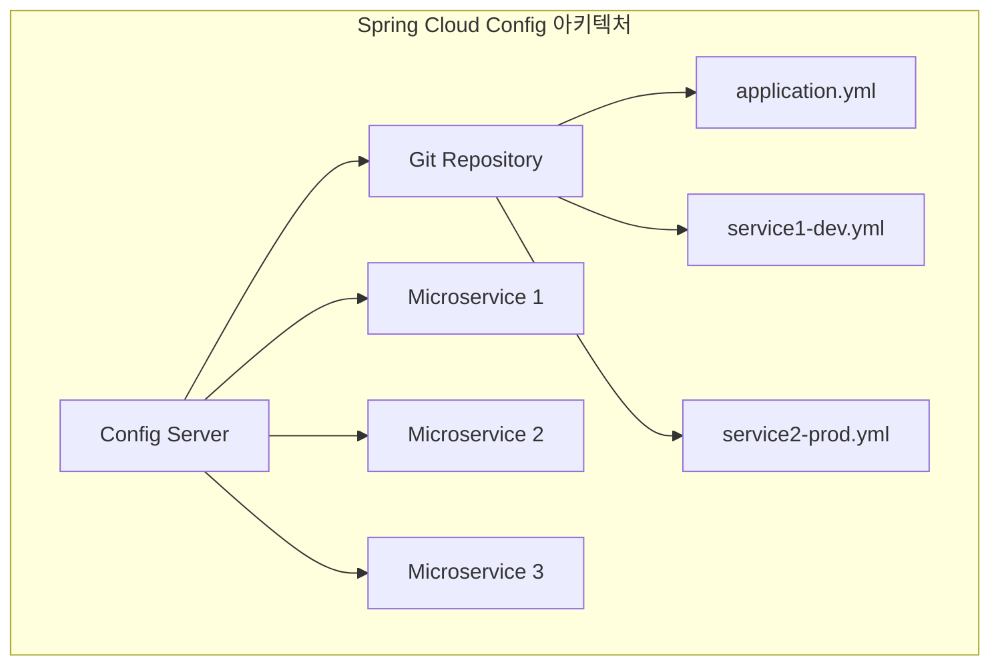

#### Config Server

Config Server는 설정 정보를 중앙에서 제공하는 서비스입니다.
Git, SVN, 파일 시스템 등 다양한 백엔드 저장소를 지원합니다.
REST API를 통해 클라이언트에게 설정을 제공합니다.

**의존성**

```xml
<?xml version="1.0" encoding="UTF-8"?>
<project xmlns="http://maven.apache.org/POM/4.0.0"
         xmlns:xsi="http://www.w3.org/2001/XMLSchema-instance"
         xsi:schemaLocation="http://maven.apache.org/POM/4.0.0 
         http://maven.apache.org/xsd/maven-4.0.0.xsd">
    <modelVersion>4.0.0</modelVersion>
    
    <parent>
        <groupId>org.springframework.boot</groupId>
        <artifactId>spring-boot-starter-parent</artifactId>
        <version>3.2.0</version>
        <relativePath/>
    </parent>
    
    <groupId>com.example</groupId>
    <artifactId>config-server</artifactId>
    <version>0.0.1-SNAPSHOT</version>
    <name>config-server</name>
    <description>Cloud Native Application with Spring Boot</description>
    
    <properties>
        <java.version>17</java.version>
    </properties>
    
	<dependencies>
	    <dependency>
	        <groupId>org.springframework.cloud</groupId>
	        <artifactId>spring-cloud-config-server</artifactId>
	    </dependency>
	    
	    <dependency>
	        <groupId>org.springframework.boot</groupId>
	        <artifactId>spring-boot-starter-web</artifactId>
	    </dependency>
	</dependencies>

	<dependencyManagement>
	    <dependencies>
	        <dependency>
	            <groupId>org.springframework.cloud</groupId>
	            <artifactId>spring-cloud-dependencies</artifactId>
	            <version>2023.0.0</version>
	            <type>pom</type>
	            <scope>import</scope>
	        </dependency>
	    </dependencies>
	</dependencyManagement>    
    
    <build>
        <plugins>
            <plugin>
                <groupId>org.springframework.boot</groupId>
                <artifactId>spring-boot-maven-plugin</artifactId>
            </plugin>
        </plugins>
    </build>
</project>
```

```java
// Config Server 애플리케이션
package com.example.configserver;

import org.springframework.boot.SpringApplication;
import org.springframework.boot.autoconfigure.SpringBootApplication;
import org.springframework.cloud.config.server.EnableConfigServer;

@SpringBootApplication
@EnableConfigServer
public class ConfigServerApplication {
    
    public static void main(String[] args) {
        SpringApplication.run(ConfigServerApplication.class, args);
    }
}
```

```yaml
# Config Server 설정 (bootstrap.yml)
spring:
  application:
    name: config-server
  cloud:
    config:
      server:
        git:
          uri: https://github.com/your-org/config-repo #config 저장소로 사용한 repository를 생성한다.
          clone-on-start: true
          default-label: main
        health:
          repositories:
            myapp:
              label: main
              name: myapp
              profiles: development,production

server:
  port: 8888

management:
  endpoints:
    web:
      exposure:
        include: health,info,refresh
```


#### 동적 설정 변경과 Refresh

Config Client는 `/actuator/refresh` 엔드포인트를 통해 설정을 갱신할 수 있습니다.
`@RefreshScope` 어노테이션을 사용하여 빈의 동적 갱신이 가능합니다.
Spring Cloud Bus를 활용하면 여러 인스턴스를 동시에 갱신할 수 있습니다.

```java
// Config Client 설정
@RestController
@RefreshScope  // 설정 갱신 시 빈 재생성
public class ConfigController {
    
    @Value("${app.message:Default Message}")
    private String message;
    
    @Autowired
    private AppProperties appProperties;
    
    @GetMapping("/config")
    public Map<String, Object> getConfig() {
        Map<String, Object> config = new HashMap<>();
        config.put("message", message);
        config.put("appName", appProperties.getName());
        config.put("version", appProperties.getVersion());
        return config;
    }
}
```

```xml
<!-- Config Client dependencies -->
<dependency>
    <groupId>org.springframework.cloud</groupId>
    <artifactId>spring-cloud-starter-config</artifactId>
</dependency>

<dependency>
    <groupId>org.springframework.boot</groupId>
    <artifactId>spring-boot-starter-actuator</artifactId>
</dependency>
```

#### GitHub 저장소 

- 브랜치: 기본값은 main이므로 저장소의 기본 브랜치를 main으로 맞추거나 Config Server에서 default-label을 실제 기본 브랜치명으로 설정한다.
- 파일 구조: 루트에 application-local.yml, application-development.yml, application-production.yml를 생성하며, 필요 시 애플리케이션별로 {spring.application.name}-{profile}.yml 형태 파일도 지원된다.

GitHub 저장소 루트에  파일 생성

```yaml
# application-local.yml
app:
  environment:
    name: "Local Development"
  message: "Hello from Local Environment!"
  database:
    max-connections: 10
    connection-timeout: 5000
spring:
  datasource:
    url: jdbc:h2:mem:localdb
    username: sa
    password: ""
  jpa:
    hibernate:
      ddl-auto: create-drop
    show-sql: true
logging:
  level:
    com.example: DEBUG
    org.springframework.web: DEBUG
```

```yaml
# application-development.yml
app:
  environment:
    name: "Development Server"
  message: "Hello from Development Environment!"
  database:
    max-connections: 15
    connection-timeout: 8000
spring:
  datasource:
    url: ${DEV_DATABASE_URL:jdbc:mysql://dev-db:3306/myapp}
    username: ${DEV_DB_USERNAME:dev_user}
    password: ${DEV_DB_PASSWORD:dev_password}
logging:
  level:
    com.example: INFO
```

```yaml
# application-production.yml
app:
  environment:
    name: "Production Server"
  message: "Hello from Production Environment!"
  database:
    max-connections: 50
    connection-timeout: 5000
  security:
    jwt-expiration-seconds: 3600
spring:
  datasource:
    url: ${DATABASE_URL}
    username: ${DB_USERNAME}
    password: ${DB_PASSWORD}
    hikari:
      maximum-pool-size: 50
      minimum-idle: 10
      connection-timeout: 20000
      idle-timeout: 300000
logging:
  level:
    root: WARN
    com.example: INFO
```

#### 클라이언트

##### 흐름도

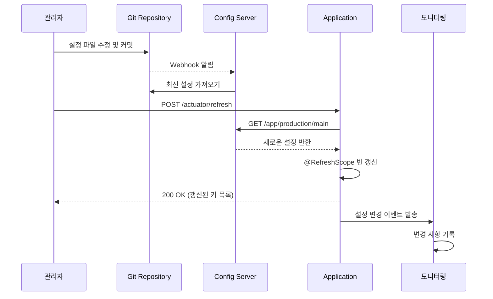

##### 소스코드

```xml
<!-- config-client/pom.xml -->
<project xmlns="http://maven.apache.org/POM/4.0.0"
         xmlns:xsi="http://www.w3.org/2001/XMLSchema-instance"
         xsi:schemaLocation="http://maven.apache.org/POM/4.0.0 https://maven.apache.org/xsd/maven-4.0.0.xsd">
  <modelVersion>4.0.0</modelVersion>
  <parent>
    <groupId>org.springframework.boot</groupId>
    <artifactId>spring-boot-starter-parent</artifactId>
    <version>3.3.4</version>
    <relativePath/>
  </parent>
  <groupId>com.example</groupId>
  <artifactId>config-client</artifactId>
  <version>0.0.1-SNAPSHOT</version>
  <name>config-client</name>
  <properties>
    <java.version>17</java.version>
    <spring-cloud.version>2023.0.3</spring-cloud.version>
    <lombok.version>1.18.32</lombok.version>
  </properties>
  <dependencyManagement>
    <dependencies>
      <dependency>
        <groupId>org.springframework.cloud</groupId>
        <artifactId>spring-cloud-dependencies</artifactId>
        <version>${spring-cloud.version}</version>
        <type>pom</type>
        <scope>import</scope>
      </dependency>
    </dependencies>
  </dependencyManagement>
  <dependencies>
    <dependency>
      <groupId>org.springframework.cloud</groupId>
      <artifactId>spring-cloud-starter-config</artifactId>
    </dependency>
    <dependency>
      <groupId>org.springframework.boot</groupId>
      <artifactId>spring-boot-starter-web</artifactId>
    </dependency>
    <dependency>
      <groupId>org.springframework.boot</groupId>
      <artifactId>spring-boot-starter-actuator</artifactId>
    </dependency>
    <dependency>
      <groupId>org.projectlombok</groupId>
      <artifactId>lombok</artifactId>
      <version>${lombok.version}</version>
      <scope>provided</scope>
    </dependency>
    <dependency>
      <groupId>org.springframework.boot</groupId>
      <artifactId>spring-boot-starter-test</artifactId>
      <scope>test</scope>
    </dependency>
  </dependencies>
  <build>
    <plugins>
      <plugin>
        <groupId>org.springframework.boot</groupId>
        <artifactId>spring-boot-maven-plugin</artifactId>
      </plugin>
    </plugins>
  </build>
</project>
```

```yaml
# config-client/src/main/resources/application.yml
server:
  port: 8080

spring:
  application:
    name: config-demo
  profiles:
    active: local
  config:
    import: optional:configserver:${CONFIG_SERVER_URI:http://localhost:8888}
  cloud:
    config:
      # 위 import의 위치 지정이 우선순위가 더 높다
      uri: ${CONFIG_SERVER_URI:http://localhost:8888}

management:
  endpoints:
    web:
      exposure:
        include: health,info,env,refresh,configprops
```

```java
// config-client/src/main/java/com/example/configclient/ConfigDemoApplication.java
package com.example.configclient;

import com.example.configclient.props.AppProperties;
import org.springframework.boot.SpringApplication;
import org.springframework.boot.autoconfigure.SpringBootApplication;
import org.springframework.boot.context.properties.EnableConfigurationProperties;

@SpringBootApplication
@EnableConfigurationProperties(AppProperties.class)
public class ConfigDemoApplication {
  public static void main(String[] args) {
    SpringApplication.run(ConfigDemoApplication.class, args);
  }
}
```

```java
// config-client/src/main/java/com/example/configclient/props/AppProperties.java
package com.example.configclient.props;

import lombok.Getter;
import lombok.Setter;
import org.springframework.boot.context.properties.ConfigurationProperties;

@Getter
@Setter
@ConfigurationProperties(prefix = "app")
public class AppProperties {
  private String message;
  private String name;
  private String version;
  private Environment environment = new Environment();
  private Database database = new Database();
  private Security security = new Security();

  @Getter @Setter
  public static class Environment { private String name; }

  @Getter @Setter
  public static class Database {
    private Integer maxConnections;
    private Integer connectionTimeout;
  }

  @Getter @Setter
  public static class Security {
    private Integer jwtExpirationSeconds;
    private String jwtSecret;
  }
}
```

```java
// config-client/src/main/java/com/example/configclient/web/EnvironmentController.java
package com.example.configclient.web;

import com.example.configclient.props.AppProperties;
import org.springframework.beans.factory.annotation.Value;
import org.springframework.cloud.context.config.annotation.RefreshScope;
import org.springframework.core.env.ConfigurableEnvironment;
import org.springframework.core.env.Environment;
import org.springframework.core.env.MutablePropertySources;
import org.springframework.web.bind.annotation.GetMapping;
import org.springframework.web.bind.annotation.RestController;
import java.util.HashMap;
import java.util.Map;

@RestController
@RefreshScope
public class EnvironmentController {

  @Value("${spring.profiles.active:default}")
  private String activeProfile;

  @Value("${app.environment.name:unknown}")
  private String environmentName;

  private final AppProperties appProperties;
  private final Environment environment;

  public EnvironmentController(AppProperties appProperties, Environment environment) {
    this.appProperties = appProperties;
    this.environment = environment;
  }

  @GetMapping("/environment")
  public Map<String, Object> getEnvironmentInfo() {
    Map<String, Object> info = new HashMap<>();
    info.put("activeProfile", activeProfile);
    info.put("environmentName", environmentName);
    info.put("appName", appProperties.getName());
    info.put("appVersion", appProperties.getVersion());
    info.put("databaseConfig", getDatabaseConfig());
    info.put("securityConfig", getSecurityConfig());
    return info;
  }

  @GetMapping("/properties")
  public Map<String, String> getAllProperties() {
    Map<String, String> props = new HashMap<>();
    MutablePropertySources sources = ((ConfigurableEnvironment) environment).getPropertySources();
    props.put("server.port", environment.getProperty("server.port"));
    props.put("spring.application.name", environment.getProperty("spring.application.name"));
    props.put("logging.level.com.example", environment.getProperty("logging.level.com.example"));
    return props;
  }

  private Map<String, Object> getDatabaseConfig() {
    Map<String, Object> db = new HashMap<>();
    db.put("maxConnections", appProperties.getDatabase().getMaxConnections());
    db.put("connectionTimeout", appProperties.getDatabase().getConnectionTimeout());
    return db;
  }

  private Map<String, Object> getSecurityConfig() {
    Map<String, Object> sec = new HashMap<>();
    sec.put("jwtExpirationSeconds", appProperties.getSecurity().getJwtExpirationSeconds());
    sec.put("jwtSecretConfigured",
        appProperties.getSecurity().getJwtSecret() != null &&
            !appProperties.getSecurity().getJwtSecret().isEmpty());
    return sec;
  }
}
```

```java
// config-client/src/main/java/com/example/configclient/support/ConfigChangeListener.java
package com.example.configclient.support;

import org.slf4j.Logger;
import org.slf4j.LoggerFactory;
import org.springframework.cloud.context.environment.EnvironmentChangeEvent;
import org.springframework.cloud.context.scope.refresh.RefreshScopeRefreshedEvent;
import org.springframework.context.event.EventListener;
import org.springframework.scheduling.annotation.Async;
import org.springframework.stereotype.Component;
import java.util.Set;

@Component
public class ConfigChangeListener {

  private static final Logger log = LoggerFactory.getLogger(ConfigChangeListener.class);

  @EventListener
  @Async
  public void onEnvironmentChange(EnvironmentChangeEvent event) {
    Set<String> keys = event.getKeys();
    log.info("EnvironmentChangeEvent received, changed keys={}", keys);
    notifyServices(keys);
  }

  @EventListener
  @Async
  public void onRefreshScopeRefreshed(RefreshScopeRefreshedEvent event) {
    log.info("RefreshScopeRefreshedEvent received for scope={}", event.getScope());
  }

  private void notifyServices(Set<String> changedKeys) {
    log.info("Notifying services about configuration changes: {}", changedKeys);
  }
}
```

##### 테스트

```shell
# 1. config-server/config-client 애플리케이션 기동
# 2. /environment api를 통해 현재 값 확인
curl http://localhost:8080/environment
# 3. GiHub에서 값 변경
# 4. 변경된 값 적용
curl -X 'POST' 'http://localhost:8080/actuator/refresh' -H 'accept: */*'
# 5. /environment api를 통해 변경된 값 확인
curl http://localhost:8080/environment

```


## 4장. 서비스 디스커버리와 로드 밸런싱

### 4.1 마이크로서비스에서의 서비스 발견

#### 서비스 디스커버리의 필요성

마이크로서비스 환경에서는 서비스 인스턴스가 동적으로 생성되고 종료됩니다.
각 서비스의 IP 주소와 포트는 런타임에 결정되므로 하드코딩할 수 없습니다.
서비스 간 통신을 위해 서비스의 위치를 자동으로 찾는 메커니즘이 필요합니다.


| 문제점 | 기존 방식 | 서비스 디스커버리 방식 |
| :-- | :-- | :-- |
| **고정 IP/포트** | 설정 파일에 하드코딩 | 동적 등록/발견 |
| **확장성** | 수동 설정 추가 | 자동 등록 |
| **장애 대응** | 수동 제거 | 자동 헬스체크 |
| **로드밸런싱** | 외부 로드밸런서 의존 | 클라이언트 측 로드밸런싱 |

#### Client-side vs Server-side Discovery

Client-side Discovery는 클라이언트가 직접 서비스 레지스트리에서 서비스를 찾습니다.
Server-side Discovery는 로드 밸런서가 서비스 레지스트리를 조회하고 라우팅합니다.
Spring Cloud에서는 주로 Client-side Discovery 패턴을 사용합니다.

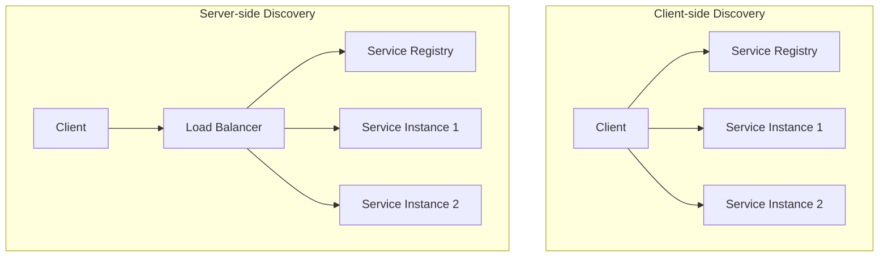


### 4.2 Ribbon에서 Spring Cloud LoadBalancer로의 전환

Spring Cloud LoadBalancer는 Netflix Ribbon을 대체하는 새로운 클라이언트 측 로드 밸런서입니다.
Reactive 스택을 지원하며 더 가벼운 구조로 설계되었습니다.
Spring Boot 2.4부터는 Ribbon이 제거되고 LoadBalancer가 기본으로 사용됩니다.

```xml
<?xml version="1.0" encoding="UTF-8"?>
<project xmlns="http://maven.apache.org/POM/4.0.0"
         xmlns:xsi="http://www.w3.org/2001/XMLSchema-instance"
         xsi:schemaLocation="http://maven.apache.org/POM/4.0.0 http://maven.apache.org/xsd/maven-4.0.0.xsd">
    <modelVersion>4.0.0</modelVersion>
  
  <groupId>com.example</groupId>
  <artifactId>servicediscovery-demo</artifactId>
  <version>0.0.1-SNAPSHOT</version>
  <name>servicediscovery-demo</name>
  <description>Service Discovery Demo</description>
  
  <properties>
    <java.version>17</java.version>
    <spring.cloud.version>2023.0.0</spring.cloud.version>
  </properties>

  <parent>
      <groupId>org.springframework.boot</groupId>
      <artifactId>spring-boot-starter-parent</artifactId>
      <version>3.2.0</version>
      <relativePath/>
  </parent>

    <dependencies>
        <dependency>
            <groupId>org.springframework.boot</groupId>
            <artifactId>spring-boot-starter-web</artifactId>
        </dependency>
        <dependency>
            <groupId>org.springframework.boot</groupId>
            <artifactId>spring-boot-starter-data-jpa</artifactId>
        </dependency>
        <dependency>
            <groupId>org.springframework.cloud</groupId>
            <artifactId>spring-cloud-starter-netflix-eureka-client</artifactId>
        </dependency>
        <dependency>
            <groupId>org.springframework.cloud</groupId>
            <artifactId>spring-cloud-starter-openfeign</artifactId>
        </dependency>
        <dependency>
            <groupId>io.github.resilience4j</groupId>
            <artifactId>resilience4j-spring-boot3</artifactId>
        </dependency>
        <dependency>
            <groupId>org.springframework.cloud</groupId>
            <artifactId>spring-cloud-starter-loadbalancer</artifactId>
        </dependency>
        <dependency>
            <groupId>org.postgresql</groupId>
            <artifactId>postgresql</artifactId>
            <scope>runtime</scope>
        </dependency>
        <dependency>
            <groupId>org.projectlombok</groupId>
            <artifactId>lombok</artifactId>
            <optional>true</optional>
        </dependency>
        <dependency>
            <groupId>org.springframework.boot</groupId>
            <artifactId>spring-boot-starter-test</artifactId>
            <scope>test</scope>
        </dependency>
    </dependencies>

	<dependencyManagement>
	    <dependencies>
	        <dependency>
	            <groupId>org.springframework.cloud</groupId>
	            <artifactId>spring-cloud-dependencies</artifactId>
	            <version>${spring.cloud.version}</version>
	            <type>pom</type>
	            <scope>import</scope>
	        </dependency>
	    </dependencies>
	</dependencyManagement>

    <build>
        <plugins>
            <plugin>
                <groupId>org.springframework.boot</groupId>
                <artifactId>spring-boot-maven-plugin</artifactId>
            </plugin>
        </plugins>
    </build>
</project>
```


#### 로드 밸런싱 알고리즘

Spring Cloud LoadBalancer는 다양한 로드 밸런싱 알고리즘을 제공합니다.
Round Robin이 기본 알고리즘이며, Random, Weighted 등의 전략을 선택할 수 있습니다.
커스텀 로드 밸런싱 전략을 구현할 수도 있습니다.

```java
// 커스텀 로드 밸런서 설정
@Configuration
@LoadBalancerClient(name = "user-service", configuration = UserServiceLoadBalancerConfig.class)
public class LoadBalancerConfig {
    
    // 전역 로드 밸런서 설정
    @Bean
    @LoadBalanced
    public RestTemplate restTemplate() {
        return new RestTemplate();
    }   
}

// 특정 서비스용 로드 밸런서 설정
class UserServiceLoadBalancerConfig {
    
    @Bean
    ReactorLoadBalancer<ServiceInstance> randomLoadBalancer(Environment environment,
                                                           LoadBalancerClientFactory loadBalancerClientFactory) {
        String name = environment.getProperty(LoadBalancerClientFactory.PROPERTY_NAME);
        return new RandomLoadBalancer(loadBalancerClientFactory
                .getLazyProvider(name, ServiceInstanceListSupplier.class), name);
    }
}

// 가중치 기반 로드 밸런서 구현
@Component
public class WeightedLoadBalancer implements ReactorServiceInstanceLoadBalancer {
    
    private final String serviceId;
    private final ObjectProvider<ServiceInstanceListSupplier> serviceInstanceListSupplierProvider;
    
    public WeightedLoadBalancer(ObjectProvider<ServiceInstanceListSupplier> serviceInstanceListSupplierProvider,
                               String serviceId) {
        this.serviceId = serviceId;
        this.serviceInstanceListSupplierProvider = serviceInstanceListSupplierProvider;
    }
    
    @Override
    public Mono<Response<ServiceInstance>> choose(Request request) {
        ServiceInstanceListSupplier supplier = serviceInstanceListSupplierProvider
                .getIfAvailable(NoopServiceInstanceListSupplier::new);
        
        return supplier.get(request).next()
                .map(serviceInstances -> processInstanceResponse(serviceInstances));
    }
    
    private Response<ServiceInstance> processInstanceResponse(List<ServiceInstance> serviceInstances) {
        if (serviceInstances.isEmpty()) {
            return new EmptyResponse();
        }
        
        // 가중치 기반 선택 로직
        ServiceInstance selectedInstance = selectByWeight(serviceInstances);
        return new DefaultResponse(selectedInstance);
    }
    
    private ServiceInstance selectByWeight(List<ServiceInstance> instances) {
        // 메타데이터의 weight 값을 기반으로 선택
        int totalWeight = instances.stream()
                .mapToInt(instance -> Integer.parseInt(
                    instance.getMetadata().getOrDefault("weight", "1")))
                .sum();
        
        Random random = new Random();
        int randomWeight = random.nextInt(totalWeight);
        
        for (ServiceInstance instance : instances) {
            int weight = Integer.parseInt(instance.getMetadata().getOrDefault("weight", "1"));
            randomWeight -= weight;
            if (randomWeight < 0) {
                return instance;
            }
        }
        
        return instances.get(0); // 기본값
    }
}
```


#### 헬스체크 기반 인스턴스 관리

Spring Cloud LoadBalancer는 Eureka의 헬스체크 정보를 활용합니다.
비정상적인 서비스 인스턴스는 자동으로 로드 밸런싱에서 제외됩니다.
Actuator의 헬스 엔드포인트를 통해 상태를 모니터링합니다.

```yaml
# Eureka 클라이언트 설정
eureka:
  client:
    service-url:
      defaultZone: http://localhost:8761/eureka/
    register-with-eureka: true
    fetch-registry: true
    healthcheck:
      enabled: true
  instance:
    health-check-url-path: /actuator/health
    status-page-url-path: /actuator/info
    prefer-ip-address: true
    lease-renewal-interval-in-seconds: 10
    lease-expiration-duration-in-seconds: 30

# LoadBalancer 헬스체크 설정
spring:
  cloud:
    loadbalancer:
      health-check:
        initial-delay: 10s
        interval: 30s
      retry:
        enabled: true
```


### 4.3 OpenFeign을 통한 서비스 간 통신

#### Declarative HTTP Client

OpenFeign은 선언적 방식으로 HTTP 클라이언트를 정의할 수 있게 해줍니다.
인터페이스와 어노테이션만으로 REST 클라이언트를 생성할 수 있습니다.
Spring Cloud LoadBalancer와 자동으로 통합되어 로드 밸런싱을 제공합니다.

```java
// Feign 클라이언트 인터페이스 정의
@FeignClient(name = "user-service", fallback = UserServiceFallback.class)
public interface UserServiceClient {
    
    @GetMapping("/users/{id}")
    User getUserById(@PathVariable("id") Long id);
    
    @GetMapping("/users")
    List<User> getAllUsers(@RequestParam("page") int page, 
                          @RequestParam("size") int size);
    
    @PostMapping("/users")
    User createUser(@RequestBody CreateUserRequest request);
    
    @PutMapping("/users/{id}")
    User updateUser(@PathVariable("id") Long id, 
                   @RequestBody UpdateUserRequest request);
    
    @DeleteMapping("/users/{id}")
    void deleteUser(@PathVariable("id") Long id);
}

// 요청/응답 DTO
public class CreateUserRequest {
    private String username;
    private String email;
    private String firstName;
    private String lastName;
    
    // constructors, getters, setters
}

public class UpdateUserRequest {
    private String email;
    private String firstName;
    private String lastName;
    
    // constructors, getters, setters
}

public class User {
    private Long id;
    private String username;
    private String email;
    private String firstName;
    private String lastName;
    private LocalDateTime createdAt;
    
    // constructors, getters, setters
}
```


#### 에러 핸들링과 재시도 정책

Feign은 다양한 에러 핸들링 전략을 제공합니다.
재시도 정책을 통해 일시적인 네트워크 오류에 대응할 수 있습니다.
커스텀 ErrorDecoder를 구현하여 특정 에러에 대한 처리를 정의할 수 있습니다.

```java
// Feign 설정 클래스
@Configuration
@EnableFeignClients
public class FeignConfig {
    
    @Bean
    public Retryer retryer() {
        // 최대 3회 재시도, 1초 간격으로 시작하여 최대 3초까지 증가
        return new Retryer.Default(1000, 3000, 3);
    }
    
    @Bean
    public ErrorDecoder errorDecoder() {
        return new CustomErrorDecoder();
    }
    
    @Bean
    public RequestInterceptor requestInterceptor() {
        return new CustomRequestInterceptor();
    }
    
    @Bean
    public Logger.Level feignLoggerLevel() {
        return Logger.Level.FULL;
    }
}

// 커스텀 에러 디코더
public class CustomErrorDecoder implements ErrorDecoder {
    
    private final Logger logger = LoggerFactory.getLogger(CustomErrorDecoder.class);
    
    @Override
    public Exception decode(String methodKey, Response response) {
        logger.error("Feign error occurred: method={}, status={}, reason={}", 
                    methodKey, response.status(), response.reason());
        
        switch (response.status()) {
            case 400:
                return new IllegalArgumentException("Bad Request: " + methodKey);
            case 404:
                return new ResourceNotFoundException("Resource not found: " + methodKey);
            case 503:
                return new RetryableException(response.status(), "Service unavailable", 
                        response.request().httpMethod(), null, response.request());
            default:
                return new FeignException.Default(methodKey, response.request(), 
                        response.status().toString().getBytes(), response.headers());
        }
    }
}

// 커스텀 요청 인터셉터
public class CustomRequestInterceptor implements RequestInterceptor {
    
    @Override
    public void apply(RequestTemplate template) {
        // 모든 요청에 공통 헤더 추가
        template.header("X-Client-Version", "1.0.0");
        template.header("X-Request-ID", UUID.randomUUID().toString());
        
        // 인증 토큰 추가 (예: JWT)
        String token = getCurrentUserToken();
        if (token != null) {
            template.header("Authorization", "Bearer " + token);
        }
    }
    
    private String getCurrentUserToken() {
        // 현재 사용자의 토큰을 가져오는 로직
        // SecurityContext, ThreadLocal 등을 활용
        return "sample-jwt-token";
    }
}
```


#### 서킷 브레이커 패턴 적용

Feign과 Resilience4j를 통합하여 서킷 브레이커 패턴을 적용할 수 있습니다.
Fallback 메서드를 통해 서비스 장애 시 대안 응답을 제공할 수 있습니다.
서비스의 복원력을 높이고 장애 전파를 방지할 수 있습니다.

```java
// Fallback 구현체
@Component
public class UserServiceFallback implements UserServiceClient {
    
    private static final Logger logger = LoggerFactory.getLogger(UserServiceFallback.class);
    
    @Override
    public User getUserById(Long id) {
        logger.warn("UserService fallback activated for getUserById: {}", id);
        return createDefaultUser(id);
    }
    
    @Override
    public List<User> getAllUsers(int page, int size) {
        logger.warn("UserService fallback activated for getAllUsers");
        return Collections.emptyList();
    }
    
    @Override
    public User createUser(CreateUserRequest request) {
        logger.error("UserService fallback activated for createUser - operation failed");
        throw new ServiceUnavailableException("User service is currently unavailable");
    }
    
    @Override
    public User updateUser(Long id, UpdateUserRequest request) {
        logger.error("UserService fallback activated for updateUser - operation failed");
        throw new ServiceUnavailableException("User service is currently unavailable");
    }
    
    @Override
    public void deleteUser(Long id) {
        logger.error("UserService fallback activated for deleteUser - operation failed");
        throw new ServiceUnavailableException("User service is currently unavailable");
    }
    
    private User createDefaultUser(Long id) {
        User defaultUser = new User();
        defaultUser.setId(id);
        defaultUser.setUsername("unknown-user");
        defaultUser.setEmail("unknown@example.com");
        defaultUser.setFirstName("Unknown");
        defaultUser.setLastName("User");
        return defaultUser;
    }
}
```

### 4.4 구현 예제

#### 시퀀스 다이어그램

- 다음 시퀀스는 OpenFeign이 서비스 ID로 요청을 생성하고 LoadBalancer가 Eureka에서 인스턴스를 받아 선택한 뒤 호출하는 흐름을 보여준다.

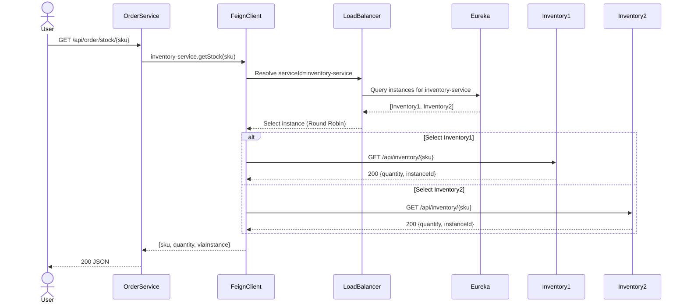


#### 프로젝트 1: eureka-server

- 역할: 서비스 레지스트리 서버로 클라이언트 등록과 조회를 담당하며 로컬 개발에서는 자기 자신을 등록하지 않도록 설정한다.

pom.xml:

```xml
<project xmlns="http://maven.apache.org/POM/4.0.0" xmlns:xsi="http://www.w3.org/2001/XMLSchema-instance"
         xsi:schemaLocation="http://maven.apache.org/POM/4.0.0 http://maven.apache.org/xsd/maven-4.0.0.xsd">
  <modelVersion>4.0.0</modelVersion>
  <groupId>com.example.eureka</groupId>
  <artifactId>eureka-server</artifactId>
  <version>1.0.0</version>
  <properties>
    <java.version>17</java.version>
    <spring.boot.version>3.2.12</spring.boot.version>
    <spring-cloud.version>2023.0.6</spring-cloud.version>
  </properties>
  <dependencyManagement>
    <dependencies>
      <dependency>
        <groupId>org.springframework.boot</groupId>
        <artifactId>spring-boot-dependencies</artifactId>
        <version>${spring.boot.version}</version>
        <type>pom</type>
        <scope>import</scope>
      </dependency>
      <dependency>
        <groupId>org.springframework.cloud</groupId>
        <artifactId>spring-cloud-dependencies</artifactId>
        <version>${spring-cloud.version}</version>
        <type>pom</type>
        <scope>import</scope>
      </dependency>
    </dependencies>
  </dependencyManagement>
  <dependencies>
    <dependency>
      <groupId>org.springframework.cloud</groupId>
      <artifactId>spring-cloud-starter-netflix-eureka-server</artifactId>
    </dependency>
    <dependency>
      <groupId>org.springframework.boot</groupId>
      <artifactId>spring-boot-starter-actuator</artifactId>
    </dependency>
  </dependencies>
  <build>
    <plugins>
      <plugin>
        <groupId>org.springframework.boot</groupId>
        <artifactId>spring-boot-maven-plugin</artifactId>
      </plugin>
    </plugins>
  </build>
</project>
```

메인 클래스:

```java
package com.example.eureka;

import org.springframework.boot.SpringApplication;
import org.springframework.boot.autoconfigure.SpringBootApplication;
import org.springframework.cloud.netflix.eureka.server.EnableEurekaServer;

@SpringBootApplication
@EnableEurekaServer
public class EurekaServerApplication {
  public static void main(String[] args) {
    SpringApplication.run(EurekaServerApplication.class, args);
  }
}
```

application.yml:

```yaml
spring:
  application:
    name: eureka-server
server:
  port: 8761
eureka:
  client:
    register-with-eureka: false
    fetch-registry: false
```

위 설정은 Eureka 서버가 다른 Eureka에 자신을 등록하지 않고 레지스트리도 가져오지 않도록 하는 로컬 개발 기본값이다.

#### 프로젝트 2: inventory-service

- 역할: 재고 조회 제공자 서비스이며 Eureka에 등록되어 다중 인스턴스를 띄워 분산 정책 검증에 사용한다.[^2_8][^2_2]

pom.xml:

```xml
<project xmlns="http://maven.apache.org/POM/4.0.0" xmlns:xsi="http://www.w3.org/2001/XMLSchema-instance"
         xsi:schemaLocation="http://maven.apache.org/POM/4.0.0 http://maven.apache.org/xsd/maven-4.0.0.xsd">
  <modelVersion>4.0.0</modelVersion>
  <groupId>com.example.inventory</groupId>
  <artifactId>inventory-service</artifactId>
  <version>1.0.0</version>
  <properties>
    <java.version>17</java.version>
    <spring.boot.version>3.2.12</spring.boot.version>
    <spring-cloud.version>2023.0.6</spring-cloud.version>
  </properties>
  <dependencyManagement>
    <dependencies>
      <dependency>
        <groupId>org.springframework.boot</groupId>
        <artifactId>spring-boot-dependencies</artifactId>
        <version>${spring.boot.version}</version>
        <type>pom</type>
        <scope>import</scope>
      </dependency>
      <dependency>
        <groupId>org.springframework.cloud</groupId>
        <artifactId>spring-cloud-dependencies</artifactId>
        <version>${spring-cloud.version}</version>
        <type>pom</type>
        <scope>import</scope>
      </dependency>
    </dependencies>
  </dependencyManagement>
  <dependencies>
    <dependency>
      <groupId>org.springframework.cloud</groupId>
      <artifactId>spring-cloud-starter-netflix-eureka-client</artifactId>
    </dependency>
    <dependency>
      <groupId>org.springframework.boot</groupId>
      <artifactId>spring-boot-starter-web</artifactId>
    </dependency>
    <dependency>
      <groupId>org.springframework.boot</groupId>
      <artifactId>spring-boot-starter-actuator</artifactId>
    </dependency>
  </dependencies>
  <build>
    <plugins>
      <plugin>
        <groupId>org.springframework.boot</groupId>
        <artifactId>spring-boot-maven-plugin</artifactId>
      </plugin>
    </plugins>
  </build>
</project>
```

메인 클래스:

```java
package com.example.inventory;

import org.springframework.boot.SpringApplication;
import org.springframework.boot.autoconfigure.SpringBootApplication;

@SpringBootApplication
public class InventoryServiceApplication {
  public static void main(String[] args) {
    SpringApplication.run(InventoryServiceApplication.class, args);
  }
}
```

컨트롤러:

```java
package com.example.inventory.api;

import org.springframework.beans.factory.annotation.Value;
import org.springframework.web.bind.annotation.*;

import java.net.InetAddress;
import java.util.Map;

@RestController
@RequestMapping("/api/inventory")
public class InventoryController {

  @Value("${spring.application.name}")
  private String appName;

  @Value("${server.port}")
  private int port;

  @GetMapping("/{sku}")
  public Map<String, Object> getStock(@PathVariable String sku) throws Exception {
    String host = InetAddress.getLocalHost().getHostAddress();
    int quantity = (port % 2 == 0) ? 50 : 100;
    return Map.of(
        "sku", sku,
        "quantity", quantity,
        "instanceId", appName + ":" + host + ":" + port
    );
  }
}
```

application.yml:

```yaml
spring:
  application:
    name: inventory-service
server:
  port: 8081
eureka:
  client:
    serviceUrl:
      defaultZone: http://localhost:8761/eureka
  instance:
    prefer-ip-address: true
    instance-id: ${spring.application.name}:${server.port}
management:
  endpoints:
    web:
      exposure:
        include: health,info
```

- Eureka 클라이언트 스타터가 있으면 애플리케이션은 spring.application.name을 서비스 ID로 사용해 자동 등록되며 조회가 가능해진다.

#### 프로젝트 3: order-service

- 역할: OpenFeign으로 inventory-service를 호출하며 Spring Cloud LoadBalancer를 통해 인스턴스 선택을 수행한다.

pom.xml:

```xml
<project xmlns="http://maven.apache.org/POM/4.0.0" xmlns:xsi="http://www.w3.org/2001/XMLSchema-instance"
         xsi:schemaLocation="http://maven.apache.org/POM/4.0.0 http://maven.apache.org/xsd/maven-4.0.0.xsd">
  <modelVersion>4.0.0</modelVersion>
  <groupId>com.example.order</groupId>
  <artifactId>order-service</artifactId>
  <version>1.0.0</version>
  <properties>
    <java.version>17</java.version>
    <spring.boot.version>3.2.12</spring.boot.version>
    <spring-cloud.version>2023.0.6</spring-cloud.version>
  </properties>
  <dependencyManagement>
    <dependencies>
      <dependency>
        <groupId>org.springframework.boot</groupId>
        <artifactId>spring-boot-dependencies</artifactId>
        <version>${spring.boot.version}</version>
        <type>pom</type>
        <scope>import</scope>
      </dependency>
      <dependency>
        <groupId>org.springframework.cloud</groupId>
        <artifactId>spring-cloud-dependencies</artifactId>
        <version>${spring-cloud.version}</version>
        <type>pom</type>
        <scope>import</scope>
      </dependency>
    </dependencies>
  </dependencyManagement>
  <dependencies>
    <dependency>
      <groupId>org.springframework.cloud</groupId>
      <artifactId>spring-cloud-starter-netflix-eureka-client</artifactId>
    </dependency>
    <dependency>
      <groupId>org.springframework.cloud</groupId>
      <artifactId>spring-cloud-starter-openfeign</artifactId>
    </dependency>
    <dependency>
      <groupId>org.springframework.cloud</groupId>
      <artifactId>spring-cloud-starter-loadbalancer</artifactId>
    </dependency>
    <dependency>
      <groupId>org.springframework.boot</groupId>
      <artifactId>spring-boot-starter-web</artifactId>
    </dependency>
    <dependency>
      <groupId>org.springframework.boot</groupId>
      <artifactId>spring-boot-starter-actuator</artifactId>
    </dependency>
  </dependencies>
  <build>
    <plugins>
      <plugin>
        <groupId>org.springframework.boot</groupId>
        <artifactId>spring-boot-maven-plugin</artifactId>
      </plugin>
    </plugins>
  </build>
</project>
```

메인 클래스:

```java
package com.example.order;

import org.springframework.boot.SpringApplication;
import org.springframework.boot.autoconfigure.SpringBootApplication;
import org.springframework.cloud.openfeign.EnableFeignClients;

@SpringBootApplication
@EnableFeignClients(basePackages = "com.example.order.client")
public class OrderServiceApplication {
  public static void main(String[] args) {
    SpringApplication.run(OrderServiceApplication.class, args);
  }
}
```

FeignClient:

```java
package com.example.order.client;

import org.springframework.cloud.openfeign.FeignClient;
import org.springframework.web.bind.annotation.GetMapping;
import org.springframework.web.bind.annotation.PathVariable;

import java.util.Map;

@FeignClient(name = "inventory-service", path = "/api/inventory")
public interface InventoryClient {
  @GetMapping("/{sku}")
  Map<String, Object> getStock(@PathVariable("sku") String sku);
}
```

API 컨트롤러:

```java
package com.example.order.api;

import com.example.order.client.InventoryClient;
import org.springframework.web.bind.annotation.*;

import java.util.Map;

@RestController
@RequestMapping("/api/order")
public class OrderController {

  private final InventoryClient inventoryClient;

  public OrderController(InventoryClient inventoryClient) {
    this.inventoryClient = inventoryClient;
  }

  @GetMapping("/stock/{sku}")
  public Map<String, Object> checkStock(@PathVariable("sku") String sku) {
    Map<String, Object> stock = inventoryClient.getStock(sku);
    return Map.of(
        "sku", stock.get("sku"),
        "quantity", stock.get("quantity"),
        "viaInstance", stock.get("instanceId")
    );
  }
}
```

application.yml:

```yaml
server:
  port: 8080
spring:
  application:
    name: order-service
  cloud:
    openfeign:
     client:
       config:
         default:
           loggerLevel: basic		

eureka:
  client:
    serviceUrl:
      defaultZone: http://localhost:8761/eureka
  instance:
    prefer-ip-address: true
    instance-id: ${spring.application.name}:${server.port}


management:
  endpoints:
    web:
      exposure:
        include: health,info
```

- OpenFeign은 @EnableFeignClients로 활성화되며 @FeignClient(name="inventory-service")의 name이 서비스 ID로 사용되어 LoadBalancer를 통해 인스턴스가 선택된다.

#### 실행 순서

- 1) eureka-server 실행: mvn spring-boot:run 또는 빌드 후 java -jar 실행을 한다.
- 2) inventory-service 2개 인스턴스 실행: 기본 8081, 추가 인스턴스는 포트만 바꿔 8082로 실행한다.
- 3) order-service 실행: Eureka에 등록된 inventory-service를 OpenFeign으로 호출하도록 준비한다.

예시 명령:

```bash
# 터미널 1
cd eureka-server
mvn -q -DskipTests package && java -jar target/eureka-server-1.0.0.jar

# 터미널 2
cd inventory-service
mvn -q -DskipTests package spring-boot:repackage && 
java -jar target/inventory-service-1.0.0.jar --server.port=8081 --eureka.instance.instance-id=inventory-service:8081

# 터미널 3
java -jar target/inventory-service-1.0.0.jar --server.port=8082 --eureka.instance.instance-id=inventory-service:8082

# 터미널 4
cd order-service
mvn -q -DskipTests package && java -jar target/order-service-1.0.0.jar
```

- Eureka 대시보드([Eureka](http://localhost:8761/))에서 두 개의 inventory-service 인스턴스가 등록되었는지 확인 후 테스트를 진행한다.

#### 테스트 방법

- Order API를 반복 호출하여 viaInstance가 8081과 8082로 교대로 바뀌는지 확인하면 기본 라운드 로빈 분산이 검증된다.

```bash
curl -s http://localhost:8080/api/order/stock/A-100
curl -s http://localhost:8080/api/order/stock/A-100
curl -s http://localhost:8080/api/order/stock/A-100
```

- Spring Cloud LoadBalancer의 기본 정책은 RoundRobin이며, Eureka에서 받은 인스턴스 목록을 대상으로 순차 분배를 수행한다.


## 5장. 회복력(Resilience) 패턴 구현

### 5.1 마이크로서비스의 장애 전파 문제

#### 분산 시스템에서의 장애 유형

마이크로서비스 환경에서는 네트워크, 서비스, 인프라스트럭처 등 다양한 계층에서 장애가 발생할 수 있습니다.
단일 서비스의 장애가 연쇄적으로 다른 서비스에 전파되어 전체 시스템이 마비될 수 있습니다.
장애 전파를 방지하고 시스템의 회복력을 향상시키는 패턴이 필요합니다.


| 장애 유형 | 설명 | 영향도 | 대응 패턴 |
| :-- | :-- | :-- | :-- |
| **네트워크 지연** | 네트워크 응답 시간 증가 | 높음 | Timeout, Circuit Breaker |
| **서비스 다운** | 서비스 인스턴스 정지 | 높음 | Retry, Fallback |
| **리소스 고갈** | CPU, 메모리, 커넥션 부족 | 중간 | Bulkhead, Rate Limiting |
| **데이터베이스 장애** | DB 연결 실패, 쿼리 타임아웃 | 높음 | Circuit Breaker, Cache |

#### Cascading Failure의 위험성

하나의 서비스 장애가 의존하는 모든 서비스에 연쇄적으로 영향을 미칩니다.
장애가 발생한 서비스를 호출하는 클라이언트들이 대기 상태로 빠져 리소스가 고갈됩니다.
최종적으로 전체 시스템이 사용 불가능한 상태가 될 수 있습니다.

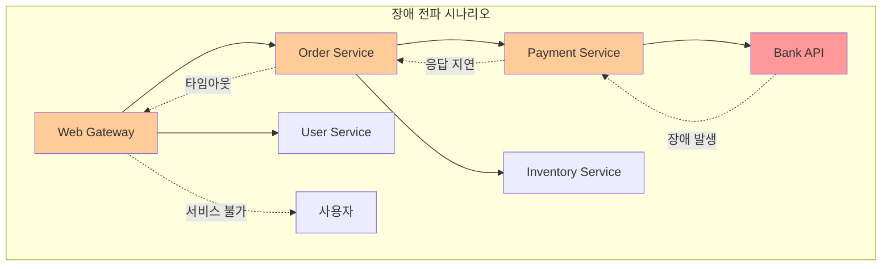


### 5.2 Spring Cloud Circuit Breaker

#### Circuit Breaker 패턴 이해

Circuit Breaker는 전기 회로의 차단기와 같은 개념으로 장애가 발생한 서비스 호출을 차단합니다.
Closed, Open, Half-Open 세 가지 상태를 가지며 각 상태에 따라 다르게 동작합니다.
설정된 실패율이나 응답 시간 임계값을 초과하면 회로가 열려 추가 호출을 차단합니다.

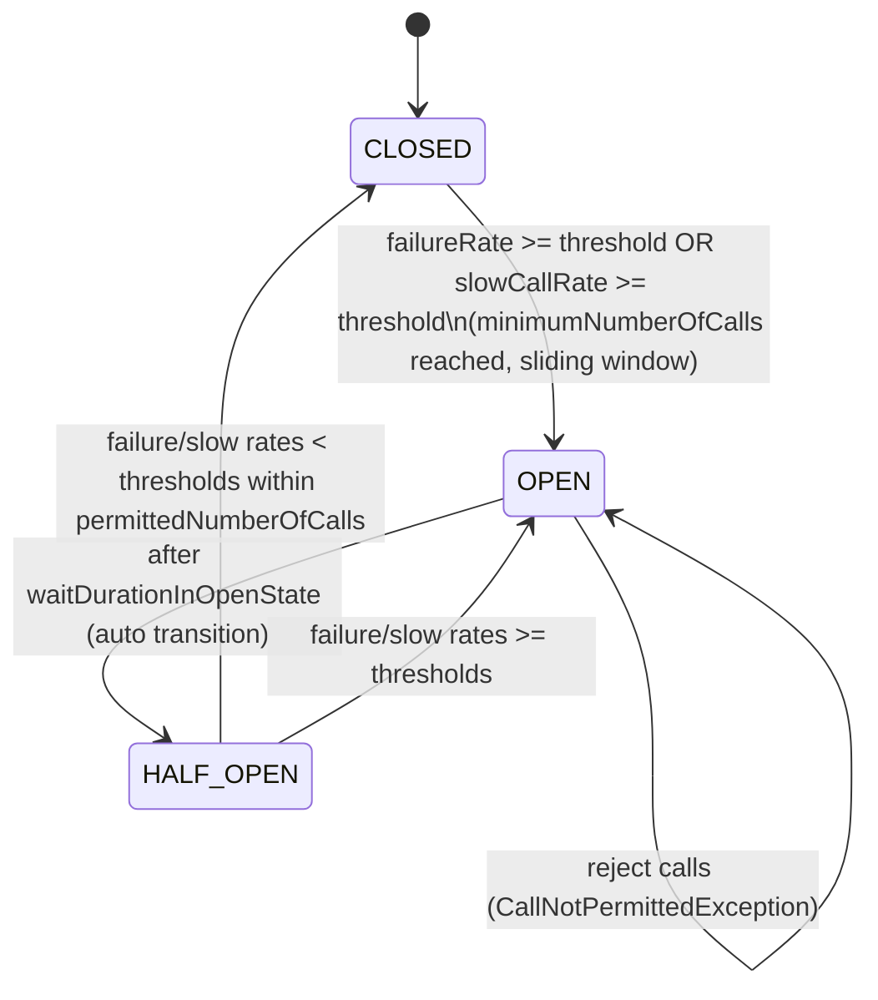


| 상태 | 동작 | 전환 조건 |
| :-- | :-- | :-- |
| **Closed** | 정상적으로 호출 수행 | 실패율이 임계값 미만 |
| **Open** | 모든 호출을 즉시 실패 처리 | 실패율이 임계값 초과 |
| **Half-Open** | 제한된 호출만 허용하여 상태 확인 | 일정 시간 경과 후 |

### 5.3 Resilience4j 통합

Spring Cloud Circuit Breaker는 Resilience4j를 기본 구현체로 사용합니다.
Resilience4j는 Netflix Hystrix의 대안으로 함수형 프로그래밍과 Java 8을 기반으로 설계되었습니다.
Circuit Breaker 외에도 Retry, RateLimiter, TimeLimiter, Bulkhead 등의 패턴을 제공합니다.

**Order Service 의존성 추가**

```xml
<!-- Resilience4j dependencies -->
<dependencies>
    <dependency>
        <groupId>org.springframework.cloud</groupId>
        <artifactId>spring-cloud-starter-circuitbreaker-resilience4j</artifactId>
    </dependency>
     <dependency>
        <groupId>org.springframework.boot</groupId>
        <artifactId>spring-boot-starter-aop</artifactId>
    </dependency>
</dependencies>
```


#### 실패율 기반 회로 차단기 구성

Circuit Breaker의 동작을 세밀하게 제어할 수 있는 다양한 설정 옵션을 제공합니다.
실패율, 최소 호출 수, 대기 시간 등을 환경에 맞게 조정할 수 있습니다.
실시간 모니터링을 통해 Circuit Breaker의 상태를 확인할 수 있습니다.

```yaml
resilience4j:
  circuitbreaker:
    instances:
      inventoryClient:
        failure-rate-threshold: 50  # 실패율 50% 이상 시 OPEN
        slow-call-duration-threshold: 1000  # 1초 이상 소요 시 느린 호출
        slow-call-rate-threshold: 30  # 느린 호출 비율 30% 이상 시 OPEN
        wait-duration-in-open-state: 10s  # OPEN -> HALF_OPEN 전환 대기시간
        minimum-number-of-calls: 5  # 집계 최소 호출 수
        sliding-window-size: 10  # 슬라이딩 윈도우 크기
        permitted-number-of-calls-in-half-open-state: 3  # HALF_OPEN에서 허용 호출 수
        record-exceptions:
          - java.lang.Exception
          - feign.FeignException
```


#### 재시도 및 타임아웃 패턴

Spring Retry를 통해 실패한 메서드 호출을 자동으로 재시도할 수 있습니다.
특정 예외에 대해서만 재시도하도록 설정할 수 있습니다.
재시도 간격과 최대 재시도 횟수를 조정할 수 있습니다.

```yaml
# Resilience4j 설정
resilience4j:
  retry:
    instances:
      inventoryClient:
        max-attempts: 3  # 최대 재시도 횟수(초기 호출 포함)
        wait-duration: 1s  # 재시도 간격
        retry-exceptions:
          - java.lang.Exception
          - feign.FeignException
  timelimiter:
    instances:
      inventoryClient:
        timeout-duration: 2s  # 타임아웃 시간
        cancel-running-future: true

```


#### 지수 백오프 전략

재시도 간격을 지수적으로 증가시켜 시스템 부하를 줄입니다.
초기 간격에서 시작하여 각 재시도마다 지정된 배수만큼 증가합니다.
최대 간격을 설정하여 무한정 증가하는 것을 방지합니다.

> [!WARNING]
>
> OpenFeign을 사용할 경우 Feign의 Retryer를 사용한다.(충돌발생)
>
> resilience4j는 circuitbraker 의 역할만 수행한다.

```yaml
# Resilience4j 설정
resilience4j:
  retry:
    instances:
      inventoryClient:
        max-attempts: 3  # 최대 재시도 횟수(초기 호출 포함)
        wait-duration: 1s  # 재시도 간격
        enable-exponential-backoff: true
        exponential-backoff-multiplier: 2
        retry-exceptions:
          - java.net.ConnectException
          - java.net.SocketTimeoutException
          - org.springframework.web.client.ResourceAccessException
```


#### 타임아웃 설정과 관리

적절한 타임아웃 설정을 통해 무한 대기 상황을 방지합니다.
Connection Timeout과 Read Timeout을 구분하여 설정합니다.
서비스별로 다른 타임아웃 값을 적용할 수 있습니다.

```yaml
# Resilience4j 설정
resilience4j:
  timelimiter:
    instances:
      inventoryClient:
        timeout-duration: 2s  # 타임아웃 시간
        cancel-running-future: true
```


#### Bulkhead 패턴

Bulkhead 패턴은 선박의 격벽과 같이 시스템의 리소스를 분리하여 장애 전파를 방지합니다.
각 서비스나 기능별로 독립적인 리소스 풀을 할당합니다.
한 부분의 장애가 다른 부분에 영향을 주지 않도록 격리합니다.

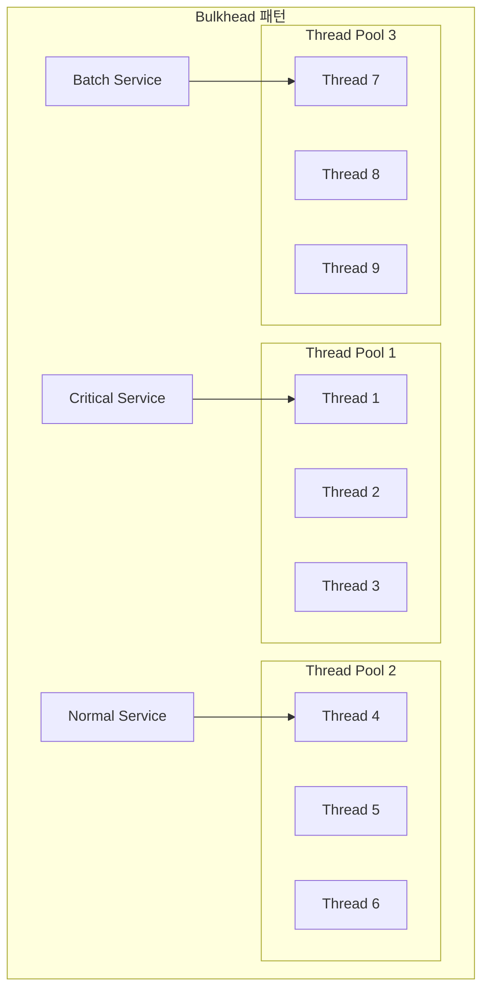


#### 스레드 풀 분리

서비스별로 독립적인 스레드 풀을 할당하여 리소스 경합을 방지합니다.
중요한 서비스와 일반 서비스를 분리하여 우선순위를 보장합니다.
스레드 풀 크기를 적절히 조정하여 성능을 최적화합니다.

```yaml
# Resilience4j 설정
resilience4j:
  thread-pool-bulkhead:
    configs:
      default:
        core-thread-pool-size: 2
        max-thread-pool-size: 4
        queue-capacity: 20
        keep-alive-duration: 20ms
    instances:
      orderProcessing:
        base-config: default
        max-thread-pool-size: 8
        queue-capacity: 50
```


#### 세마포어를 통한 동시 요청 제한

세마포어를 사용하여 특정 리소스에 대한 동시 접근을 제한합니다.
시스템 리소스 고갈을 방지하고 안정적인 성능을 보장합니다.
Resilience4j의 Bulkhead 기능을 활용할 수 있습니다.

```yaml
# Resilience4j Bulkhead 설정
resilience4j:
  bulkhead:
    configs:
      default:
        max-concurrent-calls: 10
        max-wait-duration: 1s
    instances:
      orderProcessing:
        base-config: default
        max-concurrent-calls: 5
      paymentProcessing:
        max-concurrent-calls: 3
        max-wait-duration: 2s

```


### 5.4 구현 예제

#### 시퀀스 다이어그램

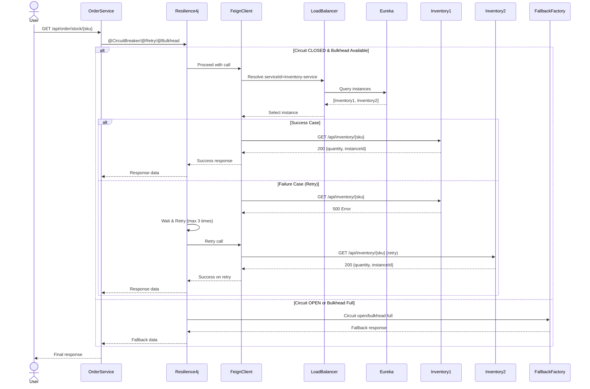


**Order Service 수정**

```yaml
spring:
  application:
    name: order-service
  cloud:
    openfeign:
      circuitbreaker:
        enabled: true  # Spring Boot 3용 설정
      client:
        config:
          default:
            loggerLevel: basic
          inventory-service:
            connectTimeout: 1000     # ms
            readTimeout: 2000        # ms
            loggerLevel: full

logging:
  level:
   com.example.order.client.circuitbreaker.InventoryClient: DEBUG  # Feign 인터페이스 FQCN						
server:
  port: 8080

eureka:
  client:
    serviceUrl:
      defaultZone: http://localhost:8761/eureka
  instance:
    prefer-ip-address: true
    instance-id: ${spring.application.name}:${server.port}

# Resilience4j 설정
resilience4j:
  circuitbreaker:
    instances:
      inventoryClient:
        failure-rate-threshold: 50  # 실패율 50% 이상 시 OPEN
        slow-call-duration-threshold: 1000  # 1초 이상 소요 시 느린 호출
        slow-call-rate-threshold: 30  # 느린 호출 비율 30% 이상 시 OPEN
        wait-duration-in-open-state: 10s  # OPEN -> HALF_OPEN 전환 대기시간
        minimum-number-of-calls: 5  # 집계 최소 호출 수
        sliding-window-size: 10  # 슬라이딩 윈도우 크기
        permitted-number-of-calls-in-half-open-state: 3  # HALF_OPEN에서 허용 호출 수
        record-exceptions:
          - java.lang.Exception
          - feign.FeignException
  timelimiter:
    instances:
      inventoryClient:
        timeout-duration: 2s  # 타임아웃 시간
        cancel-running-future: true
  bulkhead:
    instances:
      inventoryClient:
        max-concurrent-calls: 5  # 최대 동시 호출 수
        max-wait-duration: 1s  # 큐 대기 시간

management:
  endpoints:
    web:
      exposure:
        include: health,info,circuitbreakers,circuitbreakerevents
  health:
    circuitbreakers:
      enabled: true

```
**InventoryClient 수정 (회복력 패턴 적용)**

```java
//order-service/src/main/java/com/example/order/client/circuitbreaker/InventoryClient.java

package com.example.order.client.circuitbreaker;

import java.util.Map;

import org.springframework.cloud.openfeign.FeignClient;
import org.springframework.web.bind.annotation.GetMapping;
import org.springframework.web.bind.annotation.PathVariable;

import io.github.resilience4j.bulkhead.annotation.Bulkhead;
import io.github.resilience4j.circuitbreaker.annotation.CircuitBreaker;

@FeignClient(name = "inventory-service", path = "/api/inventory", fallbackFactory = InventoryClientFallbackFactory.class, configuration = InventoryFeignConfig.class)
public interface InventoryClient {

	@GetMapping("/{sku}/unreliable")
	@CircuitBreaker(name = "inventoryClient", fallbackMethod = "getStockFallback")
	@Bulkhead(name = "inventoryClient", type = Bulkhead.Type.SEMAPHORE)
	Map<String, Object> getStock(@PathVariable("sku") String sku);

	// Fallback 메서드 
	default Map<String, Object> getStockFallback(String sku, Exception ex) {
		return Map.of("sku", sku, "quantity", 0, "instanceId", "fallback-response", "error",
				"Service temporarily unavailable: " + ex.getMessage());
	}	
}

```

**FeignConfig 구현**

Retry는 OpenFeign의 Retryer를 사용한다.

```java
//order-service/src/main/java/com/example/order/client/circuitbreaker/InventoryFeignConfig.java
package com.example.order.client.circuitbreaker;

import org.springframework.context.annotation.Bean;
import org.springframework.context.annotation.Configuration;

@Configuration
public class InventoryFeignConfig {
  @Bean
  public feign.Retryer retryer() {
    return new feign.Retryer.Default(100, 1000, 3);
  }
  
  @Bean
  public feign.codec.ErrorDecoder errorDecoder() {
    return (methodKey, response) -> {
      feign.codec.ErrorDecoder defaultDecoder = new feign.codec.ErrorDecoder.Default();
      Exception ex = defaultDecoder.decode(methodKey, response);
      if (ex instanceof feign.RetryableException) return ex;
      if (response.status() >= 500) {
        return new feign.RetryableException(
            response.status(), "server error, retry", response.request().httpMethod(),
            100L, response.request());
      }
      return ex;
    };
  }  
}

```


**FallbackFactory 구현**

OpenFeign의 FallbackFactory를 구현해 서킷 브레이커 동작 시 대체 응답을 제공한다.

```java
//order-service/src/main/java/com/example/order/client/circuitbreaker/InventoryClientFallbackFactory.java
package com.example.order.client.circuitbreaker;

import java.util.Map;

import org.springframework.cloud.openfeign.FallbackFactory;
import org.springframework.stereotype.Component;

@Component
public class InventoryClientFallbackFactory implements FallbackFactory<InventoryClient> {

	@Override
	public InventoryClient create(Throwable cause) {
		return new InventoryClient() {
			@Override
			public Map<String, Object> getStock(String sku) {
				return Map.of("sku", sku, "quantity", 0, "instanceId", "fallback-factory", "error",
						"Inventory service is down: " + cause.getMessage(), "fallbackReason",
						cause.getClass().getSimpleName());
			}
		};
	}
}
```

**OrderController (비동기 및 회복력 패턴 데모)**

회복력 패턴을 테스트할 수 있는 엔드포인트를 추가한다.

```java
// order-service/src/main/java/com/example/order/api/OrderController.java
package com.example.order.api;

import java.util.Map;

import org.springframework.web.bind.annotation.GetMapping;
import org.springframework.web.bind.annotation.PathVariable;
import org.springframework.web.bind.annotation.RequestMapping;
import org.springframework.web.bind.annotation.RestController;

import com.example.order.client.circuitbreaker.InventoryClient;

@RestController
@RequestMapping("/api/order")
public class OrderCircuitBreakerController {

  private final InventoryClient inventoryClient;

  public OrderCircuitBreakerController(InventoryClient inventoryClient) {
    this.inventoryClient = inventoryClient;
  }

  // 기존 동기 호출 (회복력 패턴 적용)
  // circuitbraker 테스트에는 /slow 추가, retyer 테스트에는 /unreliable 추가 
  @GetMapping("/stock/{sku}")
  public Map<String, Object> checkStock(@PathVariable String sku) {
    Map<String, Object> stock = inventoryClient.getStock(sku);
    return Map.of(
        "sku", stock.get("sku"),
        "quantity", stock.get("quantity"),
        "viaInstance", stock.get("instanceId"),
        "error", stock.getOrDefault("error", "none")
    );
  }
}
```

**테스트용 지연 엔드포인트 (Inventory Service)**

회복력 패턴 테스트를 위해 inventory-service에 지연/실패 시뮬레이션 엔드포인트를 추가한다.

```java
// inventory-service/src/main/java/com/example/inventory/api/InventoryController.java (수정)
package com.example.inventory.api;

import org.springframework.beans.factory.annotation.Value;
import org.springframework.http.HttpStatus;
import org.springframework.web.bind.annotation.*;
import org.springframework.web.server.ResponseStatusException;

import java.net.InetAddress;
import java.util.Map;
import java.util.Random;

@RestController
@RequestMapping("/api/inventory")
public class InventoryController {

  @Value("${spring.application.name}")
  private String appName;

  @Value("${server.port}")
  private int port;

  private final Random random = new Random();

  @GetMapping("/{sku}")
  public Map<String, Object> getStock(@PathVariable String sku) throws Exception {
    String host = InetAddress.getLocalHost().getHostAddress();
    int quantity = (port % 2 == 0) ? 50 : 100;
    return Map.of(
        "sku", sku,
        "quantity", quantity,
        "instanceId", appName + ":" + host + ":" + port
    );
  }

  // 지연 시뮬레이션 엔드포인트
  @GetMapping("/{sku}/slow")
  public Map<String, Object> getStockSlow(@PathVariable String sku) throws Exception {
    // 1-3초 랜덤 지연
    Thread.sleep(1000 + random.nextInt(2000));
    return getStock(sku);
  }

  // 실패 시뮬레이션 엔드포인트 (50% 확률로 실패)
  @GetMapping("/{sku}/unreliable")
  public Map<String, Object> getStockUnreliable(@PathVariable String sku) throws Exception {
    if (random.nextBoolean()) {
      throw new ResponseStatusException(HttpStatus.INTERNAL_SERVER_ERROR, 
          "Simulated service failure");
    }
    return getStock(sku);
  }
}
```


#### 테스트

##### 1. 정상 동작 테스트

```bash
# 기본 로드밸런싱 확인
curl -s http://localhost:8080/api/order/stock/A-100 
```


##### 2. 서킷 브레이커 테스트

```bash
# inventory-service 하나를 중지한 후 반복 호출
for i in {1..10}; do
  curl -s http://localhost:8080/api/order/stock/A-100 
  echo -e 
  sleep 1
done

# 서킷 브레이커 상태 확인
curl -s http://localhost:8080/actuator/circuitbreakers 
```


##### 3. 재시도 패턴 테스트

inventory-service에 실패 시뮬레이션 엔드포인트를 호출해 재시도 동작을 확인한다.

```bash
# 불안정한 서비스 호출 (50% 실패율)
# Feign Client의 타겟 URL 변경
```


##### 4. Bulkhead 패턴 테스트

동시 요청을 보내 격벽 패턴의 동시성 제한을 확인한다.

```bash
# 동시 요청 10개 (bulkhead 설정값과 동일)
for i in {1..10}; do
  echo -e
  curl -s http://localhost:8080/api/order/stock/A-100 &
done
wait
```


##### 모니터링 및 메트릭

Actuator를 통해 Resilience4j 상태를 모니터링할 수 있다.

```bash
# 서킷 브레이커 상태 확인
curl -s http://localhost:8080/actuator/circuitbreakers

# 서킷 브레이커 이벤트 확인
curl -s http://localhost:8080/actuator/circuitbreakerevents

# 헬스 체크 (서킷 브레이커 포함)
curl -s http://localhost:8080/actuator/health
```


## 6장. API Gateway 패턴

### 6.1 API Gateway의 역할과 필요성

#### 단일 진입점의 이점

API Gateway는 클라이언트와 마이크로서비스 간의 단일 진입점 역할을 수행합니다.
모든 외부 요청이 API Gateway를 통해 적절한 백엔드 서비스로 라우팅됩니다.
클라이언트는 복잡한 마이크로서비스 구조를 알 필요 없이 하나의 엔드포인트만 알면 됩니다.


| 기능 | 설명 | 장점 |
| :-- | :-- | :-- |
| **라우팅** | 요청을 적절한 서비스로 전달 | 서비스 위치 추상화 |
| **로드 밸런싱** | 여러 인스턴스 간 부하 분산 | 성능 향상, 가용성 증대 |
| **프로토콜 변환** | HTTP/HTTPS, WebSocket 지원 | 다양한 클라이언트 지원 |
| **캐싱** | 응답 데이터 캐시 | 성능 향상, 백엔드 부하 감소 |

#### 횡단 관심사 처리

API Gateway는 인증, 로깅, 모니터링 등 공통 기능을 중앙화하여 처리합니다.
각 마이크로서비스에서 중복으로 구현할 필요가 없어 개발 효율성이 향상됩니다.
일관된 정책과 표준을 모든 서비스에 적용할 수 있습니다.

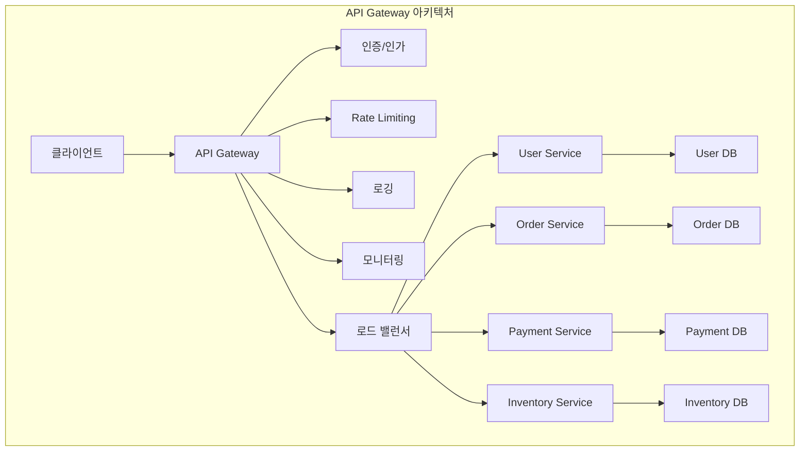


### 6.2 Spring Cloud Gateway

#### Reactive 기반 게이트웨이

Spring Cloud Gateway는 Spring WebFlux와 Project Reactor를 기반으로 구축된 비동기 게이트웨이입니다.
논블로킹 I/O를 통해 높은 성능과 확장성을 제공합니다.
Spring Boot 2.0부터 Netflix Zuul을 대체하는 새로운 게이트웨이 솔루션입니다.

```xml
<!-- Spring Cloud Gateway dependencies -->
<dependencies>
    <dependency>
        <groupId>org.springframework.cloud</groupId>
        <artifactId>spring-cloud-starter-gateway</artifactId>
    </dependency>
    
    <dependency>
        <groupId>org.springframework.cloud</groupId>
        <artifactId>spring-cloud-starter-netflix-eureka-client</artifactId>
    </dependency>
    
    <dependency>
        <groupId>org.springframework.boot</groupId>
        <artifactId>spring-boot-starter-actuator</artifactId>
    </dependency>
    
    <dependency>
        <groupId>org.springframework.boot</groupId>
        <artifactId>spring-boot-starter-data-redis-reactive</artifactId>
    </dependency>
    
    <dependency>
        <groupId>org.springframework.cloud</groupId>
        <artifactId>spring-cloud-starter-circuitbreaker-reactor-resilience4j</artifactId>
    </dependency>
</dependencies>
```


#### Route 설정과 Predicate

Route는 게이트웨이의 기본 구성 요소로 ID, 목적지 URI, Predicate, Filter로 구성됩니다.
Predicate는 HTTP 요청이 라우트와 매칭되는 조건을 정의합니다.
경로, 헤더, 쿠키, 시간 등 다양한 조건으로 라우팅을 제어할 수 있습니다.

```yaml
# Gateway 라우트 설정
spring:
  cloud:
    gateway:
      discovery:
        locator:
          enabled: true
          lower-case-service-id: true
      routes:
        # 사용자 서비스 라우트
        - id: user-service
          uri: lb://user-service
          predicates:
            - Path=/api/users/**
            - Method=GET,POST,PUT,DELETE
          filters:
            - name: StripPrefix
              args:
                parts: 1
            - name: AddRequestHeader
              args:
                name: X-Gateway-Route
                value: user-service
        
        # 주문 서비스 라우트
        - id: order-service
          uri: lb://order-service  
          predicates:
            - Path=/api/orders/**
            - Header=Authorization, Bearer.*
          filters:
            - StripPrefix=1
            - name: RequestRateLimiter
              args:
                redis-rate-limiter.replenish-rate: 10
                redis-rate-limiter.burst-capacity: 20
                redis-rate-limiter.requested-tokens: 1
        
        # 결제 서비스 라우트 (보안 강화)
        - id: payment-service
          uri: lb://payment-service
          predicates:
            - Path=/api/payments/**
            - Method=POST,PUT
            - Header=X-API-Version, v1
          filters:
            - StripPrefix=1
            - name: CircuitBreaker
              args:
                name: payment-cb
                fallbackUri: forward:/api/fallback/payment
        
        # 정적 리소스 라우트
        - id: static-resources
          uri: http://cdn.example.com
          predicates:
            - Path=/static/**
          filters:
            - name: SetPath
              args:
                template: /{segment}
```


### 6.3 구현 예제

```xml
<!-- gateway/pom.xml -->
<project xmlns="http://maven.apache.org/POM/4.0.0"
         xmlns:xsi="http://www.w3.org/2001/XMLSchema-instance"
         xsi:schemaLocation="http://maven.apache.org/POM/4.0.0 http://maven.apache.org/xsd/maven-4.0.0.xsd">
  <modelVersion>4.0.0</modelVersion>
  <groupId>com.example</groupId>
  <artifactId>gateway</artifactId>
  <version>0.0.1-SNAPSHOT</version>
  <name>gateway</name>

  <parent>
    <groupId>org.springframework.boot</groupId>
    <artifactId>spring-boot-starter-parent</artifactId>
    <version>3.3.13</version>
    <relativePath/>
  </parent>

  <properties>
    <java.version>17</java.version>
    <spring-cloud.version>2023.0.6</spring-cloud.version>
  </properties>

  <dependencyManagement>
    <dependencies>
      <dependency>
        <groupId>org.springframework.cloud</groupId>
        <artifactId>spring-cloud-dependencies</artifactId>
        <version>${spring-cloud.version}</version>
        <type>pom</type>
        <scope>import</scope>
      </dependency>
    </dependencies>
  </dependencyManagement>

  <dependencies>
    <dependency>
      <groupId>org.springframework.cloud</groupId>
      <artifactId>spring-cloud-starter-gateway</artifactId>
    </dependency>
    <dependency>
      <groupId>org.springframework.cloud</groupId>
      <artifactId>spring-cloud-starter-netflix-eureka-client</artifactId>
    </dependency>
    <dependency>
      <groupId>org.springframework.cloud</groupId>
      <artifactId>spring-cloud-starter-loadbalancer</artifactId>
    </dependency>
  </dependencies>
</project>
```

```java
// gateway/src/main/java/com/example/gateway/GatewayApplication.java
package com.example.gateway;

import org.springframework.boot.SpringApplication;
import org.springframework.boot.autoconfigure.SpringBootApplication;

@SpringBootApplication
public class GatewayApplication {
  public static void main(String[] args) {
    SpringApplication.run(GatewayApplication.class, args);
  }
}
```
```java
// gateway/src/main/java/com/example/gateway/DemoRouteLocator.java
package com.example.gateway;

import org.springframework.cloud.gateway.route.RouteLocator;
import org.springframework.cloud.gateway.route.builder.RouteLocatorBuilder;
import org.springframework.context.annotation.Bean;
import org.springframework.context.annotation.Configuration;

@Configuration
public class DemoRouteLocator {

	@Bean
	public RouteLocator gatewayRoutes(RouteLocatorBuilder builder) {
		return builder.routes().route(r -> r.path("/api/inventory/**").filters(f -> f.addRequestHeader("Hello", "World"))
				.uri("lb://INVENTORY-SERVICE")).build();
	}
	
}
```
```yaml
# gateway/src/main/resources/application.yml
spring:
  application:
    name: gateway
  cloud:
    gateway:
      discovery:
        locator:
          enabled: true
          lower-case-service-id: true

server:
  port: 8080

eureka:
  client:
    service-url:
      defaultZone: http://localhost:8761/eureka
```


#### 테스트

```bash
curl -s http://localhost/api/inventory/A-100
```


 


## 7장. 컨테이너화

### 7.1 Dockerfile 

Dockerfile은 컨테이너 이미지를 빌드하기 위한 선언형 스크립트로, 베이스 이미지 선택부터 애플리케이션 복사, 의존성 설치, 실행 명령까지의 과정을 단계별로 정의합니다. 소스와 함께 버전 관리되어 재현 가능한 빌드와 자동화를 보장하며, 캐시와 레이어를 활용해 빌드 속도를 최적화합니다.

```dockerfile
# 기본적인 Dockerfile
FROM eclipse-temurin:17-jre-alpine

# 애플리케이션 사용자 생성
RUN addgroup -g 1001 -S appgroup && \
    adduser -u 1001 -S appuser -G appgroup

# 작업 디렉토리 설정
WORKDIR /app

# JAR 파일 복사
COPY target/*.jar app.jar

# 소유권 변경
RUN chown appuser:appgroup /app/app.jar

# 사용자 전환
USER appuser

# 포트 노출
EXPOSE 8080

# 헬스체크 설정
HEALTHCHECK --interval=30s --timeout=3s --start-period=5s --retries=3 \
  CMD wget --no-verbose --tries=1 --spider http://localhost:8080/actuator/health || exit 1

# 애플리케이션 실행
ENTRYPOINT ["java", "-jar", "app.jar"]
```


### 8.2 Cloud Native Buildpacks

#### Buildpack을 통한 이미지 생성

Cloud Native Buildpacks은 소스 코드에서 직접 컨테이너 이미지를 생성하는 도구입니다.
Dockerfile 없이도 베스트 프랙티스가 적용된 이미지를 자동으로 생성할 수 있습니다.
런타임 의존성과 보안 패치를 자동으로 관리하여 운영 부담을 줄입니다.

#### Spring Boot의 빌드팩 지원

Spring Boot 2.3부터 내장된 빌드팩 지원을 통해 쉽게 컨테이너 이미지를 생성할 수 있습니다.
Maven과 Gradle 플러그인을 통해 빌드 프로세스에 통합할 수 있습니다.
레이어 최적화와 JVM 튜닝이 자동으로 적용됩니다.

```xml
<!-- Maven 설정 - pom.xml -->
<plugin>
    <groupId>org.springframework.boot</groupId>
    <artifactId>spring-boot-maven-plugin</artifactId>
    <configuration>
        <image>
            <name>${docker.registry}/${project.artifactId}:${project.version}</name>
            <builder>paketobuildpacks/builder:base</builder>
            <env>
                <BP_JVM_VERSION>17</BP_JVM_VERSION>
                <BPE_DELIM_JAVA_TOOL_OPTIONS> </BPE_DELIM_JAVA_TOOL_OPTIONS>
                <BPE_JAVA_TOOL_OPTIONS>-XX:+UseContainerSupport -XX:MaxRAMPercentage=75.0</BPE_JAVA_TOOL_OPTIONS>
                <BPE_SPRING_PROFILES_ACTIVE>docker</BPE_SPRING_PROFILES_ACTIVE>
            </env>
            <buildpacks>
                <buildpack>paketobuildpacks/java</buildpack>
                <buildpack>paketobuildpacks/health-checker</buildpack>
            </buildpacks>
        </image>
        <docker>
            <host>${docker.host}</host>
            <tlsVerify>${docker.tls.verify}</tlsVerify>
            <certPath>${docker.cert.path}</certPath>
        </docker>
    </configuration>
</plugin>

<!-- 속성 설정 -->
<properties>
    <docker.registry>my-registry.com</docker.registry>
    <docker.host>unix:///var/run/docker.sock</docker.host>
    <docker.tls.verify>false</docker.tls.verify>
    <docker.cert.path></docker.cert.path>
</properties>
```

### 8.3 Jib

Jib은 Dockerfile 없이 Maven/Gradle에서 바로 Java 애플리케이션을 Docker/OCI 이미지로 빌드·푸시하는 도구입니다.
 빠른 증분 빌드와 재현 가능한 이미지를 제공하는 것이 핵심입니다. 

- pom.xml의 build.plugins에 jib-maven-plugin을 추가하고 <to.image>를 지정하면 mvn compile jib:build 만으로 빌드·푸시가 됩니다.

```xml
<!-- pom.xml (핵심 부분) -->
<build>
  <plugins>
    <plugin>
      <groupId>com.google.cloud.tools</groupId>
      <artifactId>jib-maven-plugin</artifactId>
      <version>3.4.6</version>
      <configuration>
        <to>
          <image>docker.io/yourid/demo:0.0.1</image>
        </to>
      </configuration>
    </plugin>
  </plugins>
</build>
```


## 8장. 성능 최적화

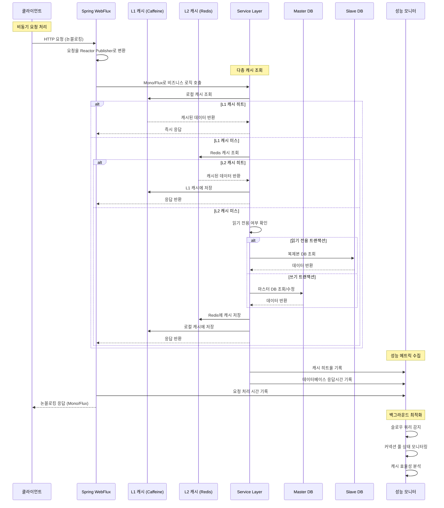


### 8.1 Reactive Programming

#### Spring WebFlux vs Spring MVC

Spring WebFlux는 비동기 논블로킹 I/O를 기반으로 하는 리액티브 웹 프레임워크입니다.
높은 동시성과 적은 메모리 사용량으로 더 많은 요청을 처리할 수 있습니다.
Spring MVC는 스레드 풀 기반으로 동작하며 블로킹 I/O를 사용합니다.


| 구분 | Spring MVC | Spring WebFlux |
| :-- | :-- | :-- |
| **프로그래밍 모델** | 명령형(Imperative) | 함수형(Functional), 선언적 |
| **동시성 모델** | 스레드 풀 기반 | 이벤트 루프 기반 |
| **메모리 사용량** | 높음 (스레드당 스택) | 낮음 (적은 스레드) |
| **처리량** | 높은 CPU 처리 시 유리 | 높은 I/O 처리 시 유리 |
| **학습 곡선** | 완만함 | 가파름 |


### 8.2 캐싱 전략

#### Redis 분산 캐시

Redis는 인메모리 데이터 구조 저장소로 높은 성능의 분산 캐시를 제공합니다.
다양한 데이터 타입(String, Hash, List, Set, Sorted Set)을 지원합니다.
클러스터링과 복제를 통해 확장성과 가용성을 보장할 수 있습니다.

#### Caffeine 로컬 캐시

Caffeine은 자바 8+ 기반의 고성능 로컬 캐시 라이브러리입니다.
LRU, LFU 등 다양한 캐시 제거 정책을 지원합니다.
로컬 캐시와 분산 캐시를 계층적으로 구성하여 최적의 성능을 달성할 수 있습니다.

#### 다층 캐시 구조

L1 캐시(로컬), L2 캐시(분산), L3 캐시(데이터베이스)를 계층적으로 구성합니다.
각 레이어별로 다른 TTL과 캐시 정책을 적용하여 최적화합니다.
캐시 미스 시 하위 레이어에서 데이터를 가져와 상위 레이어를 갱신합니다.


### 8.3 데이터베이스 최적화

#### 쿼리 최적화

데이터베이스 쿼리 성능은 전체 애플리케이션 성능에 큰 영향을 미칩니다.
인덱스 활용, 쿼리 플랜 분석, N+1 문제 해결 등을 통해 성능을 향상시킬 수 있습니다.
JPA/Hibernate의 영속성 컨텍스트와 쿼리 최적화 기능을 적절히 활용합니다.

#### 커넥션 풀 튜닝

적절한 커넥션 풀 크기 설정을 통해 데이터베이스 성능을 최적화합니다.
HikariCP의 설정을 통해 커넥션 생성, 유지, 해제를 효율적으로 관리합니다.
모니터링을 통해 커넥션 풀 사용량과 성능을 지속적으로 개선합니다.

#### 읽기 전용 복제본 활용

읽기 전용 쿼리를 복제본으로 분산하여 마스터 데이터베이스의 부하를 줄입니다.
@Transactional(readOnly = true)를 활용하여 읽기 전용 트랜잭션을 설정합니다.
데이터 복제 지연을 고려한 애플리케이션 로직을 구현합니다.


### 8.5 JVM 최적화

#### 8.5.1 JVM 성능 튜닝 기초

JVM 성능 최적화는 애플리케이션의 처리량과 응답 시간을 개선하는 핵심 요소입니다.
메모리 관리, 가비지 컬렉션, 컴파일러 최적화를 통해 시스템 성능을 극대화할 수 있습니다.
클라우드 환경에서는 컨테이너 리소스 제한과 동적 확장성을 고려한 튜닝이 필요합니다.

#### 8.5.2 메모리 관리 최적화

##### 힙 메모리 설정

| 옵션                         | 설명                 | 추천값                   | 고려사항                                        |
| :--------------------------- | :------------------- | :----------------------- | :---------------------------------------------- |
| **-Xms**                     | 초기 힙 크기         | 전체 힙의 50-75%         | 애플리케이션 시작 성능 향상, 메모리 단편화 방지 |
| **-Xmx**                     | 최대 힙 크기         | 컨테이너 메모리의 75-80% | OOM 방지, 시스템 메모리 여유 공간 확보          |
| **-XX:MaxRAMPercentage**     | 컨테이너 메모리 비율 | 75.0                     | 컨테이너 환경에서 동적 메모리 할당              |
| **-XX:InitialRAMPercentage** | 초기 메모리 비율     | 50.0                     | 컨테이너 시작 시 메모리 효율성                  |
| **-XX:MinRAMPercentage**     | 최소 메모리 비율     | 50.0                     | 소형 컨테이너 환경 대응                         |

```bash
# 컨테이너 환경 권장 설정
-XX:+UseContainerSupport 
-XX:MaxRAMPercentage=75.0 
-XX:InitialRAMPercentage=50.0
-Xms2g -Xmx4g  # 고정 메모리 환경
```


##### Non-Heap 메모리 설정

| 옵션                             | 설명                   | 추천값  | 고려사항                     |
| :------------------------------- | :--------------------- | :------ | :--------------------------- |
| **-XX:MetaspaceSize**            | 초기 메타스페이스 크기 | 256m    | 클래스 로딩 성능 개선        |
| **-XX:MaxMetaspaceSize**         | 최대 메타스페이스 크기 | 512m-1g | 클래스 수에 따라 조정        |
| **-XX:CompressedClassSpaceSize** | 압축 클래스 공간 크기  | 1g      | 64bit 환경에서 메모리 효율성 |
| **-Xss**                         | 스레드 스택 크기       | 1m      | 스레드 수와 재귀 깊이 고려   |

```bash
# Non-Heap 메모리 최적화
-XX:MetaspaceSize=256m 
-XX:MaxMetaspaceSize=512m 
-XX:CompressedClassSpaceSize=1g 
-Xss1m
```


#### 8.5.3 가비지 컬렉션 최적화

##### GC 알고리즘 선택 가이드

| GC 알고리즘     | 적용 환경                  | 힙 크기  | 지연 시간 | 처리량    | 추천 설정                                               |
| :-------------- | :------------------------- | :------- | :-------- | :-------- | :------------------------------------------------------ |
| **G1GC**        | 일반적인 서버 애플리케이션 | 4GB+     | 낮음-중간 | 높음      | `-XX:+UseG1GC -XX:MaxGCPauseMillis=200`                 |
| **ZGC**         | 초저지연 애플리케이션      | 8GB+     | 매우 낮음 | 중간      | `-XX:+UseZGC -XX:+UnlockExperimentalVMOptions`          |
| **Shenandoah**  | 일관된 저지연 애플리케이션 | 4GB+     | 낮음      | 중간      | `-XX:+UseShenandoahGC -XX:+UnlockExperimentalVMOptions` |
| **Parallel GC** | 배치 처리, 높은 처리량     | 제한없음 | 높음      | 매우 높음 | `-XX:+UseParallelGC -XX:ParallelGCThreads=8`            |

##### G1GC 세부 튜닝

| 옵션                         | 설명                  | 추천값 | 고려사항                        |
| :--------------------------- | :-------------------- | :----- | :------------------------------ |
| **-XX:MaxGCPauseMillis**     | 최대 GC 일시정지 시간 | 200ms  | 응답 시간 요구사항에 따라 조정  |
| **-XX:G1HeapRegionSize**     | G1 힙 리전 크기       | 16m    | 힙 크기의 1/2000, 1MB-32MB 범위 |
| **-XX:G1NewSizePercent**     | 새로운 세대 최소 비율 | 20     | Young GC 빈도 조절              |
| **-XX:G1MaxNewSizePercent**  | 새로운 세대 최대 비율 | 40     | 메모리 할당률에 따라 조정       |
| **-XX:G1ReservePercent**     | 힙 예약 공간 비율     | 10     | OOM 방지를 위한 여유 공간       |
| **-XX:G1MixedGCCountTarget** | Mixed GC 타겟 횟수    | 8      | Old 세대 정리 효율성            |

```bash
# G1GC 최적화 설정
-XX:+UseG1GC 
-XX:MaxGCPauseMillis=200 
-XX:G1HeapRegionSize=16m 
-XX:G1NewSizePercent=20 
-XX:G1MaxNewSizePercent=40 
-XX:G1ReservePercent=10 
-XX:G1MixedGCCountTarget=8
```


##### ZGC/Shenandoah 초저지연 설정

| 옵션                                 | 설명                | 추천값   | 고려사항                            |
| :----------------------------------- | :------------------ | :------- | :---------------------------------- |
| **-XX:+UseZGC**                      | ZGC 활성화          | true     | Java 11+ 필요                       |
| **-XX:+UseShenandoahGC**             | Shenandoah 활성화   | true     | OpenJDK 빌드 필요                   |
| **-XX:ShenandoahGCHeuristics**       | Shenandoah 휴리스틱 | adaptive | compact, static, aggressive 중 선택 |
| **-XX:+UnlockExperimentalVMOptions** | 실험적 옵션 활성화  | true     | 프로덕션 사용 시 신중히 고려        |

```bash
# ZGC 설정 (Java 17+)
-XX:+UseZGC 
-XX:+UnlockExperimentalVMOptions 
-XX:+UseTransparentHugePages

# Shenandoah 설정 (OpenJDK)
-XX:+UseShenandoahGC 
-XX:+UnlockExperimentalVMOptions 
-XX:ShenandoahGCHeuristics=adaptive
```


#### 8.5.4 컴파일러 최적화

##### JIT 컴파일러 설정

| 옵션                          | 설명                  | 추천값        | 고려사항                     |
| :---------------------------- | :-------------------- | :------------ | :--------------------------- |
| **-XX:+TieredCompilation**    | 계층형 컴파일 활성화  | true (기본값) | 시작 성능과 최적화 성능 균형 |
| **-XX:TieredStopAtLevel**     | 컴파일 중단 레벨      | 4             | 1-4, 높을수록 더 많은 최적화 |
| **-XX:CompileThreshold**      | 컴파일 임계값         | 10000         | 메서드 호출 횟수 기준        |
| **-XX:+UseCodeCacheFlushing** | 코드 캐시 정리 활성화 | true          | 장기 실행 애플리케이션       |
| **-XX:InitialCodeCacheSize**  | 초기 코드 캐시 크기   | 64m           | 시작 성능 개선               |
| **-XX:ReservedCodeCacheSize** | 예약 코드 캐시 크기   | 256m          | 대형 애플리케이션 대응       |

```bash
# JIT 컴파일러 최적화
-XX:+TieredCompilation 
-XX:TieredStopAtLevel=4 
-XX:InitialCodeCacheSize=64m 
-XX:ReservedCodeCacheSize=256m 
-XX:+UseCodeCacheFlushing
```


#### 8.5.5 성능 모니터링 및 진단

##### GC 로깅 및 분석

| 옵션                          | 설명               | 추천값         | 고려사항                |
| :---------------------------- | :----------------- | :------------- | :---------------------- |
| **-XX:+PrintGC**              | 기본 GC 정보 출력  | true           | 성능 영향 최소          |
| **-XX:+PrintGCDetails**       | 상세 GC 정보 출력  | true           | 분석 시에만 활성화      |
| **-XX:+PrintGCTimeStamps**    | GC 타임스탬프 출력 | true           | 시계열 분석 필요        |
| **-Xloggc**                   | GC 로그 파일 경로  | `/logs/gc.log` | 로그 로테이션 고려      |
| **-XX:+UseGCLogFileRotation** | GC 로그 로테이션   | true           | 디스크 공간 관리        |
| **-XX:NumberOfGCLogFiles**    | GC 로그 파일 수    | 5              | 보관 정책에 따라 조정   |
| **-XX:GCLogFileSize**         | GC 로그 파일 크기  | 100M           | 분석 도구와 호환성 고려 |

```bash
# GC 로깅 설정 (Java 8)
-XX:+PrintGC 
-XX:+PrintGCDetails 
-XX:+PrintGCTimeStamps 
-Xloggc:/logs/gc.log 
-XX:+UseGCLogFileRotation 
-XX:NumberOfGCLogFiles=5 
-XX:GCLogFileSize=100M

# GC 로깅 설정 (Java 9+)
-Xlog:gc*:gc.log:time:filecount=5,filesize=100M
```


##### 힙 덤프 및 진단

| 옵션                                        | 설명                  | 추천값    | 고려사항                |
| :------------------------------------------ | :-------------------- | :-------- | :---------------------- |
| **-XX:+HeapDumpOnOutOfMemoryError**         | OOM 시 힙 덤프 생성   | true      | 메모리 누수 진단        |
| **-XX:HeapDumpPath**                        | 힙 덤프 저장 경로     | `/dumps/` | 충분한 디스크 공간 확보 |
| **-XX:+PrintStringDeduplicationStatistics** | 문자열 중복 제거 통계 | true      | G1GC 사용 시            |
| **-XX:+FlightRecorder**                     | JFR 활성화            | true      | Java 11+에서 무료       |

```bash
# 진단 및 덤프 설정
-XX:+HeapDumpOnOutOfMemoryError 
-XX:HeapDumpPath=/dumps/ 
-XX:+PrintStringDeduplicationStatistics 
-XX:+FlightRecorder
```


#### 8.5.6 클라우드 네이티브 최적화

##### 컨테이너 환경 특화 설정

| 옵션                            | 설명                 | 추천값                | 고려사항                  |
| :------------------------------ | :------------------- | :-------------------- | :------------------------ |
| **-XX:+UseContainerSupport**    | 컨테이너 지원 활성화 | true                  | Java 8u191+, Java 11+     |
| **-XX:+ExitOnOutOfMemoryError** | OOM 시 JVM 종료      | true                  | 컨테이너 재시작으로 복구  |
| **-Djava.security.egd**         | 엔트로피 소스 설정   | `file:/dev/./urandom` | 컨테이너 시작 속도 개선   |
| **-Djava.awt.headless**         | 헤드리스 모드 활성화 | true                  | GUI 불필요한 서버 환경    |
| **-XX:+UseStringDeduplication** | 문자열 중복 제거     | true                  | G1GC와 함께 메모리 효율성 |

```bash
# 컨테이너 환경 최적화
-XX:+UseContainerSupport 
-XX:+ExitOnOutOfMemoryError 
-Djava.security.egd=file:/dev/./urandom 
-Djava.awt.headless=true 
-XX:+UseStringDeduplication
```


#### 8.5.8 성능 측정 및 튜닝 방법론

##### JVM 성능 메트릭

| 메트릭               | 측정 방법       | 목표값     | 개선 방법                       |
| :------------------- | :-------------- | :--------- | :------------------------------ |
| **GC 일시정지 시간** | GC 로그 분석    | <100ms     | GC 알고리즘 변경, 힙 크기 조정  |
| **GC 빈도**          | GC 로그 분석    | 분당 <10회 | 힙 크기 증가, 할당률 감소       |
| **힙 사용률**        | JFR, MBeans     | <85%       | 힙 크기 증가, 메모리 누수 수정  |
| **CPU 사용률**       | 시스템 모니터링 | <80%       | 알고리즘 최적화, 스레드 풀 조정 |
| **응답 시간**        | APM 도구        | <2초       | 전반적 성능 튜닝                |


##### 튜닝 단계별 접근법

| 단계          | 활동           | 도구                  | 기대 효과        |
| :------------ | :------------- | :-------------------- | :--------------- |
| **1. 측정**   | 현재 성능 측정 | JFR, GCViewer         | 베이스라인 설정  |
| **2. 분석**   | 병목 지점 식별 | VisualVM, MAT         | 문제 영역 파악   |
| **3. 설정**   | JVM 옵션 조정  | GC 튜닝, 힙 크기 조정 | 성능 개선        |
| **4. 검증**   | 성능 변화 측정 | 부하 테스트, 모니터링 | 개선 효과 확인   |
| **5. 최적화** | 반복적 개선    | 지속적 모니터링       | 점진적 성능 향상 |


