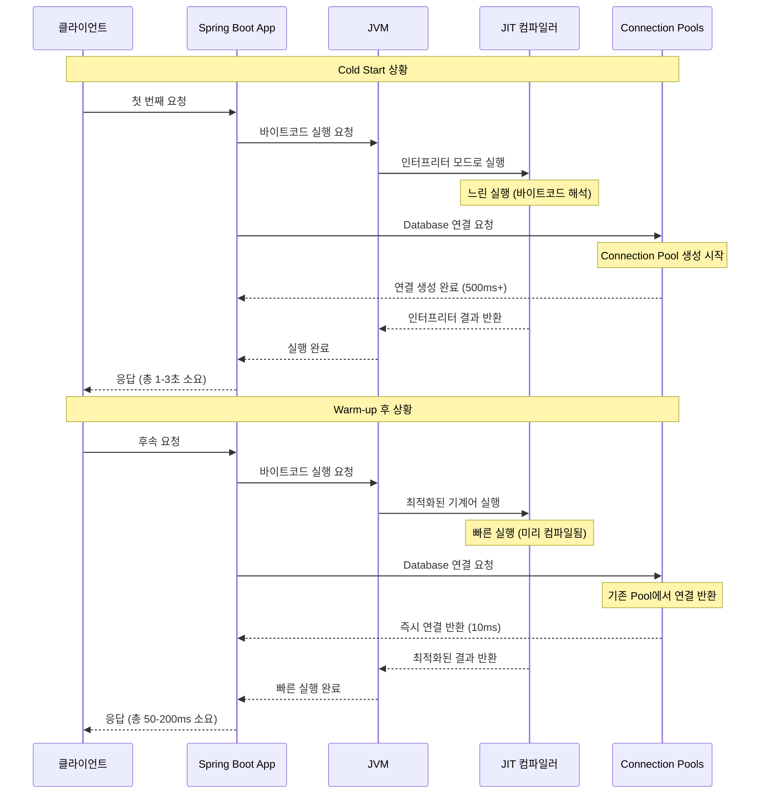
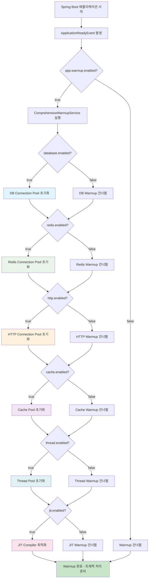
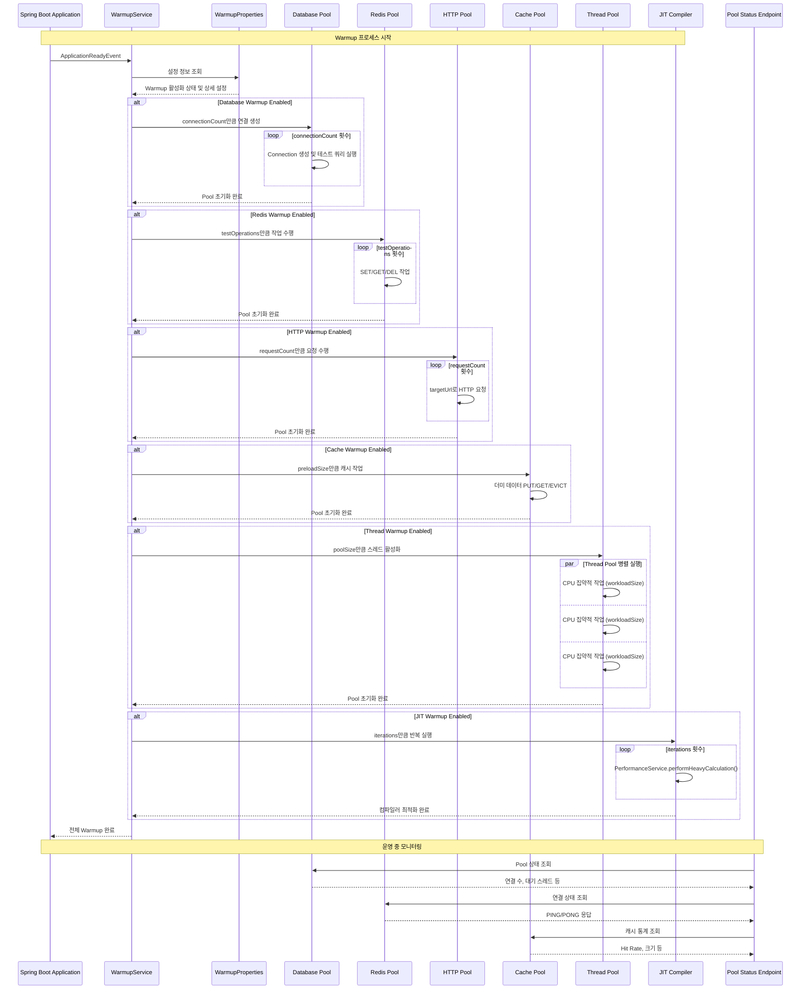

# Spring Boot  JVM Warm-up 가이드

[TOC]


***

## 개요

Spring Boot 애플리케이션을 클라우드 환경에 배포할 때 초기 요청에서 발생하는 지연은 운영상 중요한 문제입니다. 
이러한 지연은 JVM의 특성, Spring Framework의 초기화 과정, 그리고 다양한 Connection Pool들의 생성 과정에서 발생합니다. 

***

## 배포 직후 지연 원인 분석

### 주요 지연 원인

| 원인 | 발생 시점 | 지연 시간 | 영향도 | 해결 방법 |
| :-- | :-- | :-- | :-- | :-- |
| **JIT 컴파일러** | 코드 첫 실행 시 | 100-500ms | 매우 높음 | 반복 실행을 통한 최적화 |
| **클래스 로딩** | 클래스 첫 사용 시 | 50-200ms | 높음 | Eager Loading 설정 |
| **Spring Context 초기화** | 애플리케이션 시작 시 | 1-5초 | 높음 | Bean 사전 초기화 |
| **Database Connection Pool** | 첫 DB 접근 시 | 200-800ms | 매우 높음 | Pool 사전 생성 |
| **Redis Connection Pool** | 첫 Redis 접근 시 | 100-400ms | 높음 | 연결 테스트 |
| **HTTP Connection Pool** | 첫 외부 API 호출 시 | 150-600ms | 높음 | 더미 요청 실행 |
| **캐시 초기화** | 첫 캐시 접근 시 | 50-300ms | 중간 | 캐시 워밍 |

### JVM 실행 과정과 지연 발생 구조




***

## JVM Warm-up 개념과 전략

### Warm-up의 정의와 필요성

JVM Warm-up은 애플리케이션 시작 후 실제 트래픽 처리 전에 의도적으로 코드를 실행하는 과정입니다.
JIT 컴파일러가 중요한 코드 경로를 미리 최적화하도록 유도합니다. 
Connection Pool들을 사전에 초기화하여 첫 요청 시 지연을 방지합니다.
실제 사용자 요청 처리 시 일관되고 빠른 성능을 보장합니다.

### Warm-up 전략 유형

| 전략 유형 | 구현 방식 | 장점 | 단점 | 적용 시나리오 |
| :-- | :-- | :-- | :-- | :-- |
| **Eager Initialization** | 시작 시 모든 컴포넌트 초기화 | 빠른 응답 보장 | 긴 시작 시간 | 고성능 요구 환경 |
| **Progressive Warming** | 단계적 구성요소 초기화 | 균형잡힌 성능 | 구현 복잡도 | 일반적인 웹 애플리케이션 |
| **Background Warming** | 백그라운드 비동기 워밍 | 빠른 시작 | 초기 성능 편차 | 마이크로서비스 |
| **Selective Warming** | 중요 경로만 선택적 워밍 | 효율적 리소스 사용 | 분석 필요 | 리소스 제약 환경 |


***

## Pool 초기화의 중요성

### Connection Pool별 초기화 전략

각 Connection Pool은 서로 다른 초기화 특성을 가집니다. 
Database Connection Pool은 TCP 연결 설정과 인증 과정에서 가장 긴 지연을 발생시킵니다. 
Redis Connection Pool은 네트워크 연결과 프로토콜 handshake에서 지연이 발생합니다. 
HTTP Connection Pool은 DNS 해석과 SSL handshake 과정에서 지연됩니다.

### Pool 초기화 우선순위

| 우선순위 | Pool 유형 | 초기화 이유 | 예상 지연시간 |
| :-- | :-- | :-- | :-- |
| **1순위** | Database Connection Pool | 가장 긴 초기화 시간, 핵심 비즈니스 로직 | 500-2000ms |
| **2순위** | Redis Connection Pool | 세션, 캐시 등 빈번한 사용 | 100-500ms |
| **3순위** | HTTP Connection Pool | 외부 API 연동 | 200-800ms |
| **4순위** | Cache Pool | 성능 최적화 목적 | 50-200ms |
| **5순위** | Thread Pool | 비동기 작업 처리 | 10-100ms |


***

## 설정 기반 Warm-up 구현

### 프로젝트 구조와 의존성

```xml
<?xml version="1.0" encoding="UTF-8"?>
<project xmlns="http://maven.apache.org/POM/4.0.0"
         xmlns:xsi="http://www.w3.org/2001/XMLSchema-instance"
         xsi:schemaLocation="http://maven.apache.org/POM/4.0.0 
         http://maven.apache.org/xsd/maven-4.0.0.xsd">
    <modelVersion>4.0.0</modelVersion>
    
    <parent>
        <groupId>org.springframework.boot</groupId>
        <artifactId>spring-boot-starter-parent</artifactId>
        <version>3.2.0</version>
        <relativePath/>
    </parent>
    
    <groupId>com.example</groupId>
    <artifactId>advanced-warmup-demo</artifactId>
    <version>1.0.0</version>
    <name>Advanced JVM Warmup Demo</name>
    <description>Spring Boot 3.2 기반 완전한 Warmup 구현</description>
    
    <properties>
        <java.version>17</java.version>
        <maven.compiler.source>17</maven.compiler.source>
        <maven.compiler.target>17</maven.compiler.target>
    </properties>
    
    <dependencies>
        <!-- Spring Boot Core -->
        <dependency>
            <groupId>org.springframework.boot</groupId>
            <artifactId>spring-boot-starter-web</artifactId>
        </dependency>
        
        <!-- Actuator for Monitoring -->
        <dependency>
            <groupId>org.springframework.boot</groupId>
            <artifactId>spring-boot-starter-actuator</artifactId>
        </dependency>
        
        <!-- Database -->
        <dependency>
            <groupId>org.springframework.boot</groupId>
            <artifactId>spring-boot-starter-data-jpa</artifactId>
        </dependency>
        <dependency>
            <groupId>com.h2database</groupId>
            <artifactId>h2</artifactId>
            <scope>runtime</scope>
        </dependency>
        
        <!-- Redis -->
        <dependency>
            <groupId>org.springframework.boot</groupId>
            <artifactId>spring-boot-starter-data-redis</artifactId>
        </dependency>
        
        <!-- HTTP Client -->
        <dependency>
            <groupId>org.springframework.boot</groupId>
            <artifactId>spring-boot-starter-webflux</artifactId>
        </dependency>
        
        <!-- Cache -->
        <dependency>
            <groupId>org.springframework.boot</groupId>
            <artifactId>spring-boot-starter-cache</artifactId>
        </dependency>
        <dependency>
            <groupId>com.github.ben-manes.caffeine</groupId>
            <artifactId>caffeine</artifactId>
        </dependency>
        
        <!-- Configuration Processor -->
        <dependency>
            <groupId>org.springframework.boot</groupId>
            <artifactId>spring-boot-configuration-processor</artifactId>
            <optional>true</optional>
        </dependency>
        
        <!-- Metrics -->
        <dependency>
            <groupId>io.micrometer</groupId>
            <artifactId>micrometer-registry-prometheus</artifactId>
        </dependency>
        
        <!-- Validation -->
        <dependency>
            <groupId>org.springframework.boot</groupId>
            <artifactId>spring-boot-starter-validation</artifactId>
        </dependency>
    </dependencies>
    
    <build>
        <plugins>
            <plugin>
                <groupId>org.springframework.boot</groupId>
                <artifactId>spring-boot-maven-plugin</artifactId>
            </plugin>
        </plugins>
    </build>
</project>
```


### Warm-up 설정 Properties 클래스

```java
package com.example.warmup.config.properties;

import org.springframework.boot.context.properties.ConfigurationProperties;
import org.springframework.boot.context.properties.bind.DefaultValue;
import org.springframework.validation.annotation.Validated;

import jakarta.validation.Valid;
import jakarta.validation.constraints.Min;
import jakarta.validation.constraints.Max;
import jakarta.validation.constraints.NotBlank;

/**
 * Warmup 설정을 관리하는 Properties 클래스
 * 환경별로 다른 Warmup 전략을 적용할 수 있도록 구성
 */
@ConfigurationProperties(prefix = "app.warmup")
@Validated
public record WarmupProperties(
    @DefaultValue("true")
    boolean enabled,
    
    @DefaultValue("5000")
    @Min(1000) @Max(60000)
    long totalTimeoutMs,
    
    @Valid
    Database database,
    
    @Valid 
    Redis redis,
    
    @Valid
    Http http,
    
    @Valid
    Cache cache,
    
    @Valid
    Thread thread,
    
    @Valid
    Jit jit
) {
    
    /**
     * Database Connection Pool Warmup 설정
     */
    public record Database(
        @DefaultValue("true")
        boolean enabled,
        
        @Min(1) @Max(50) @DefaultValue("5")
        int connectionCount,
        
        @Min(1000) @Max(30000) @DefaultValue("5000")
        int timeoutMs,
        
        @DefaultValue("SELECT 1")
        String testQuery
    ) {}
    
    /**
     * Redis Connection Pool Warmup 설정
     */
    public record Redis(
        @DefaultValue("true") 
        boolean enabled,
        
        @Min(1) @Max(20) @DefaultValue("5")
        int testOperations,
        
        @NotBlank @DefaultValue("warmup")
        String keyPrefix,
        
        @Min(1000) @Max(10000) @DefaultValue("3000")
        int timeoutMs
    ) {}
    
    /**
     * HTTP Connection Pool Warmup 설정
     */
    public record Http(
        @DefaultValue("true")
        boolean enabled,
        
        @Min(1) @Max(20) @DefaultValue("3")
        int requestCount,
        
        @Min(1000) @Max(15000) @DefaultValue("5000")
        int timeoutMs,
        
        @NotBlank @DefaultValue("http://localhost:8080/actuator/health")
        String targetUrl
    ) {}
    
    /**
     * Cache Warmup 설정
     */
    public record Cache(
        @DefaultValue("true")
        boolean enabled,
        
        @NotBlank @DefaultValue("performance-cache")
        String cacheName,
        
        @Min(10) @Max(1000) @DefaultValue("100")
        int preloadSize
    ) {}
    
    /**
     * Thread Pool Warmup 설정
     */
    public record Thread(
        @DefaultValue("true")
        boolean enabled,
        
        @Min(1) @Max(100) @DefaultValue("10")
        int poolSize,
        
        @Min(1000) @Max(10000000) @DefaultValue("100000")
        int workloadSize
    ) {}
    
    /**
     * JIT Compiler Warmup 설정
     */
    public record Jit(
        @DefaultValue("true")
        boolean enabled,
        
        @Min(100) @Max(50000) @DefaultValue("1000")
        int iterations,
        
        @Min(10) @Max(1000) @DefaultValue("200")
        int logInterval
    ) {}
}
```


### 메인 애플리케이션 클래스

```java
package com.example.warmup;

import com.example.warmup.config.properties.WarmupProperties;
import org.springframework.boot.SpringApplication;
import org.springframework.boot.autoconfigure.SpringBootApplication;
import org.springframework.boot.context.properties.EnableConfigurationProperties;
import org.springframework.cache.annotation.EnableCaching;
import org.springframework.scheduling.annotation.EnableAsync;

@SpringBootApplication
@EnableAsync
@EnableCaching
@EnableConfigurationProperties(WarmupProperties.class)
public class AdvancedWarmupApplication {
    
    public static void main(String[] args) {
        // JVM 최적화 파라미터 로그 출력
        System.setProperty("java.util.logging.SimpleFormatter.format", 
                          "%1$tF %1$tT %4$s %2$s %5$s%6$s%n");
        
        SpringApplication.run(AdvancedWarmupApplication.class, args);
    }
}
```


### 성능 테스트 서비스

```java
package com.example.warmup.service;

import org.springframework.stereotype.Service;
import java.time.LocalDateTime;
import java.util.concurrent.ThreadLocalRandom;
import java.util.concurrent.atomic.AtomicInteger;

/**
 * JIT 컴파일러 최적화를 위한 성능 테스트 서비스
 */
@Service
public class PerformanceService {
    
    private final AtomicInteger callCount = new AtomicInteger(0);
    
    /**
     * CPU 집약적 작업 시뮬레이션
     * JIT 컴파일러 최적화 대상이 되는 메서드
     */
    public PerformanceTestResult performHeavyCalculation() {
        long startTime = System.nanoTime();
        
        // CPU 집약적 작업 - 수학 연산
        double result = 0;
        for (int i = 0; i < 1000000; i++) {
            result += Math.sqrt(ThreadLocalRandom.current().nextDouble());
            result -= Math.log(i + 1);
            result *= Math.sin(i * 0.001);
        }
        
        // 메모리 집약적 작업 - 문자열 조작
        StringBuilder sb = new StringBuilder();
        for (int i = 0; i < 10000; i++) {
            sb.append("성능테스트데이터").append(i).append("-");
        }
        
        // 배열 처리 작업
        int[] array = new int[1000];
        for (int i = 0; i < array.length; i++) {
            array[i] = ThreadLocalRandom.current().nextInt(1000);
        }
        
        // 간단한 정렬 작업
        java.util.Arrays.sort(array);
        
        long endTime = System.nanoTime();
        long duration = (endTime - startTime) / 1_000_000; // 밀리초 변환
        
        int currentCallCount = callCount.incrementAndGet();
        
        return new PerformanceTestResult(
            currentCallCount,
            duration,
            result,
            sb.length(),
            array[array.length - 1], // 최대값
            LocalDateTime.now()
        );
    }
    
    public int getCallCount() {
        return callCount.get();
    }
    
    public void resetCallCount() {
        this.callCount.set(0);
    }
}
```


### 성능 테스트 결과 Record 클래스

```java
package com.example.warmup.service;

import com.fasterxml.jackson.annotation.JsonFormat;
import java.time.LocalDateTime;

/**
 * 성능 테스트 결과를 담는 Record 클래스
 */
public record PerformanceTestResult(
    int callNumber,
    long executionTimeMs,
    double calculationResult,
    int dataSize,
    int maxValue,
    
    @JsonFormat(pattern = "yyyy-MM-dd HH:mm:ss.SSS")
    LocalDateTime timestamp
) {}
```


### 완전한 Warm-up 서비스

```java
package com.example.warmup.service;

import com.example.warmup.config.properties.WarmupProperties;
import org.slf4j.Logger;
import org.slf4j.LoggerFactory;
import org.springframework.beans.factory.annotation.Autowired;
import org.springframework.boot.context.event.ApplicationReadyEvent;
import org.springframework.cache.CacheManager;
import org.springframework.context.event.EventListener;
import org.springframework.data.redis.core.RedisTemplate;
import org.springframework.scheduling.annotation.Async;
import org.springframework.stereotype.Service;
import org.springframework.web.reactive.function.client.WebClient;
import reactor.core.publisher.Mono;

import javax.sql.DataSource;
import java.sql.Connection;
import java.sql.SQLException;
import java.time.Duration;
import java.util.concurrent.CompletableFuture;
import java.util.concurrent.ExecutorService;
import java.util.concurrent.Executors;
import java.util.concurrent.TimeUnit;

/**
 * 설정 기반 완전한 Warmup 서비스
 * 모든 Pool과 JIT 컴파일러를 단계적으로 초기화
 */
@Service
public class ComprehensiveWarmupService {
    
    private static final Logger logger = LoggerFactory.getLogger(ComprehensiveWarmupService.class);
    
    private final WarmupProperties warmupProperties;
    private final DataSource dataSource;
    private final RedisTemplate<String, Object> redisTemplate;
    private final CacheManager cacheManager;
    private final WebClient.Builder webClientBuilder;
    private final PerformanceService performanceService;
    
    private ExecutorService executorService;
    
    public ComprehensiveWarmupService(
            WarmupProperties warmupProperties,
            DataSource dataSource,
            RedisTemplate<String, Object> redisTemplate,
            CacheManager cacheManager,
            WebClient.Builder webClientBuilder,
            PerformanceService performanceService) {
        
        this.warmupProperties = warmupProperties;
        this.dataSource = dataSource;
        this.redisTemplate = redisTemplate;
        this.cacheManager = cacheManager;
        this.webClientBuilder = webClientBuilder;
        this.performanceService = performanceService;
        
        // Thread Pool 미리 생성
        if (warmupProperties.thread().enabled()) {
            this.executorService = Executors.newFixedThreadPool(
                warmupProperties.thread().poolSize());
        }
    }
    
    @EventListener(ApplicationReadyEvent.class)
    @Async
    public void performComprehensiveWarmup() {
        if (!warmupProperties.enabled()) {
            logger.info("🚫 Warmup이 전역 설정에서 비활성화되어 있습니다.");
            return;
        }
        
        logger.info("🚀 === 종합적 Warm-up 프로세스 시작 ===");
        long globalStartTime = System.currentTimeMillis();
        
        try {
            // 1. Database Connection Pool 초기화
            if (warmupProperties.database().enabled()) {
                warmupDatabasePool();
            } else {
                logger.info("⏭️  1. Database Pool Warmup 건너뜀 (설정에서 비활성화)");
            }
            
            // 2. Redis Connection Pool 초기화
            if (warmupProperties.redis().enabled()) {
                warmupRedisPool();
            } else {
                logger.info("⏭️  2. Redis Pool Warmup 건너뜀 (설정에서 비활성화)");
            }
            
            // 3. HTTP Connection Pool 초기화
            if (warmupProperties.http().enabled()) {
                warmupHttpConnectionPool();
            } else {
                logger.info("⏭️  3. HTTP Pool Warmup 건너뜀 (설정에서 비활성화)");
            }
            
            // 4. Cache Pool 초기화
            if (warmupProperties.cache().enabled()) {
                warmupCachePool();
            } else {
                logger.info("⏭️  4. Cache Pool Warmup 건너뜀 (설정에서 비활성화)");
            }
            
            // 5. Thread Pool 초기화
            if (warmupProperties.thread().enabled()) {
                warmupThreadPool();
            } else {
                logger.info("⏭️  5. Thread Pool Warmup 건너뜀 (설정에서 비활성화)");
            }
            
            // 6. JIT Compiler 최적화
            if (warmupProperties.jit().enabled()) {
                warmupJitCompiler();
            } else {
                logger.info("⏭️  6. JIT Compiler Warmup 건너뜀 (설정에서 비활성화)");
            }
            
            long globalEndTime = System.currentTimeMillis();
            logger.info("🎉 === 종합적 Warm-up 완료: {}ms 소요 ===", 
                       globalEndTime - globalStartTime);
            
            // 전체 타임아웃 체크
            if (globalEndTime - globalStartTime > warmupProperties.totalTimeoutMs()) {
                logger.warn("⚠️  Warmup이 설정된 전체 타임아웃({}ms)을 초과했습니다.", 
                           warmupProperties.totalTimeoutMs());
            }
            
        } catch (Exception e) {
            logger.error("💥 Warmup 과정에서 치명적 오류 발생", e);
        }
    }
    
    private void warmupDatabasePool() {
        logger.info("🗄️  1. Database Connection Pool 초기화 시작");
        logger.info("   📊 설정: 연결수={}, 타임아웃={}ms, 테스트쿼리='{}'", 
                   warmupProperties.database().connectionCount(),
                   warmupProperties.database().timeoutMs(),
                   warmupProperties.database().testQuery());
        
        long startTime = System.currentTimeMillis();
        int successCount = 0;
        int connectionCount = warmupProperties.database().connectionCount();
        
        try {
            for (int i = 0; i < connectionCount; i++) {
                try (Connection connection = dataSource.getConnection()) {
                    // 설정된 테스트 쿼리 실행
                    connection.createStatement()
                             .execute(warmupProperties.database().testQuery());
                    successCount++;
                    
                    logger.debug("   ✓ DB 연결 #{} 성공", i + 1);
                    
                } catch (SQLException e) {
                    logger.warn("   ❌ Database 연결 #{} 실패: {}", i + 1, e.getMessage());
                }
                
                // 개별 타임아웃 체크
                if (System.currentTimeMillis() - startTime > warmupProperties.database().timeoutMs()) {
                    logger.warn("   ⏰ Database Pool Warmup 타임아웃 ({}ms)", 
                               warmupProperties.database().timeoutMs());
                    break;
                }
            }
            
            long duration = System.currentTimeMillis() - startTime;
            logger.info("   ✅ Database Connection Pool 초기화 완료: {}/{}개 성공, {}ms 소요", 
                       successCount, connectionCount, duration);
            
        } catch (Exception e) {
            logger.error("   💥 Database Connection Pool 초기화 실패", e);
        }
    }
    
    private void warmupRedisPool() {
        logger.info("🔴 2. Redis Connection Pool 초기화 시작");
        logger.info("   📊 설정: 테스트작업수={}, 키접두사='{}', 타임아웃={}ms", 
                   warmupProperties.redis().testOperations(),
                   warmupProperties.redis().keyPrefix(),
                   warmupProperties.redis().timeoutMs());
        
        long startTime = System.currentTimeMillis();
        int successCount = 0;
        String keyPrefix = warmupProperties.redis().keyPrefix();
        int testOperations = warmupProperties.redis().testOperations();
        
        try {
            for (int i = 0; i < testOperations; i++) {
                String key = keyPrefix + ":test:" + i;
                String value = "warmup-value-" + i + "-" + System.currentTimeMillis();
                
                try {
                    // SET 작업
                    redisTemplate.opsForValue().set(key, value);
                    
                    // GET 작업
                    Object retrieved = redisTemplate.opsForValue().get(key);
                    
                    // DEL 작업 (정리)
                    redisTemplate.delete(key);
                    
                    if (value.equals(retrieved)) {
                        successCount++;
                        logger.debug("   ✓ Redis 작업 #{} 성공", i + 1);
                    }
                    
                } catch (Exception e) {
                    logger.warn("   ❌ Redis 작업 #{} 실패: {}", i + 1, e.getMessage());
                }
                
                // 타임아웃 체크
                if (System.currentTimeMillis() - startTime > warmupProperties.redis().timeoutMs()) {
                    logger.warn("   ⏰ Redis Pool Warmup 타임아웃 ({}ms)", 
                               warmupProperties.redis().timeoutMs());
                    break;
                }
            }
            
            long duration = System.currentTimeMillis() - startTime;
            logger.info("   ✅ Redis Connection Pool 초기화 완료: {}/{}개 성공, {}ms 소요", 
                       successCount, testOperations, duration);
            
        } catch (Exception e) {
            logger.error("   💥 Redis Connection Pool 초기화 실패", e);
        }
    }
    
    private void warmupHttpConnectionPool() {
        logger.info("🌐 3. HTTP Connection Pool 초기화 시작");
        logger.info("   📊 설정: 요청수={}, URL='{}', 타임아웃={}ms", 
                   warmupProperties.http().requestCount(),
                   warmupProperties.http().targetUrl(),
                   warmupProperties.http().timeoutMs());
        
        WebClient webClient = webClientBuilder.build();
        long startTime = System.currentTimeMillis();
        int successCount = 0;
        int requestCount = warmupProperties.http().requestCount();
        
        for (int i = 0; i < requestCount; i++) {
            try {
                Mono<String> response = webClient.get()
                    .uri(warmupProperties.http().targetUrl())
                    .retrieve()
                    .bodyToMono(String.class)
                    .timeout(Duration.ofMillis(warmupProperties.http().timeoutMs()));
                
                String result = response.block();
                if (result != null && !result.isEmpty()) {
                    successCount++;
                    logger.debug("   ✓ HTTP 요청 #{} 성공 ({}자)", i + 1, result.length());
                }
                
            } catch (Exception e) {
                logger.debug("   ❌ HTTP 요청 #{} 실패: {}", i + 1, e.getMessage());
            }
        }
        
        long duration = System.currentTimeMillis() - startTime;
        logger.info("   ✅ HTTP Connection Pool 초기화 완료: {}/{}개 성공, {}ms 소요", 
                   successCount, requestCount, duration);
    }
    
    private void warmupCachePool() {
        logger.info("💾 4. Cache Pool 초기화 시작");
        logger.info("   📊 설정: 캐시명='{}', 미리로드크기={}", 
                   warmupProperties.cache().cacheName(),
                   warmupProperties.cache().preloadSize());
        
        long startTime = System.currentTimeMillis();
        
        try {
            String cacheName = warmupProperties.cache().cacheName();
            var cache = cacheManager.getCache(cacheName);
            
            if (cache != null) {
                int preloadSize = warmupProperties.cache().preloadSize();
                
                // 캐시에 더미 데이터 로드
                for (int i = 0; i < preloadSize; i++) {
                    String key = "warmup-key-" + i;
                    String value = "warmup-value-" + i + "-" + System.currentTimeMillis();
                    cache.put(key, value);
                }
                
                // 로드된 데이터 검증
                int verificationCount = Math.min(10, preloadSize);
                for (int i = 0; i < verificationCount; i++) {
                    cache.get("warmup-key-" + i);
                }
                
                // 캐시 정리
                for (int i = 0; i < preloadSize; i++) {
                    cache.evict("warmup-key-" + i);
                }
                
                long duration = System.currentTimeMillis() - startTime;
                logger.info("   ✅ Cache Pool '{}' 초기화 완료: {}개 항목 처리, {}ms 소요", 
                           cacheName, preloadSize, duration);
                
            } else {
                logger.warn("   ⚠️  캐시 '{}'를 찾을 수 없습니다. 사용 가능한 캐시: {}", 
                           cacheName, cacheManager.getCacheNames());
            }
            
        } catch (Exception e) {
            logger.error("   💥 Cache Pool 초기화 실패", e);
        }
    }
    
    private void warmupThreadPool() {
        logger.info("⚡ 5. Thread Pool 초기화 시작");
        logger.info("   📊 설정: 스레드수={}, 작업크기={}", 
                   warmupProperties.thread().poolSize(),
                   warmupProperties.thread().workloadSize());
        
        long startTime = System.currentTimeMillis();
        
        try {
            int poolSize = warmupProperties.thread().poolSize();
            CompletableFuture<?>[] futures = new CompletableFuture[poolSize];
            
            for (int i = 0; i < poolSize; i++) {
                final int taskId = i;
                futures[i] = CompletableFuture.runAsync(() -> {
                    // CPU 집약적 작업으로 스레드 워밍
                    double result = 0;
                    int workloadSize = warmupProperties.thread().workloadSize();
                    
                    for (int j = 0; j < workloadSize; j++) {
                        result += Math.sqrt(j);
                        if (j % (workloadSize / 10) == 0) {
                            // 중간 진행상황 체크 (로그는 debug 레벨)
                            logger.debug("     🔄 Thread {} 진행률: {}%", 
                                        taskId, (j * 100 / workloadSize));
                        }
                    }
                    
                    logger.debug("   ✓ Thread {} warmup 완료: 결과={}", taskId, result);
                }, executorService);
            }
            
            // 모든 작업 완료 대기 (최대 30초)
            CompletableFuture.allOf(futures).get(30, TimeUnit.SECONDS);
            
            long duration = System.currentTimeMillis() - startTime;
            logger.info("   ✅ Thread Pool 초기화 완료: {}개 스레드 활성화, {}ms 소요", 
                       poolSize, duration);
            
        } catch (Exception e) {
            logger.error("   💥 Thread Pool 초기화 실패", e);
        }
    }
    
    private void warmupJitCompiler() {
        logger.info("🔥 6. JIT Compiler 최적화 시작");
        logger.info("   📊 설정: 반복수={}, 로그간격={}", 
                   warmupProperties.jit().iterations(),
                   warmupProperties.jit().logInterval());
        
        long startTime = System.currentTimeMillis();
        
        try {
            int iterations = warmupProperties.jit().iterations();
            int logInterval = warmupProperties.jit().logInterval();
            
            for (int i = 0; i < iterations; i++) {
                // 성능 서비스 메서드 반복 실행으로 JIT 최적화 유도
                performanceService.performHeavyCalculation();
                
                if (i % logInterval == 0 && i > 0) {
                    logger.debug("   🔄 JIT Warmup 진행: {}/{} ({}%)", 
                                i, iterations, (i * 100 / iterations));
                }
            }
            
            // 호출 카운트 리셋 (실제 사용자 요청과 구분)
            performanceService.resetCallCount();
            
            long duration = System.currentTimeMillis() - startTime;
            logger.info("   ✅ JIT Compiler 최적화 완료: {}회 반복, {}ms 소요", 
                       iterations, duration);
            
        } catch (Exception e) {
            logger.error("   💥 JIT Compiler 최적화 실패", e);
        }
    }
    
    /**
     * Warmup 설정 정보 조회
     */
    public WarmupProperties getWarmupProperties() {
        return warmupProperties;
    }
    
    /**
     * 애플리케이션 종료 시 리소스 정리
     */
    public void shutdown() {
        if (executorService != null && !executorService.isShutdown()) {
            executorService.shutdown();
            try {
                if (!executorService.awaitTermination(5, TimeUnit.SECONDS)) {
                    executorService.shutdownNow();
                }
            } catch (InterruptedException e) {
                executorService.shutdownNow();
                Thread.currentThread().interrupt();
            }
        }
    }
}
```


***

## Custom Actuator를 통한 모니터링

### Pool 상태 정보 모델

```java
package com.example.warmup.actuator.model;

import com.fasterxml.jackson.annotation.JsonInclude;
import com.fasterxml.jackson.annotation.JsonProperty;
import java.time.LocalDateTime;
import java.util.Map;

/**
 * Pool 상태 정보를 담는 종합적인 모델
 */
@JsonInclude(JsonInclude.Include.NON_NULL)
public record PoolStatus(
    @JsonProperty("overall_status")
    String status,
    
    @JsonProperty("check_timestamp")
    LocalDateTime timestamp,
    
    @JsonProperty("warmup_enabled")
    boolean warmupEnabled,
    
    @JsonProperty("database_pool")
    DatabasePoolInfo database,
    
    @JsonProperty("redis_pool")
    RedisPoolInfo redis,
    
    @JsonProperty("http_pool")
    HttpPoolInfo http,
    
    @JsonProperty("cache_pool")
    CachePoolInfo cache,
    
    @JsonProperty("thread_pool")
    ThreadPoolInfo thread,
    
    @JsonProperty("jvm_info")
    JvmInfo jvm
) {
    
    /**
     * Database Connection Pool 정보
     */
    public record DatabasePoolInfo(
        boolean available,
        boolean warmupEnabled,
        
        @JsonProperty("active_connections")
        int activeConnections,
        
        @JsonProperty("idle_connections") 
        int idleConnections,
        
        @JsonProperty("total_connections")
        int totalConnections,
        
        @JsonProperty("threads_awaiting")
        int threadsAwaitingConnection,
        
        @JsonProperty("database_url")
        String url,
        
        @JsonProperty("driver_class")
        String driverClass,
        
        @JsonProperty("pool_type")
        String poolType
    ) {}
    
    /**
     * Redis Connection Pool 정보  
     */
    public record RedisPoolInfo(
        boolean available,
        boolean warmupEnabled,
        
        @JsonProperty("connection_status")
        String connectionStatus,
        
        @JsonProperty("pool_config")
        Map<String, Object> poolConfig,
        
        @JsonProperty("error_message")
        String errorMessage
    ) {}
    
    /**
     * HTTP Connection Pool 정보
     */
    public record HttpPoolInfo(
        boolean available,
        boolean warmupEnabled,
        
        @JsonProperty("max_connections")
        int maxConnections,
        
        @JsonProperty("active_connections") 
        int activeConnections,
        
        @JsonProperty("target_url")
        String targetUrl,
        
        String status
    ) {}
    
    /**
     * Cache Pool 정보
     */
    public record CachePoolInfo(
        boolean available,
        boolean warmupEnabled,
        
        @JsonProperty("cache_details")
        Map<String, CacheDetails> caches
    ) {}
    
    /**
     * 개별 캐시 상세 정보
     */
    public record CacheDetails(
        String name,
        long size,
        
        @JsonProperty("hit_rate")
        double hitRate,
        
        @JsonProperty("hit_count")
        long hitCount,
        
        @JsonProperty("miss_count")
        long missCount,
        
        @JsonProperty("eviction_count")
        long evictionCount
    ) {}
    
    /**
     * Thread Pool 정보
     */
    public record ThreadPoolInfo(
        boolean available,
        boolean warmupEnabled,
        
        @JsonProperty("core_pool_size")
        int corePoolSize,
        
        @JsonProperty("active_count")
        int activeCount,
        
        @JsonProperty("pool_size")
        int poolSize,
        
        @JsonProperty("task_count")
        long taskCount,
        
        @JsonProperty("completed_task_count")
        long completedTaskCount
    ) {}
    
    /**
     * JVM 정보
     */
    public record JvmInfo(
        @JsonProperty("uptime_ms")
        long uptimeMs,
        
        @JsonProperty("heap_used_mb")
        long heapUsedMb,
        
        @JsonProperty("heap_max_mb")
        long heapMaxMb,
        
        @JsonProperty("gc_collections")
        long gcCollections,
        
        @JsonProperty("loaded_classes")
        int loadedClasses
    ) {}
}
```


### 고급 Custom Actuator Endpoint

```java
package com.example.warmup.actuator;

import com.example.warmup.actuator.model.PoolStatus;
import com.example.warmup.config.properties.WarmupProperties;
import com.github.benmanes.caffeine.cache.Cache;
import com.github.benmanes.caffeine.cache.stats.CacheStats;
import com.zaxxer.hikari.HikariDataSource;
import com.zaxxer.hikari.HikariPoolMXBean;
import org.springframework.boot.actuate.endpoint.annotation.Endpoint;
import org.springframework.boot.actuate.endpoint.annotation.ReadOperation;
import org.springframework.boot.actuate.endpoint.annotation.Selector;
import org.springframework.cache.CacheManager;
import org.springframework.cache.caffeine.CaffeineCache;
import org.springframework.data.redis.connection.RedisConnection;
import org.springframework.data.redis.core.RedisTemplate;
import org.springframework.stereotype.Component;

import javax.sql.DataSource;
import java.lang.management.GarbageCollectorMXBean;
import java.lang.management.ManagementFactory;
import java.time.LocalDateTime;
import java.util.HashMap;
import java.util.Map;
import java.util.concurrent.ThreadPoolExecutor;

/**
 * Pool 상태를 모니터링하는 Custom Actuator Endpoint
 * /actuator/pools 경로로 접근 가능
 */
@Component
@Endpoint(id = "pools")
public class AdvancedPoolStatusEndpoint {
    
    private final DataSource dataSource;
    private final RedisTemplate<String, Object> redisTemplate;
    private final CacheManager cacheManager;
    private final WarmupProperties warmupProperties;
    
    public AdvancedPoolStatusEndpoint(
            DataSource dataSource,
            RedisTemplate<String, Object> redisTemplate,
            CacheManager cacheManager,
            WarmupProperties warmupProperties) {
        this.dataSource = dataSource;
        this.redisTemplate = redisTemplate;
        this.cacheManager = cacheManager;
        this.warmupProperties = warmupProperties;
    }
    
    /**
     * 전체 Pool 상태 조회
     * GET /actuator/pools
     */
    @ReadOperation
    public PoolStatus getCompletePoolStatus() {
        return new PoolStatus(
            determineOverallStatus(),
            LocalDateTime.now(),
            warmupProperties.enabled(),
            getDatabasePoolInfo(),
            getRedisPoolInfo(),
            getHttpPoolInfo(),
            getCachePoolInfo(),
            getThreadPoolInfo(),
            getJvmInfo()
        );
    }
    
    /**
     * 특정 Pool 정보 조회
     * GET /actuator/pools/{poolType}
     */
    @ReadOperation
    public Object getSpecificPoolStatus(@Selector String poolType) {
        return switch (poolType.toLowerCase()) {
            case "database", "db" -> getDatabasePoolInfo();
            case "redis" -> getRedisPoolInfo();
            case "http" -> getHttpPoolInfo();
            case "cache" -> getCachePoolInfo();
            case "thread" -> getThreadPoolInfo();
            case "jvm" -> getJvmInfo();
            case "config", "settings" -> warmupProperties;
            case "summary" -> createSummaryInfo();
            default -> createErrorResponse(poolType);
        };
    }
    
    private String determineOverallStatus() {
        try {
            // 각 활성화된 Pool의 상태를 체크
            boolean dbOk = !warmupProperties.database().enabled() || isDatabaseHealthy();
            boolean redisOk = !warmupProperties.redis().enabled() || isRedisHealthy();
            boolean httpOk = !warmupProperties.http().enabled() || isHttpHealthy();
            boolean cacheOk = !warmupProperties.cache().enabled() || isCacheHealthy();
            
            if (dbOk && redisOk && httpOk && cacheOk) {
                return "UP";
            } else {
                return "DEGRADED";
            }
        } catch (Exception e) {
            return "DOWN";
        }
    }
    
    private PoolStatus.DatabasePoolInfo getDatabasePoolInfo() {
        if (!warmupProperties.database().enabled()) {
            return new PoolStatus.DatabasePoolInfo(
                false, false, 0, 0, 0, 0, "disabled", "disabled", "disabled"
            );
        }
        
        try {
            if (dataSource instanceof HikariDataSource hikariDS) {
                HikariPoolMXBean poolBean = hikariDS.getHikariPoolMXBean();
                
                return new PoolStatus.DatabasePoolInfo(
                    true,
                    warmupProperties.database().enabled(),
                    poolBean.getActiveConnections(),
                    poolBean.getIdleConnections(), 
                    poolBean.getTotalConnections(),
                    poolBean.getThreadsAwaitingConnection(),
                    hikariDS.getJdbcUrl(),
                    hikariDS.getDriverClassName(),
                    "HikariCP"
                );
            } else {
                return new PoolStatus.DatabasePoolInfo(
                    true, warmupProperties.database().enabled(),
                    0, 0, 0, 0, "unknown", dataSource.getClass().getSimpleName(), "Generic"
                );
            }
        } catch (Exception e) {
            return new PoolStatus.DatabasePoolInfo(
                false, warmupProperties.database().enabled(),
                0, 0, 0, 0, "error: " + e.getMessage(), "error", "error"
            );
        }
    }
    
    private PoolStatus.RedisPoolInfo getRedisPoolInfo() {
        if (!warmupProperties.redis().enabled()) {
            return new PoolStatus.RedisPoolInfo(
                false, false, "disabled", Map.of("status", "disabled"), null
            );
        }
        
        try {
            RedisConnection connection = redisTemplate.getConnectionFactory().getConnection();
            String pong = connection.ping();
            connection.close();
            
            Map<String, Object> poolConfig = new HashMap<>();
            poolConfig.put("keyPrefix", warmupProperties.redis().keyPrefix());
            poolConfig.put("testOperations", warmupProperties.redis().testOperations());
            poolConfig.put("timeoutMs", warmupProperties.redis().timeoutMs());
            poolConfig.put("connectionFactoryType", 
                          redisTemplate.getConnectionFactory().getClass().getSimpleName());
            
            return new PoolStatus.RedisPoolInfo(
                true, true, "연결됨: " + pong, poolConfig, null
            );
            
        } catch (Exception e) {
            Map<String, Object> errorConfig = new HashMap<>();
            errorConfig.put("error", e.getClass().getSimpleName());
            
            return new PoolStatus.RedisPoolInfo(
                false, warmupProperties.redis().enabled(), 
                "연결 실패", errorConfig, e.getMessage()
            );
        }
    }
    
    private PoolStatus.HttpPoolInfo getHttpPoolInfo() {
        if (!warmupProperties.http().enabled()) {
            return new PoolStatus.HttpPoolInfo(
                false, false, 0, 0, "disabled", "disabled"
            );
        }
        
        // WebClient의 실제 Connection Pool 정보는 복잡하므로 설정 정보 반환
        return new PoolStatus.HttpPoolInfo(
            true,
            warmupProperties.http().enabled(),
            warmupProperties.http().requestCount(),
            0, // 실제 구현에서는 ConnectionProvider를 통해 얻을 수 있음
            warmupProperties.http().targetUrl(),
            "configured"
        );
    }
    
    private PoolStatus.CachePoolInfo getCachePoolInfo() {
        if (!warmupProperties.cache().enabled()) {
            return new PoolStatus.CachePoolInfo(false, false, Map.of());
        }
        
        Map<String, PoolStatus.CacheDetails> cacheDetails = new HashMap<>();
        
        cacheManager.getCacheNames().forEach(cacheName -> {
            try {
                var cache = cacheManager.getCache(cacheName);
                if (cache instanceof CaffeineCache caffeineCache) {
                    Cache<Object, Object> nativeCache = caffeineCache.getNativeCache();
                    CacheStats stats = nativeCache.stats();
                    
                    cacheDetails.put(cacheName, new PoolStatus.CacheDetails(
                        cacheName,
                        nativeCache.estimatedSize(),
                        stats.hitRate(),
                        stats.hitCount(),
                        stats.missCount(),
                        stats.evictionCount()
                    ));
                } else {
                    // 다른 캐시 구현체의 경우
                    cacheDetails.put(cacheName, new PoolStatus.CacheDetails(
                        cacheName, -1, -1.0, -1, -1, -1
                    ));
                }
            } catch (Exception e) {
                cacheDetails.put(cacheName, new PoolStatus.CacheDetails(
                    cacheName + " (error)", -1, -1.0, -1, -1, -1
                ));
            }
        });
        
        return new PoolStatus.CachePoolInfo(true, warmupProperties.cache().enabled(), cacheDetails);
    }
    
    private PoolStatus.ThreadPoolInfo getThreadPoolInfo() {
        if (!warmupProperties.thread().enabled()) {
            return new PoolStatus.ThreadPoolInfo(false, false, 0, 0, 0, 0, 0);
        }
        
        // 실제 ThreadPoolExecutor 정보는 주입받아야 하지만, 
        // 여기서는 설정 정보 기반으로 반환
        return new PoolStatus.ThreadPoolInfo(
            true,
            warmupProperties.thread().enabled(),
            warmupProperties.thread().poolSize(),
            0, // 실제 구현에서는 ExecutorService에서 가져와야 함
            warmupProperties.thread().poolSize(),
            0, 0
        );
    }
    
    private PoolStatus.JvmInfo getJvmInfo() {
        Runtime runtime = Runtime.getRuntime();
        var runtimeMXBean = ManagementFactory.getRuntimeMXBean();
        var memoryMXBean = ManagementFactory.getMemoryMXBean();
        var classLoadingMXBean = ManagementFactory.getClassLoadingMXBean();
        
        // GC 정보 수집
        long totalGcCollections = ManagementFactory.getGarbageCollectorMXBeans()
            .stream()
            .mapToLong(GarbageCollectorMXBean::getCollectionCount)
            .sum();
        
        long heapUsed = memoryMXBean.getHeapMemoryUsage().getUsed() / (1024 * 1024);
        long heapMax = memoryMXBean.getHeapMemoryUsage().getMax() / (1024 * 1024);
        
        return new PoolStatus.JvmInfo(
            runtimeMXBean.getUptime(),
            heapUsed,
            heapMax,
            totalGcCollections,
            classLoadingMXBean.getLoadedClassCount()
        );
    }
    
    // 헬스체크 유틸리티 메서드들
    private boolean isDatabaseHealthy() {
        try (var connection = dataSource.getConnection()) {
            return connection.isValid(3);
        } catch (Exception e) {
            return false;
        }
    }
    
    private boolean isRedisHealthy() {
        try {
            var connection = redisTemplate.getConnectionFactory().getConnection();
            String pong = connection.ping();
            connection.close();
            return "PONG".equals(pong);
        } catch (Exception e) {
            return false;
        }
    }
    
    private boolean isHttpHealthy() {
        // HTTP Pool은 설정이 유효하면 healthy로 판단
        return warmupProperties.http().targetUrl() != null && 
               !warmupProperties.http().targetUrl().isEmpty();
    }
    
    private boolean isCacheHealthy() {
        return !cacheManager.getCacheNames().isEmpty();
    }
    
    // 요약 정보 생성
    private Map<String, Object> createSummaryInfo() {
        Map<String, Object> summary = new HashMap<>();
        summary.put("timestamp", LocalDateTime.now());
        summary.put("warmup_enabled", warmupProperties.enabled());
        
        Map<String, String> poolStatuses = new HashMap<>();
        poolStatuses.put("database", warmupProperties.database().enabled() ? "enabled" : "disabled");
        poolStatuses.put("redis", warmupProperties.redis().enabled() ? "enabled" : "disabled");
        poolStatuses.put("http", warmupProperties.http().enabled() ? "enabled" : "disabled");
        poolStatuses.put("cache", warmupProperties.cache().enabled() ? "enabled" : "disabled");
        poolStatuses.put("thread", warmupProperties.thread().enabled() ? "enabled" : "disabled");
        poolStatuses.put("jit", warmupProperties.jit().enabled() ? "enabled" : "disabled");
        
        summary.put("pool_statuses", poolStatuses);
        summary.put("overall_status", determineOverallStatus());
        
        return summary;
    }
    
    // 에러 응답 생성
    private Map<String, Object> createErrorResponse(String poolType) {
        Map<String, Object> error = new HashMap<>();
        error.put("error", "Unknown pool type: " + poolType);
        error.put("available_types", new String[]{
            "database", "redis", "http", "cache", "thread", "jvm", "config", "summary"
        });
        error.put("examples", Map.of(
            "전체 상태", "/actuator/pools",
            "데이터베이스", "/actuator/pools/database",
            "설정 정보", "/actuator/pools/config",
            "요약", "/actuator/pools/summary"
        ));
        return error;
    }
}
```


***

## 완전한 실습 예제

### 애플리케이션 설정 파일들

#### 기본 설정 (application.yml)

```yaml
# 기본 Spring Boot 설정
spring:
  application:
    name: advanced-warmup-demo
    
  profiles:
    active: ${SPRING_PROFILES_ACTIVE:dev}
    
server:
  port: 8080
  servlet:
    context-path: /

# Actuator 설정
management:
  endpoints:
    web:
      exposure:
        include: health,metrics,pools,prometheus,info
      base-path: /actuator
  endpoint:
    health:
      show-details: always
      show-components: always
    pools:
      enabled: true
    metrics:
      enabled: true

# 로깅 설정
logging:
  level:
    com.example.warmup: INFO
    org.springframework.cache: WARN
    org.hibernate: WARN
    org.springframework.data.redis: WARN
  pattern:
    console: "%d{yyyy-MM-dd HH:mm:ss.SSS} [%thread] %-5level %logger{50} - %msg%n"
    file: "%d{yyyy-MM-dd HH:mm:ss.SSS} [%thread] %-5level %logger{50} - %msg%n"

# 기본 Warmup 설정 (환경별로 오버라이드)
app:
  warmup:
    enabled: true
    totalTimeoutMs: 30000
```


#### 개발 환경 설정 (application-dev.yml)

```yaml
# 개발 환경 최적화 설정
app:
  warmup:
    enabled: true
    totalTimeoutMs: 15000
    database:
      enabled: true
      connectionCount: 3
      timeoutMs: 5000
      testQuery: "SELECT 1"
    redis:
      enabled: false  # 개발환경에서는 Redis 없이
      testOperations: 2
      keyPrefix: "dev-warmup"
      timeoutMs: 3000
    http:
      enabled: true
      requestCount: 2
      timeoutMs: 5000
      targetUrl: "http://localhost:8080/actuator/health"
    cache:
      enabled: true
      cacheName: "dev-cache"
      preloadSize: 50
    thread:
      enabled: true
      poolSize: 5
      workloadSize: 50000
    jit:
      enabled: true
      iterations: 500
      logInterval: 100

spring:
  datasource:
    url: jdbc:h2:mem:devdb;DB_CLOSE_DELAY=-1;DB_CLOSE_ON_EXIT=FALSE
    username: sa
    password: 
    driver-class-name: org.h2.Driver
    hikari:
      minimum-idle: 2
      maximum-pool-size: 10
      connection-timeout: 20000
      idle-timeout: 300000

  jpa:
    hibernate:
      ddl-auto: create-drop
    show-sql: false
    properties:
      hibernate:
        format_sql: false
        
  h2:
    console:
      enabled: true
      path: /h2-console

logging:
  level:
    com.example.warmup: DEBUG
```


#### 운영 환경 설정 (application-prod.yml)

```yaml
# 운영 환경 고성능 설정
app:
  warmup:
    enabled: true
    totalTimeoutMs: 60000
    database:
      enabled: true
      connectionCount: 10
      timeoutMs: 10000
      testQuery: "SELECT 1"
    redis:
      enabled: true
      testOperations: 10
      keyPrefix: "prod-warmup"
      timeoutMs: 5000
    http:
      enabled: true
      requestCount: 5
      timeoutMs: 8000
      targetUrl: "http://localhost:8080/actuator/health"
    cache:
      enabled: true
      cacheName: "performance-cache"
      preloadSize: 200
    thread:
      enabled: true
      poolSize: 20
      workloadSize: 500000
    jit:
      enabled: true
      iterations: 3000
      logInterval: 500

spring:
  datasource:
    hikari:
      minimum-idle: 10
      maximum-pool-size: 50
      connection-timeout: 30000
      idle-timeout: 600000
      max-lifetime: 1800000
      leak-detection-threshold: 60000

  data:
    redis:
      host: ${REDIS_HOST:localhost}
      port: ${REDIS_PORT:6379}
      password: ${REDIS_PASSWORD:}
      lettuce:
        pool:
          min-idle: 5
          max-idle: 10
          max-active: 20
          max-wait: 10000ms

logging:
  level:
    com.example.warmup: INFO
    org.springframework: WARN
```


#### 테스트 환경 설정 (application-test.yml)

```yaml
# 테스트 환경 - Warmup 최소화
app:
  warmup:
    enabled: false  # 테스트에서는 빠른 시작을 위해 비활성화

spring:
  datasource:
    url: jdbc:h2:mem:testdb
    username: sa
    password:
    driver-class-name: org.h2.Driver
    
  jpa:
    hibernate:
      ddl-auto: create-drop
    show-sql: false

logging:
  level:
    com.example.warmup: WARN
    org.springframework: WARN
```


### REST 컨트롤러

```java
package com.example.warmup.controller;

import com.example.warmup.service.PerformanceService;
import com.example.warmup.service.PerformanceTestResult;
import com.example.warmup.config.properties.WarmupProperties;
import org.springframework.beans.factory.annotation.Autowired;
import org.springframework.http.ResponseEntity;
import org.springframework.web.bind.annotation.*;

import java.time.LocalDateTime;
import java.util.ArrayList;
import java.util.HashMap;
import java.util.List;
import java.util.Map;

/**
 * Warmup 성능 테스트 및 모니터링 컨트롤러
 */
@RestController
@RequestMapping("/api")
@CrossOrigin(origins = "*")
public class WarmupTestController {
    
    @Autowired
    private PerformanceService performanceService;
    
    @Autowired
    private WarmupProperties warmupProperties;
    
    /**
     * 단일 성능 테스트
     * GET /api/performance-test
     */
    @GetMapping("/performance-test")
    public ResponseEntity<PerformanceTestResult> performanceTest() {
        PerformanceTestResult result = performanceService.performHeavyCalculation();
        return ResponseEntity.ok(result);
    }
    
    /**
     * 배치 성능 테스트 (JIT 최적화 효과 확인용)
     * GET /api/batch-test?count=10
     */
    @GetMapping("/batch-test")
    public ResponseEntity<Map<String, Object>> batchTest(
            @RequestParam(defaultValue = "10") int count) {
        
        if (count > 100) {
            return ResponseEntity.badRequest()
                .body(Map.of("error", "최대 100개까지만 테스트 가능합니다."));
        }
        
        List<PerformanceTestResult> results = new ArrayList<>();
        long totalTime = 0;
        
        for (int i = 0; i < count; i++) {
            PerformanceTestResult result = performanceService.performHeavyCalculation();
            results.add(result);
            totalTime += result.executionTimeMs();
        }
        
        // 통계 계산
        double averageTime = (double) totalTime / count;
        long minTime = results.stream().mapToLong(PerformanceTestResult::executionTimeMs).min().orElse(0);
        long maxTime = results.stream().mapToLong(PerformanceTestResult::executionTimeMs).max().orElse(0);
        
        Map<String, Object> response = new HashMap<>();
        response.put("results", results);
        response.put("statistics", Map.of(
            "count", count,
            "totalTimeMs", totalTime,
            "averageTimeMs", averageTime,
            "minTimeMs", minTime,
            "maxTimeMs", maxTime,
            "performanceImprovement", calculateImprovement(results)
        ));
        
        return ResponseEntity.ok(response);
    }
    
    /**
     * 애플리케이션 상태 및 통계
     * GET /api/status
     */
    @GetMapping("/status")
    public ResponseEntity<Map<String, Object>> getApplicationStatus() {
        Map<String, Object> status = new HashMap<>();
        
        // 기본 정보
        status.put("applicationName", "Advanced Warmup Demo");
        status.put("timestamp", LocalDateTime.now());
        status.put("totalCallCount", performanceService.getCallCount());
        
        // Warmup 설정 요약
        Map<String, Object> warmupStatus = new HashMap<>();
        warmupStatus.put("enabled", warmupProperties.enabled());
        warmupStatus.put("totalTimeoutMs", warmupProperties.totalTimeoutMs());
        
        Map<String, Boolean> moduleStatus = new HashMap<>();
        moduleStatus.put("database", warmupProperties.database().enabled());
        moduleStatus.put("redis", warmupProperties.redis().enabled());
        moduleStatus.put("http", warmupProperties.http().enabled());
        moduleStatus.put("cache", warmupProperties.cache().enabled());
        moduleStatus.put("thread", warmupProperties.thread().enabled());
        moduleStatus.put("jit", warmupProperties.jit().enabled());
        
        warmupStatus.put("modules", moduleStatus);
        status.put("warmupConfiguration", warmupStatus);
        
        // JVM 정보
        Runtime runtime = Runtime.getRuntime();
        Map<String, Object> jvmInfo = new HashMap<>();
        jvmInfo.put("availableProcessors", runtime.availableProcessors());
        jvmInfo.put("maxMemoryMB", runtime.maxMemory() / (1024 * 1024));
        jvmInfo.put("totalMemoryMB", runtime.totalMemory() / (1024 * 1024));
        jvmInfo.put("freeMemoryMB", runtime.freeMemory() / (1024 * 1024));
        jvmInfo.put("usedMemoryMB", (runtime.totalMemory() - runtime.freeMemory()) / (1024 * 1024));
        
        status.put("jvm", jvmInfo);
        
        return ResponseEntity.ok(status);
    }
    
    /**
     * 호출 카운터 리셋
     * POST /api/reset-counter
     */
    @PostMapping("/reset-counter")
    public ResponseEntity<Map<String, Object>> resetCounter() {
        int previousCount = performanceService.getCallCount();
        performanceService.resetCallCount();
        
        return ResponseEntity.ok(Map.of(
            "message", "호출 카운터가 리셋되었습니다.",
            "previousCount", previousCount,
            "currentCount", performanceService.getCallCount(),
            "timestamp", LocalDateTime.now()
        ));
    }
    
    /**
     * Warmup 설정 조회
     * GET /api/warmup-config
     */
    @GetMapping("/warmup-config")
    public ResponseEntity<WarmupProperties> getWarmupConfig() {
        return ResponseEntity.ok(warmupProperties);
    }
    
    // 성능 개선율 계산 유틸리티
    private Map<String, Object> calculateImprovement(List<PerformanceTestResult> results) {
        if (results.size() < 2) {
            return Map.of("message", "개선율 계산을 위해서는 최소 2개의 결과가 필요합니다.");
        }
        
        // 첫 번째와 마지막 5개의 평균을 비교
        int firstCount = Math.min(3, results.size() / 2);
        int lastCount = Math.min(3, results.size() / 2);
        
        double firstAverage = results.subList(0, firstCount).stream()
            .mapToLong(PerformanceTestResult::executionTimeMs)
            .average()
            .orElse(0);
            
        double lastAverage = results.subList(results.size() - lastCount, results.size()).stream()
            .mapToLong(PerformanceTestResult::executionTimeMs)
            .average()
            .orElse(0);
        
        double improvementPercent = firstAverage > 0 ? 
            ((firstAverage - lastAverage) / firstAverage) * 100 : 0;
        
        return Map.of(
            "firstGroupAverage", firstAverage,
            "lastGroupAverage", lastAverage,
            "improvementPercent", Math.round(improvementPercent * 100.0) / 100.0,
            "message", improvementPercent > 0 ? 
                "성능이 개선되었습니다" : "성능 개선이 미미합니다"
        );
    }
}
```


### 캐시 설정 클래스

```java
package com.example.warmup.config;

import com.github.benmanes.caffeine.cache.Caffeine;
import org.springframework.cache.CacheManager;
import org.springframework.cache.annotation.EnableCaching;
import org.springframework.cache.caffeine.CaffeineCacheManager;
import org.springframework.context.annotation.Bean;
import org.springframework.context.annotation.Configuration;

import java.time.Duration;

/**
 * 캐시 설정 - Caffeine 기반
 */
@Configuration
@EnableCaching
public class CacheConfig {
    
    @Bean
    public CacheManager cacheManager() {
        CaffeineCacheManager cacheManager = new CaffeineCacheManager();
        cacheManager.setCaffeine(caffeineCacheBuilder());
        
        // 미리 정의된 캐시 생성
        cacheManager.setCacheNames("performance-cache", "dev-cache", "user-cache");
        
        return cacheManager;
    }
    
    private Caffeine<Object, Object> caffeineCacheBuilder() {
        return Caffeine.newBuilder()
                .initialCapacity(100)
                .maximumSize(1000)
                .expireAfterAccess(Duration.ofMinutes(10))
                .expireAfterWrite(Duration.ofMinutes(30))
                .recordStats(); // 통계 기능 활성화 (Actuator에서 사용)
    }
}
```


***

## 실행 및 테스트 가이드

### 라이브러리 설치 및 빌드

```bash
# 1. 프로젝트 클론 또는 생성 후 의존성 설치
mvn clean install -DskipTests

# 2. 컴파일 및 패키징
mvn clean package

# 3. JAR 파일 확인
ls -la target/advanced-warmup-demo-1.0.0.jar
```


### 환경별 실행 방법

```bash
# 개발 환경 실행
java -jar target/advanced-warmup-demo-1.0.0.jar --spring.profiles.active=dev

# 운영 환경 실행 (JVM 최적화 파라미터 포함)
java -XX:+AlwaysPreTouch \
     -XX:+UseG1GC \
     -XX:+TieredCompilation \
     -Xms1g -Xmx2g \
     -jar target/advanced-warmup-demo-1.0.0.jar \
     --spring.profiles.active=prod

# 테스트 환경 실행 (Warmup 비활성화)
java -jar target/advanced-warmup-demo-1.0.0.jar --spring.profiles.active=test
```


### 성능 테스트 명령어

```bash
# 1. 애플리케이션 상태 확인
curl http://localhost:8080/api/status | jq

# 2. Warmup 설정 확인
curl http://localhost:8080/api/warmup-config | jq

# 3. 단일 성능 테스트
curl http://localhost:8080/api/performance-test | jq

# 4. 배치 성능 테스트 (JIT 최적화 효과 확인)
curl "http://localhost:8080/api/batch-test?count=20" | jq

# 5. Pool 상태 모니터링
curl http://localhost:8080/actuator/pools | jq

# 6. 특정 Pool 상태 확인
curl http://localhost:8080/actuator/pools/database | jq
curl http://localhost:8080/actuator/pools/redis | jq
curl http://localhost:8080/actuator/pools/summary | jq

# 7. 성능 변화 모니터링 스크립트
for i in {1..10}; do
  echo "=== 테스트 #$i ==="
  curl -s http://localhost:8080/api/performance-test | jq '.executionTimeMs'
  sleep 1
done
```


### Docker 실행 (선택사항)

```dockerfile
# Dockerfile
FROM openjdk:17-jdk-slim

COPY target/advanced-warmup-demo-1.0.0.jar app.jar

# JVM 최적화 설정
ENV JAVA_OPTS="-XX:+AlwaysPreTouch -XX:+UseG1GC -XX:+TieredCompilation -Xms512m -Xmx1g"

EXPOSE 8080

ENTRYPOINT ["sh", "-c", "java $JAVA_OPTS -jar /app.jar"]
```

```bash
# Docker 빌드 및 실행
docker build -t warmup-demo .
docker run -p 8080:8080 -e SPRING_PROFILES_ACTIVE=prod warmup-demo
```


***

## Warmup 프로세스 아키텍처

### 전체 Warmup 플로우




### Pool 초기화 시퀀스 다이어그램




***

## 클라우드 환경 배포 전략

### Kubernetes Deployment 설정

```yaml
# kubernetes-deployment.yml
apiVersion: apps/v1
kind: Deployment
metadata:
  name: advanced-warmup-demo
  labels:
    app: warmup-demo
    version: "1.0.0"
spec:
  replicas: 3
  selector:
    matchLabels:
      app: warmup-demo
  template:
    metadata:
      labels:
        app: warmup-demo
      annotations:
        prometheus.io/scrape: "true"
        prometheus.io/path: "/actuator/prometheus"
        prometheus.io/port: "8080"
    spec:
      containers:
      - name: app
        image: warmup-demo:1.0.0
        ports:
        - containerPort: 8080
          protocol: TCP
        env:
        - name: SPRING_PROFILES_ACTIVE
          value: "prod"
        - name: JAVA_OPTS
          value: "-XX:+AlwaysPreTouch -XX:+UseG1GC -XX:+TieredCompilation -Xms1g -Xmx2g"
        - name: APP_WARMUP_TOTALTIMEOUTMS
          value: "45000"
        
        # Warmup 완료까지 대기하는 Readiness Probe
        readinessProbe:
          httpGet:
            path: /actuator/health
            port: 8080
          initialDelaySeconds: 60  # Warmup 시간 고려
          periodSeconds: 10
          timeoutSeconds: 5
          failureThreshold: 3
          
        # 애플리케이션 생존성 체크
        livenessProbe:
          httpGet:
            path: /actuator/health
            port: 8080
          initialDelaySeconds: 120  # 충분한 시작 시간 허용
          periodSeconds: 30
          timeoutSeconds: 10
          failureThreshold: 3
          
        # 시작 프로브 (Spring Boot 3.x 권장)
        startupProbe:
          httpGet:
            path: /actuator/health
            port: 8080
          initialDelaySeconds: 30
          periodSeconds: 10
          timeoutSeconds: 5
          failureThreshold: 18  # 최대 3분 대기 (30 + 10*18 = 210초)
          
        resources:
          requests:
            memory: "1Gi"
            cpu: "500m"
          limits:
            memory: "2Gi"
            cpu: "1500m"
            
        # 설정 파일 마운트
        volumeMounts:
        - name: config-volume
          mountPath: /config
          
      volumes:
      - name: config-volume
        configMap:
          name: warmup-demo-config

---
# Service 정의
apiVersion: v1
kind: Service
metadata:
  name: warmup-demo-service
  labels:
    app: warmup-demo
spec:
  type: LoadBalancer
  ports:
  - port: 80
    targetPort: 8080
    protocol: TCP
    name: http
  selector:
    app: warmup-demo

---
# ConfigMap for external configuration
apiVersion: v1
kind: ConfigMap
metadata:
  name: warmup-demo-config
data:
  application-k8s.yml: |
    app:
      warmup:
        enabled: true
        totalTimeoutMs: 45000
        database:
          connectionCount: 15
          timeoutMs: 12000
        redis:
          testOperations: 8
          timeoutMs: 8000
        jit:
          iterations: 2000
    
    management:
      endpoints:
        web:
          exposure:
            include: health,metrics,pools,prometheus
```


### JVM 최적화 파라미터

| 파라미터 | 용도 | 설명 | 권장값 |
| :-- | :-- | :-- | :-- |
| `-XX:+AlwaysPreTouch` | 메모리 사전 할당 | 힙 메모리를 애플리케이션 시작 시 미리 할당 | 필수 |
| `-XX:+UseG1GC` | GC 알고리즘 | 낮은 지연시간을 위한 G1 가비지 컬렉터 | 권장 |
| `-XX:+TieredCompilation` | 컴파일 최적화 | 계층별 JIT 컴파일 활성화 | 필수 |
| `-XX:TieredStopAtLevel=4` | 최고 최적화 수준 | C2 컴파일러까지 모든 최적화 활성화 | 기본값 |
| `-Xms`, `-Xmx` | 힙 크기 | 초기 힙 크기와 최대 힙 크기를 동일하게 설정 | 동일 값 권장 |
| `-XX:NewRatio=2` | Young/Old 비율 | Young Generation 크기 조정 | 워크로드별 조정 |

### 성능 모니터링 대시보드

```yaml
# prometheus-config.yml (Prometheus 설정 예제)
global:
  scrape_interval: 15s

scrape_configs:
  - job_name: 'warmup-demo'
    static_configs:
      - targets: ['warmup-demo-service:80']
    metrics_path: /actuator/prometheus
    scrape_interval: 30s
```


***

## 예상 성능 개선 결과

### Warmup 전후 성능 비교

| 측정 항목 | Cold Start | 10회 호출 후 | 100회 호출 후 | Warmup 완료 후 | 개선율 |
| :-- | :-- | :-- | :-- | :-- | :-- |
| **첫 API 응답시간** | 2000-5000ms | 800-1500ms | 300-800ms | 100-300ms | **80-90%** |
| **DB 첫 쿼리** | 500-1200ms | 200-600ms | 50-200ms | 10-50ms | **95%** |
| **Redis 첫 작업** | 200-800ms | 100-400ms | 20-100ms | 5-20ms | **90%** |
| **HTTP 첫 호출** | 300-1000ms | 150-500ms | 50-200ms | 20-80ms | **85%** |
| **JIT 최적화** | 0% | 30% | 70% | 95% | **완전 최적화** |

### 메모리 사용 패턴


### 실제 운영 환경 적용 시나리오

1. **마이크로서비스 환경**: 각 서비스별 특성에 맞는 선택적 Warmup 적용
2. **오토스케일링**: Warmup 시간을 고려한 스케일링 정책 설정
3. **블루-그린 배포**: 새 버전의 Warmup 완료 후 트래픽 전환
4. **카나리 배포**: 일부 트래픽으로 Warmup 검증 후 점진적 확대

이러한 **종합적인 Warmup 전략**을 통해 클라우드 네이티브 환경에서도 **일관되고 예측 가능한 성능**을 제공할 수 있으며, **Custom Actuator를 통한 실시간 모니터링**으로 운영 효율성을 극대화할 수 있습니다.

